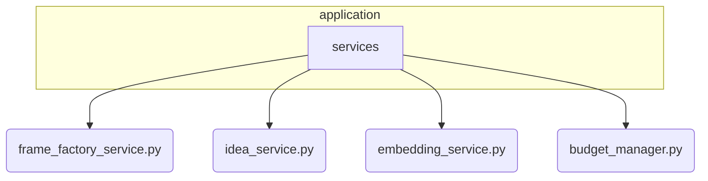

# Application Services Subsystem

**Description:** This subsystem contains high-level services that orchestrate domain logic and provide core application capabilities. These services act as the connective tissue between the abstract domain model and the concrete mechanisms, often encapsulating business rules that are not specific to any single mechanism. They are frequently used by many other parts of the system.

---

## Public API / Contracts

- **`application.services.frame_factory_service.FrameFactoryService`**: The primary service for creating, managing, and retrieving `Frame` objects, which provide execution context, budgets, and policies for cognitive tasks.
- **`application.services.idea_service.IdeaService`**: Manages the lifecycle of `Idea` objects, including creation, persistence, and relationship tracking.
- **`application.services.embedding_service.EmbeddingService`**: Provides a high-level interface for converting text into vector embeddings and performing novelty detection.
- **`application.services.budget_manager.InMemoryBudgetManager`**: A concrete implementation for managing and enforcing computational resource budgets within a `Frame`.
- **`application.services.stage_evaluation_service.StageEvaluationService`**: Provides contextual parameters and prompts for idea evaluation based on the current `EpistemicStage`.

---

## Dependencies (Imports From)

- `Kernel`
- `Domain_Model`
- `Persistence_and_Storage`
- `Event_and_Signal_System`

---

## Directory Layout (Conceptual)

