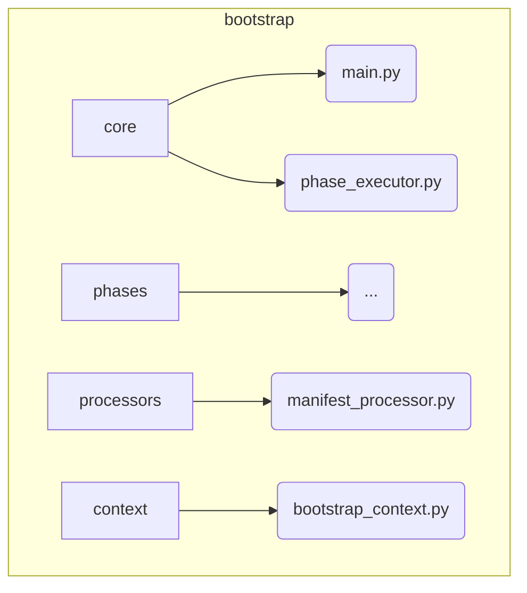

# Bootstrap System

**Description:** This subsystem is responsible for the entire startup sequence of the Nireon application. It orchestrates a series of well-defined phases to load configurations, instantiate all components, wire up their dependencies, and bring the system online in a predictable and reliable state.

---

## Public API / Contracts

- **`bootstrap.core.main.bootstrap_nireon_system()`**: The single, primary function to call to start the entire system.
- **`bootstrap.phases.*`**: A collection of phase classes (`AbiogenesisPhase`, `ManifestProcessingPhase`, etc.) that define the sequential steps of the startup process.
- **`bootstrap.processors.manifest_processor.ManifestProcessor`**: The engine for parsing component definitions from `standard.yaml` and other manifests.
- **`bootstrap.registry.registry_manager.RegistryManager`**: A helper that provides a higher-level API over the `ComponentRegistry` for bootstrap-specific tasks like self-certification.

---

## Dependencies (Imports From)

- *All other subsystems*, as it is responsible for instantiating and wiring them together.

---

## Directory Layout (Conceptual)

