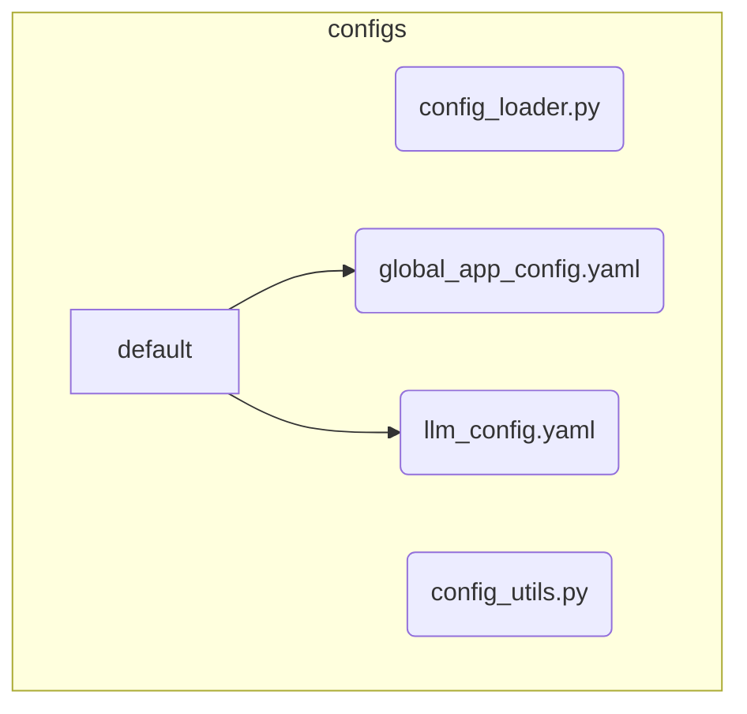

# Configuration Management Subsystem

**Description:** This subsystem is responsible for loading, merging, and providing access to all configuration files. It handles different environments (e.g., default, development), merges configurations in a specific order of precedence, and expands environment variables.

---

## Public API / Contracts

- **`configs.config_loader.ConfigLoader`**: The main class for loading global and component-specific configurations from YAML files.
- **`configs.config_utils.ConfigMerger`**: A utility for recursively merging configuration dictionaries, handling overrides correctly.

---

## Dependencies (Imports From)

- *None (stdlib and third-party only)*

---

## Directory Layout (Conceptual)

