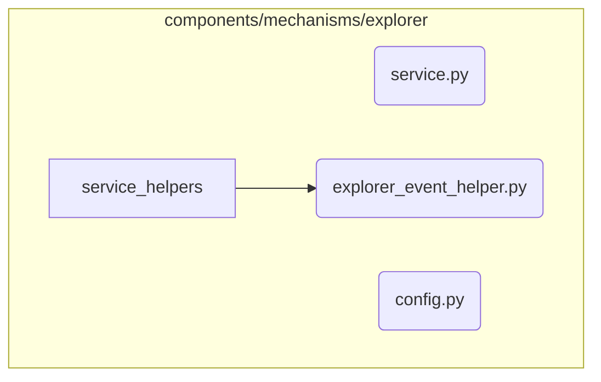

# Explorer Mechanism Subsystem

**Description:** A generative agent focused on creating novel variations of existing ideas. The Explorer's primary goal is to increase the diversity of the idea space by applying mutations and transformations, effectively "exploring" the conceptual neighborhood around a seed idea.

---

## Public API / Contracts

- **`components.mechanisms.explorer.service.ExplorerMechanism`**: The main component class, which implements the `NireonBaseComponent` lifecycle.
- **Accepted Signals:** Primarily triggered by a `SeedSignal` via a Reactor rule.
- **Produced Signals:** Emits `IdeaGeneratedSignal` for each new variation and `ExplorationCompleteSignal` upon finishing a task.

---

## Dependencies (Imports From)

- `Mechanism_Gateway`
- `Application_Services`
- `Event_and_Signal_System`
- `Domain_Model`
- `Kernel`

---

## Directory Layout (Conceptual)

