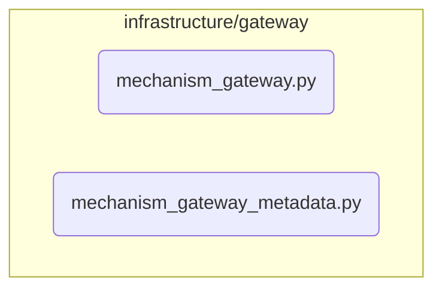

# Mechanism Gateway Subsystem

**Description:** The Mechanism Gateway acts as a crucial façade, providing a single, controlled entry point for all cognitive mechanisms (`Explorer`, `Sentinel`, etc.) to interact with core system services. By routing all external calls through this gateway, we can enforce policies, manage budgets, and maintain a clean separation between mechanism logic and infrastructure concerns.

---

## Public API / Contracts

- **`infrastructure.gateway.mechanism_gateway.MechanismGateway`**: The concrete implementation of the gateway.
- **`domain.ports.mechanism_gateway_port.MechanismGatewayPort`**: The abstract interface that defines the gateway's capabilities.
- **`process_cognitive_event(CognitiveEvent)`**: The single method used by mechanisms to request services like LLM calls or event publishing.

---

## Dependencies (Imports From)

- `LLM_Subsystem`
- `Application_Services`
- `Event_and_Signal_System`
- `Domain_Model`
- `Kernel`

---

## Directory Layout (Conceptual)

