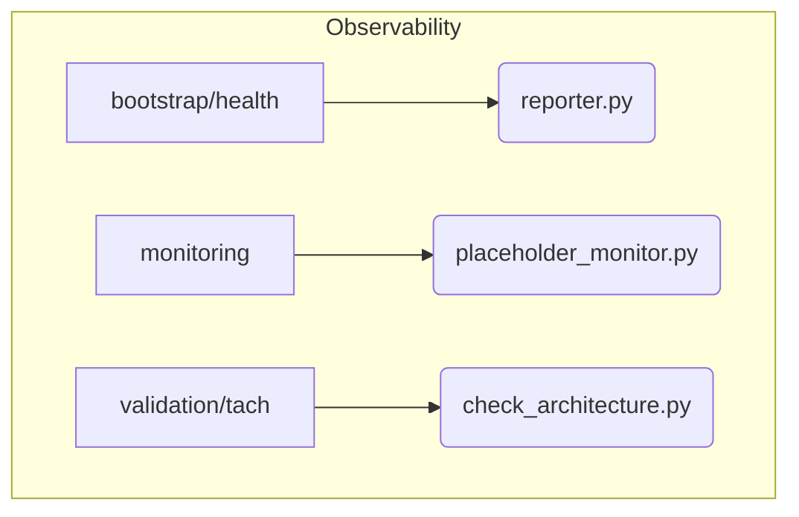

# Observability Subsystem

**Description:** This subsystem contains all components related to monitoring system health, managing alerts, and collecting metrics. Its primary role is to provide insight into the system's operational status and performance.

---

## Public API / Contracts

- **`bootstrap.health.reporter.HealthReporter`**: The core class for collecting and reporting component health during the startup sequence.
- **`monitoring.placeholder_monitor.PlaceholderMonitor`**: A utility to detect if any placeholder/mock services are running in a production environment, which would indicate a misconfiguration.
- **`validation.tach.check_architecture.py`**: A script that uses `tach` to enforce architectural layer boundaries, ensuring modules do not have invalid dependencies.

---

## Dependencies (Imports From)

- `Kernel`
- `Application_Services`

---

## Directory Layout (Conceptual)

