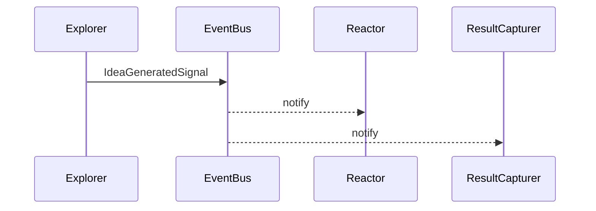
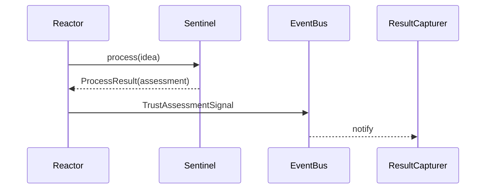

# Distinguishing **Producer** vs **Processor** Mechanisms in NIREON V4 *(v0.3 draft – 2025‑06‑29)*

## 1 · Executive Summary & Purpose

A recent race condition (duplicate **TrustAssessmentSignal** deliveries) exposed ambiguity around *who* publishes follow‑up signals.  This document formalises two interaction patterns—**Producer** and **Processor**—and prescribes contracts, enforcement, and a migration path so that every future mechanism is unambiguously classified.  The goal is higher robustness, easier testing, and clearer observability while maintaining NIREON’s throughput characteristics.

---

## 2 · Architectural Problem & Solution

\*\*Problem \*\* Both the *Sentinel* mechanism **and** the **Reactor** published assessment signals, giving ResultCapturer two deliveries and creating order‑of‑execution races.

\*\*Solution \*\* Treat evaluative mechanisms as *Processors*: they **return** a `ProcessResult`; the Reactor promotes that result to a new signal.  Generative mechanisms remain *Producers* that publish directly.

---

## 3 · Patterns at a Glance

| Trait            | **Producer (Explorer)**                    | **Processor (Sentinel / Quantifier)**                 |
| ---------------- | ------------------------------------------ | ----------------------------------------------------- |
| **Trigger**      | Seed signal / user action                  | Preceding pipeline signal                             |
| **I/O Ratio**    | **1 → N** (divergence)                     | **1 → 1** (convergence)                               |
| **Function**     | Generate / mutate ideas                    | Evaluate / filter / transform                         |
| **Signal Flow**  | `Component → EventBus` (*fire‑and‑forget*) | `Component → Reactor → EventBus` (*request–response*) |
| **Typical tags** | `generator`, `explorer`                    | `evaluator`, `critic`                                 |

<sup>See glossary entry **Producer Pattern** / **Processor Pattern** for searchable definitions.</sup>

### Sequence diagrams





---

## 4 · Enforcement Strategy

### 4.1 Abstract Base Classes *(compile‑time safety)*

```python
class ProducerMechanism(NireonBaseComponent):
    async def _process_impl(...):
        # MUST publish via event_bus
        ...

class ProcessorMechanism(NireonBaseComponent):
    async def _process_impl(...):
        # MUST return output_data and MUST NOT publish
        ...
```

*Static analysis*: a custom **flake8** plugin (`flake8‑nireon‑patterns`) forbids `event_bus.publish` inside *Processor* subclasses.

### 4.2 Metadata Flag *(runtime introspection)*

Add `interaction_pattern: Literal['producer', 'processor']` to `ComponentMetadata` so the Reactor, dashboards, and analytics can query role at runtime.

> **Adopt both**—ABCs for hard safety, metadata for observability.

### 4.3 Idempotency & Provenance

Reactor‑promoted signals **MUST** include a deterministic `signal_id` (hash of `idea_id‖stage‖epoch`) so retries remain single‑delivery and replay logs remain canonical.

---

## 5 · Migration & Tracking

| # | Owner     | Task                                                       | Tooling / notes           | Target date\* |
| - | --------- | ---------------------------------------------------------- | ------------------------- | ------------- |
| 1 | Core      | Implement ABCs + helper utilities                          | `core/mechanisms/base.py` | 2025‑07‑02    |
| 2 | Core      | Add metadata field + default                               | `core/lifecycle.py`       | 2025‑07‑02    |
| 3 | Mechanism | Refactor **Explorer** → ProducerMechanism                  | wrapper publishes         | 2025‑07‑03    |
| 4 | Mechanism | Refactor **Sentinel**, **Quantifier** → ProcessorMechanism | remove bus port           | 2025‑07‑04    |
| 5 | Reactor   | Add `promote_assessment()` + provenance hash               | see Appendix A            | 2025‑07‑04    |
| 6 | QA        | Add flake8 rule & conformance tests                        | `flake8‑nireon‑patterns`  | 2025‑07‑06    |

<sup>\*Target dates assume “T” = 2025‑06‑30 (merge of this doc).</sup>

---

## 6 · Architectural Impact

* **Correctness** — Eliminates duplicate delivery; future processors cannot accidentally fan‑out.
* **Testability** — Processors become pure functions; no bus stubs required.
* **Observability** — Reactor log is the single timeline; metadata enables role dashboards.
* **Performance** — High‑volume producers unaffected; extra Reactor hop for processors is negligible.
* **Maintainability** — Compile‑time contracts + lint rule lower cognitive load; hybrids must be composed, not monolithic.

---

## 7 · Hybrid & Future‑Proofing

If a mechanism must both stream telemetry **and** return a deterministic result, compose two smaller components—a Producer for telemetry and a Processor for the main evaluation—rather than violating pattern purity.

---

## Appendix A · Promotion Helper (reference implementation)

```python
def promote_assessment(pr: ProcessResult, parent: BaseSignal, bus: EventBus):
    """Convert Processor output → TrustAssessmentSignal, ensure idempotent ID."""
    if not (pr.success and isinstance(pr.output_data, dict)):
        return None
    data = pr.output_data
    if {"idea_id", "trust_score", "is_stable"} <= data.keys():
        # deterministic signal_id ensures retries are safe
        sid = sha256(f"{data['idea_id']}|assessment|{data.get('epoch', 0)}".encode()).hexdigest()
        sig = TrustAssessmentSignal(
            signal_id=sid,
            source_node_id=pr.component_id,
            target_id=data["idea_id"],
            trust_score=data["trust_score"],
            payload=data,
            parent_signal_ids=[parent.signal_id],
        )
        bus.publish(sig.signal_type, sig)
        return sig
    return None
```
