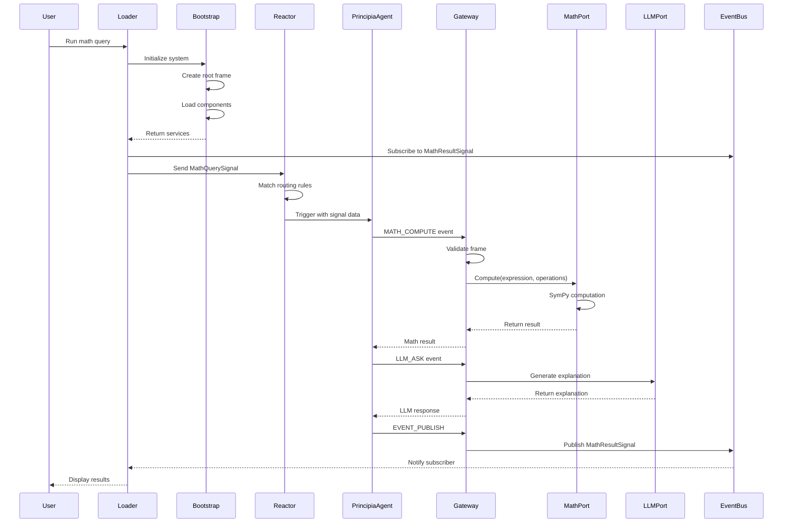

# NIREON V4 Mathematical Processing System

This document provides a comprehensive guide to the NIREON V4 mathematical processing system, covering the complete flow from system initialization through computation and result delivery.

## System Architecture Overview

The NIREON V4 math system consists of several key components working in concert:
- **Bootstrap System**: Initializes all components and services
- **Frame Factory**: Manages execution contexts (frames)
- **Reactor**: Routes signals to appropriate agents
- **Principia Agent**: Processes mathematical queries
- **Mechanism Gateway**: Coordinates service calls (LLM, Math, Events)
- **SymPy Adapter**: Performs actual mathematical computations

## 1. Engaging the Bootstrapper

The bootstrap process is the critical first step that brings the entire NIREON system online. Here's how it works:

### Bootstrap Invocation
```python
from bootstrap import bootstrap_nireon_system

boot_res = await bootstrap_nireon_system(
    config_paths=[Path('configs/manifests/standard.yaml')],
    strict_mode=False
)
```

### What Bootstrap Does
1. **Loads Configuration**: Reads the manifest file specifying which components to load
2. **Creates Root Frame**: Establishes the foundational frame with ID `F-ROOT-00000000-0000-0000-0000-000000000000`
3. **Initializes Core Services**:
   - Component Registry
   - Event Bus
   - Frame Factory Service
   - Budget Manager
   - Mechanism Gateway
   - LLM Router
   - Math Port (SymPy Adapter)
4. **Sets Up Reactor Rules**: Configures signal routing rules
5. **Performs Health Checks**: Verifies all components are operational

### Key Bootstrap Phases
- **Abiogenesis**: Initial system creation
- **Context Formation**: Establishes execution context
- **Registry Setup**: Creates component registry
- **Factory Setup**: Initializes service factories
- **Manifest Processing**: Loads components from manifest
- **Component Initialization**: Starts all components
- **Interface Validation**: Verifies component interfaces
- **RBAC Setup**: Configures access control
- **Reactor Setup**: Establishes signal routing
- **Late Rebinding**: Final dependency resolution

## 2. Engaging the Gateway

The Mechanism Gateway is the central coordination point for all cognitive operations. It's engaged through CognitiveEvents:

### Gateway Access Pattern
```python
from domain.cognitive_events import CognitiveEvent

# Create a cognitive event
event = CognitiveEvent(
    frame_id=ROOT_FRAME_ID,
    owning_agent_id='component_id',
    service_call_type='MATH_COMPUTE',  # or 'LLM_ASK', 'EVENT_PUBLISH'
    payload={...},
    epistemic_intent='PERFORM_COMPUTATION'
)

# Process through gateway
result = await gateway.process_cognitive_event(event, context)
```

### Gateway Service Types
1. **MATH_COMPUTE**: Routes to Math Port (SymPy)
2. **LLM_ASK**: Routes to LLM services
3. **EVENT_PUBLISH**: Publishes events to Event Bus

### Gateway Responsibilities
- Frame validation and budget checking
- Service routing based on event type
- Error handling and recovery
- Performance tracking
- Event episode publishing

## 3. Creating the Unified Loader - Step by Step

Here's a detailed walkthrough of creating `unified_loader.py` from scratch:

### Step 1: Basic Structure
```python
#!/usr/bin/env python3
import argparse
import asyncio
import logging
from pathlib import Path
import sys

# Constants
ROOT_FRAME_ID = 'F-ROOT-00000000-0000-0000-0000-000000000000'
```

### Step 2: Project Root Discovery
```python
def find_project_root() -> Path:
    """Find NIREON root by looking for marker directories."""
    markers = ['bootstrap', 'domain', 'core', 'configs']
    here = Path(__file__).resolve().parent
    
    for candidate in [here, *here.parents]:
        if all((candidate / m).is_dir() for m in markers):
            return candidate
    
    raise RuntimeError('Could not find project root')
```

### Step 3: Bootstrap Function
```python
async def bootstrap_system(logger):
    """Initialize the NIREON system."""
    from bootstrap import bootstrap_nireon_system
    
    manifest = Path('configs/manifests/standard.yaml')
    boot_res = await bootstrap_nireon_system(
        config_paths=[manifest],
        strict_mode=False
    )
    
    if not boot_res.success:
        raise RuntimeError('Bootstrap failed')
    
    # Extract services
    registry = boot_res.registry
    return {
        'registry': registry,
        'reactor': registry.get_service_instance(ReactorPort),
        'event_bus': registry.get_service_instance(EventBusPort),
        'frame_factory': registry.get_service_instance(FrameFactoryService),
        'gateway': registry.get_service_instance(MechanismGatewayPort)
    }
```

### Step 4: Frame Verification
```python
async def verify_root_frame(services, logger):
    """Ensure root frame exists."""
    context = NireonExecutionContext(
        run_id='verification',
        component_id='loader',
        component_registry=services['registry'],
        event_bus=services['event_bus']
    )
    
    frame = await services['frame_factory'].get_frame_by_id(
        context, ROOT_FRAME_ID
    )
    
    return frame is not None and frame.status == 'active'
```

### Step 5: Math Query Processing
```python
async def process_math_query(services, query, expression, operations, timeout, logger):
    """Process math through Principia Agent."""
    # Create execution context
    context = NireonExecutionContext(
        run_id='math_query',
        component_id='loader',
        component_registry=services['registry'],
        event_bus=services['event_bus']
    )
    
    # Setup result handler
    result_future = asyncio.Future()
    
    def on_result(payload):
        if not result_future.done():
            result_future.set_result(payload)
    
    # Subscribe to results
    services['event_bus'].subscribe(MathResultSignal.__name__, on_result)
    
    try:
        # Create signal with frame_id in payload (CRITICAL!)
        signal = MathQuerySignal(
            source_node_id='loader',
            natural_language_query=query,
            expression=expression,
            operations=operations,
            payload={'frame_id': ROOT_FRAME_ID}  # Must include this!
        )
        
        # Process through reactor
        await services['reactor'].process_signal(signal)
        
        # Wait for result
        return await asyncio.wait_for(result_future, timeout=timeout)
        
    finally:
        services['event_bus'].unsubscribe(MathResultSignal.__name__, on_result)
```

### Step 6: Main Function Assembly
```python
async def main():
    parser = argparse.ArgumentParser()
    # Add arguments...
    args = parser.parse_args()
    
    # Setup path
    project_root = find_project_root()
    sys.path.insert(0, str(project_root))
    
    # Bootstrap
    services = await bootstrap_system(logger)
    
    # Verify frame
    if not await verify_root_frame(services, logger):
        raise RuntimeError('Root frame not available')
    
    # Process query
    result = await process_math_query(
        services, args.query, args.expr, operations, args.timeout, logger
    )
    
    # Display results
    if result:
        print(f"Explanation: {result.get('explanation')}")
        print(f"Details: {result.get('computation_details')}")
```

## 4. Process Flow Diagram



## 5. Additional Key Concepts

### Frame System
- **Frames** provide execution context and resource boundaries
- **Root Frame** (ID: `F-ROOT-00000000-0000-0000-0000-000000000000`) is always available
- Frames track budgets, permissions, and epistemic goals
- All operations must specify a frame_id

### Signal Routing
- **Signals** are the primary communication mechanism
- **Reactor Rules** determine which component handles each signal type
- Rules can trigger components or emit new signals
- Rules use pattern matching on signal types and payload conditions

### Error Handling Patterns
1. **Frame Not Found**: Falls back to root frame
2. **Budget Exceeded**: Operation denied, error signal emitted
3. **Service Unavailable**: Graceful degradation with error messages
4. **Timeout**: Operations have configurable timeouts

### Critical Success Factors
1. **Always include frame_id in signal payload**
2. **Verify root frame exists before operations**
3. **Subscribe to result signals before triggering operations**
4. **Handle async timeouts appropriately**
5. **Check bootstrap success before proceeding**

### Operations Format
Operations are specified as JSON arrays:
```json
[
  {
    "type": "differentiate",
    "variable": "x"
  },
  {
    "type": "integrate", 
    "variable": "x",
    "limits": [0, 1]
  },
  {
    "type": "evaluate",
    "at": {"x": 5}
  }
]
```

## Troubleshooting Guide

### "No frame_id found" Error
- Ensure `payload={'frame_id': ROOT_FRAME_ID}` is included in MathQuerySignal

### "No result received" 
- Check event bus subscription is correct
- Verify signal processing completed
- Ensure callback doesn't look for nested 'payload'

### Bootstrap Failures
- Check manifest file exists at specified path
- Verify all required directories exist
- Check for port conflicts (especially for services)

### Math Computation Errors
- Verify expression syntax is SymPy-compatible
- Check operations array is properly formatted
- Ensure variables referenced in operations are defined