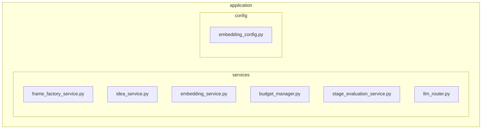

An updated `README.md` has been generated below, expanding on the original to incorporate the detailed functionality discovered in the provided source code.

---

# Application Services Subsystem

**Description:** This subsystem contains high-level services that orchestrate domain logic and provide core application capabilities. These services act as the connective tissue between the abstract domain model and the concrete mechanisms of the system. They encapsulate business rules, manage the lifecycle of key domain objects (`Frame`, `Idea`), provide core AI functionalities (embedding, novelty detection), enforce operational policies (resource budgets), and prepare context for other system components.

---

## Public API / Contracts

-   **`application.services.frame_factory_service.FrameFactoryService`**: Manages the entire lifecycle of `Frame` objects. It is responsible for creating a foundational "root" frame on initialization. It can create new frames, spawn hierarchical sub-frames that inherit properties, update a frame's status (e.g., to `archived`), and retrieve frames by ID or owner. It enforces memory limits by cleaning up expired frames.

-   **`application.services.idea_service.IdeaService`**: A facade for managing `Idea` objects. It orchestrates creation, persistence (via `IdeaRepositoryPort`), and relationship tracking (parent-child). It can publish events to the `EventBusPort` upon idea creation and persistence.

-   **`application.services.embedding_service.EmbeddingService`**: A comprehensive service for AI-related text processing. It converts text into vector embeddings using a configurable provider (`EmbeddingPort`). Key features include an in-memory LRU cache for performance, novelty detection by comparing new embeddings against a persistent `VectorMemoryPort`, and publishing events for significant findings (e.g., `HighNoveltyDetectedEvent`). It includes retry logic with backoff for robustness.

-   **`application.services.budget_manager.InMemoryBudgetManager`**: A concrete, thread-safe implementation for managing and enforcing computational resource budgets. Budgets are scoped to specific `Frame` objects (e.g., `frame_id:llm_tokens`) and can be consumed or credited. It raises exceptions (`BudgetExceededError`) when a requested resource consumption exceeds the available limit.

-   **`application.services.stage_evaluation_service.StageEvaluationService`**: Provides contextual parameters and generates evaluation prompts. Based on the current `EpistemicStage` (e.g., `EXPLORATION`), it resolves a set of scoring weights (e.g., for alignment, feasibility) and synthesizes a complete LLM prompt for use by evaluation mechanisms.

-   **Configuration Objects**:
    -   **`application.config.embedding_config.EmbeddingConfig`**: A Pydantic model for configuring the `EmbeddingService`, including the provider, model, novelty threshold, and retry policies.
    -   **`application.services.frame_factory_service.FrameFactoryConfig`**: A Pydantic model for configuring the `FrameFactoryService`, defining root frame properties, memory limits, and expiration policies.

---

## Key Concepts & Design Patterns

-   **Component-Based Services**: Most services (e.g., `FrameFactoryService`, `EmbeddingService`) inherit from `NireonBaseComponent`. This provides a standardized lifecycle (`_initialize_impl`, `_process_impl`), configuration handling, and health checking (`health_check`), integrating them into the core application framework.

-   **Ports and Adapters (Hexagonal Architecture)**: Services depend on abstract "Ports" (e.g., `EmbeddingPort`, `IdeaRepositoryPort`, `EventBusPort`) rather than concrete implementations. These dependencies are resolved and injected at runtime via the `NireonExecutionContext`'s component registry, allowing for flexible swapping of underlying technologies (e.g., using a mock embedding provider for tests).

-   **Facade Pattern**: The `IdeaService` acts as a simple facade, providing a clean, high-level API over the more data-centric `IdeaRepositoryPort` and the `EventBusPort`, hiding the underlying complexity of persistence and event publishing.

-   **Configuration via Pydantic Models**: Services like `EmbeddingService` and `FrameFactoryService` use Pydantic `BaseModel`s for their configuration. This provides robust, typed, and self-documenting configuration with automatic validation at startup.

-   **State Management**:
    -   **In-Memory State**: `FrameFactoryService` and `InMemoryBudgetManager` maintain their primary state (the collection of frames and budgets, respectively) in memory, using thread-safe locks (`threading.RLock`, `asyncio.Lock`) to ensure consistency.
    -   **Delegated State**: `EmbeddingService` and `IdeaService` delegate their primary state management to external components via ports (`VectorMemoryPort`, `IdeaRepositoryPort`).

-   **Asynchronous Operations**: Services are designed with `async`/`await` syntax, making them suitable for I/O-bound operations and integration into an asynchronous application core.

---

## Dependencies (Imports From)

-   `Kernel`
-   `Domain_Model`
-   `Persistence_and_Storage`
-   `Event_and_Signal_System`

---

## Directory Layout (Conceptual)

