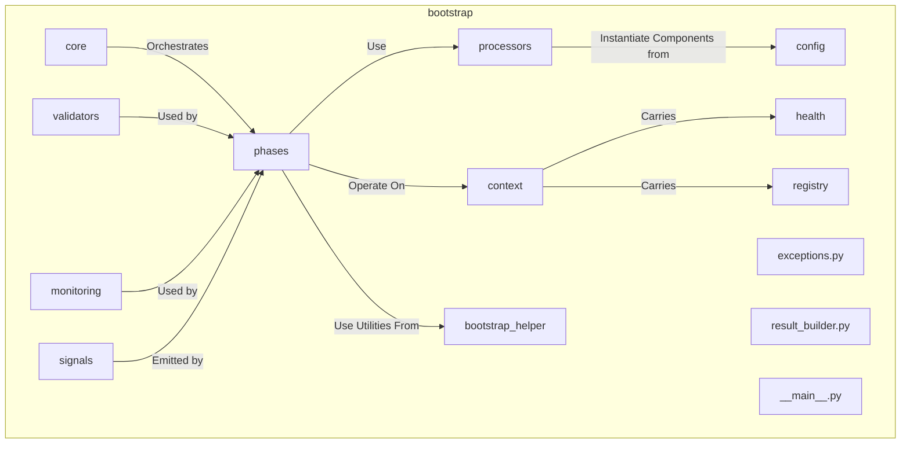

# Bootstrap Subsystem

**Description:** The Bootstrap subsystem is the foundational entry point for the entire NIREON system, a process referred to as "L0 Abiogenesis." Its primary responsibility is to orchestrate the transition from static configuration files (YAML manifests) to a fully instantiated, interconnected, and operational runtime environment. It manages the entire startup lifecycle through a series of distinct, ordered phases, ensuring that core services, factories, and application components are created, configured, and validated correctly before the system begins its main operational loop.

This subsystem is designed for robustness, providing detailed health reporting, clear separation of concerns through its phased approach, and sophisticated dependency management to handle the complexity of a large-scale AI system.

---

## Core Concepts & Design Philosophy

The bootstrap process is built on several key architectural principles:

-   **Phased Orchestration:** The startup is not a single, monolithic function. It's broken into a sequence of phases (e.g., `AbiogenesisPhase`, `FactorySetupPhase`, `ComponentInitializationPhase`), each with a specific, well-defined responsibility. The `BootstrapOrchestrator` (`core/main.py`) executes these phases in a strict order, ensuring that foundational components are ready before dependent components are built. This makes the process easier to debug, maintain, and extend.

-   **Manifest-Driven Architecture:** The entire composition of the NIREON system is defined declaratively in YAML manifest files. The `ManifestProcessor` (`processors/manifest_processor.py`) is responsible for parsing these files. This "infrastructure-as-code" approach allows system architects to define and alter the system's structure without changing the bootstrap code itself.

-   **Hierarchical and Merged Configuration:** Component configuration is resolved from a clear hierarchy, providing flexibility and control:
    1.  **Pydantic Defaults:** Default values defined in a component's `ConfigModel`.
    2.  **YAML File Config:** Values loaded from an external `.yaml` file specified in the manifest's `config` key.
    3.  **Inline Overrides:** The `config_override` key in the manifest provides the final, highest-precedence values.
    This entire process is managed by `ConfigMerger` and helper functions in `processors/component_processor.py`.

-   **Robust Diagnostics and Health Reporting:** Every step of the bootstrap process is tracked. The `HealthReporter` (`health/reporter.py`) is a central object that collects the status of every component and phase. It uses a detailed `ComponentStatus` enum (e.g., `DEFINITION_ERROR`, `INSTANCE_REGISTERED`, `VALIDATION_FAILED`) to provide precise diagnostic information. The final `BootstrapResult` object contains a full report, which is invaluable for debugging startup failures.

-   **Advanced Dependency Management (Placeholders & Late Rebinding):** To solve the "chicken-and-egg" problem of complex inter-service dependencies, the bootstrap process uses a two-stage approach:
    1.  **Placeholders:** Components can be instantiated with placeholder implementations (see `bootstrap_helper/placeholders.py`) for their dependencies. This allows the object to be created even if its real dependencies aren't ready yet.
    2.  **Late Rebinding:** After all components have been instantiated and core services are live, the `LateRebindingPhase` iterates through every component and replaces any remaining placeholder attributes with the real, fully-initialized service instances from the `ComponentRegistry`.

-   **Integrated Security (RBAC):** Role-Based Access Control is not an afterthought. The `RBACSetupPhase` is a core part of the startup sequence. It loads policy definitions from `.yaml` files and configures the `RBACPolicyEngine`, ensuring that security rules are in place from the very beginning.

-   **Extensibility via the Reactor Engine:** The `ReactorSetupPhase` initializes and configures the `reactor` subsystem, loading its declarative rules from the filesystem. It then bridges the system's `EventBus` to the reactor, allowing the system's behavior to be extended or modified simply by adding or changing rule files, without altering core code.

---

## The Bootstrap Lifecycle: An Execution Flow

The `BootstrapOrchestrator` executes the following phases in order. Each phase builds upon the last, progressively bringing the system to life.

1.  **`AbiogenesisPhase`**: The very first step. It scans manifests for critical, low-level services marked with `preload: true`. These are instantiated immediately so they are available to the bootstrap process itself.
    -   *Key Outcome:* A `ComponentRegistry` with the most essential services (e.g., a real `EventBusPort` if defined) already present.

2.  **`ContextFormationPhase`**: Creates and registers core context-managing components that define the system's self-awareness.
    -   *Key Outcome:* `FeatureFlagsManager` is created. The `ComponentRegistry` registers *itself* as a service, allowing other components to discover it.

3.  **`RegistrySetupPhase`**: Configures the now-registered `ComponentRegistry` for advanced V4 operations, enabling metadata tracking, self-certification, and performance monitoring.
    -   *Key Outcome:* A fully configured, observable `ComponentRegistry`.

4.  **`FactorySetupPhase`**: Instantiates and registers the "factories" and core "manager" components that are required to build the rest of the application.
    -   *Key Outcome:* The `SimpleMechanismFactory`, `FrameFactoryService`, `MechanismGateway`, `ParameterService`, and `InMemoryBudgetManager` are created and registered. An `InterfaceValidator` is also prepared.

5.  **`ManifestProcessingPhase`**: The main workhorse phase. It parses all specified `.yaml` manifests, and for each component definition, it uses the appropriate factory or class path to create an instance and register it.
    -   *Key Outcome:* The `ComponentRegistry` is populated with all mechanisms, observers, and other services defined in the manifests.

6.  **`ComponentInitializationPhase`**: Iterates through every component in the registry. If a component's metadata indicates `requires_initialize=True`, its `initialize()` method is called. This can be configured to run sequentially or concurrently for performance.
    -   *Key Outcome:* All stateful components have run their initialization logic and are ready for operation.

7.  **`InterfaceValidationPhase`**: Performs a deep validation of all instantiated components using the `InterfaceValidator`.
    -   *Key Outcome:* Confirmation that all components adhere to their required methods, metadata contracts, and interface protocols.

8.  **`RBACSetupPhase`**: If enabled via feature flags, this phase locates, parses, and loads Role-Based Access Control (RBAC) policy files.
    -   *Key Outcome:* A fully configured `RBACPolicyEngine` is registered as a service, ready to enforce permissions.

9.  **`ReactorSetupPhase`**: Initializes the `reactor` rule engine.
    -   *Key Outcome:* Loads all `.py` rule files, instantiates the `MainReactorEngine`, and subscribes it to the `EventBus` to process system signals.

10. **`LateRebindingPhase`**: The final wiring step. It scans all components for any placeholder dependencies and replaces them with the final, live service instances from the registry.
    -   *Key Outcome:* A fully interconnected system where all component dependencies point to their real, operational implementations.

---

## Directory & Module Breakdown

The `bootstrap` subsystem is organized into modules with specific responsibilities, as detailed below.

-   `core/`: Contains the main orchestration logic.
    -   `main.py`: Defines the `BootstrapOrchestrator` and the top-level `bootstrap_nireon_system` entry point.
    -   `phase_executor.py`: Manages the execution, timing, and result aggregation for a list of phases.

-   `phases/`: Contains the implementation for each distinct step of the bootstrap lifecycle.
    -   `base_phase.py`: Defines the abstract `BootstrapPhase` class and `PhaseResult` dataclass that all phases inherit from.
    -   *(other files)*: Each file (`abiogenesis_phase.py`, `manifest_processing_phase.py`, etc.) implements the logic for one specific phase.

-   `processors/`: Holds the logic for parsing manifest sections and instantiating components based on their definitions.
    -   `manifest_processor.py`: The main processor that reads a manifest file and breaks it down into individual component specifications.
    -   `component_processor.py`, `shared_service_processor.py`: Contain the detailed logic for creating a component instance, including merging configurations, building metadata, and calling the correct constructor.

-   `config/`: Classes related to handling the bootstrap configuration itself.
    -   `bootstrap_config.py`: Defines the `BootstrapConfig` dataclass for configuring an orchestrator run.

-   `context/`: Defines the shared context that is passed between all phases.
    -   `bootstrap_context.py`: Defines the main `BootstrapContext` class.
    -   `bootstrap_context_builder.py`: A builder pattern for safely constructing the `BootstrapContext`.

-   `bootstrap_helper/`: A collection of utility classes and functions that support the bootstrap phases.
    -   `placeholders.py`: Defines placeholder implementations (`PlaceholderLLMPortImpl`, etc.) used for early-stage dependency fulfillment.
    -   `metadata.py`: Provides default `ComponentMetadata` for common system components.
    -   `context_helper.py`: Utilities for creating `NireonExecutionContext` instances for different bootstrap stages.
    -   `_exceptions.py`: Defines the hierarchy of custom bootstrap exceptions.

-   `health/`: Code related to health tracking and reporting.
    -   `reporter.py`: Defines the `HealthReporter` and `ComponentHealthRecord` classes used to track and summarize the health of the entire startup process.

-   `registry/`: Code that enhances or interacts with the `ComponentRegistry`.
    -   `registry_manager.py`: A manager that provides higher-level functions on top of the registry, such as "register with certification."
    -   `security/rbac_engine.py`: Defines the `RBACPolicyEngine`.

-   `validators/`: Contains validators that check for correctness.
    -   `interface_validator.py`: A powerful validator that checks if components correctly implement their required methods and conform to their metadata contracts.

-   `monitoring/`: Tools for monitoring the bootstrap process itself.
    -   `placeholder_monitor.py`: A utility that can scan the registry for any placeholder services that might have been left behind, which is critical for production environments.

-   `__main__.py`: Implements the command-line interface (CLI), allowing the bootstrap process to be run directly with flags like `--diagnose` and `--validate`.

-   `result_builder.py`: Defines the `BootstrapResultBuilder` which constructs the final `BootstrapResult` object from the completed context.

---

## Public API / Contracts

The public interface for initiating and interacting with the bootstrap process includes:

-   **`bootstrap.bootstrap_nireon_system()` / `bootstrap.bootstrap_sync()`**: The main asynchronous and synchronous functions to start the system.
-   **`bootstrap.core.main.BootstrapOrchestrator`**: The core class that manages the sequence of bootstrap phases.
-   **`bootstrap.config.bootstrap_config.BootstrapConfig`**: Dataclass for configuring the orchestrator.
-   **`bootstrap.result_builder.BootstrapResult`**: The final object returned upon completion, providing access to the live `ComponentRegistry` and a full `HealthReporter`.
-   **`bootstrap.exceptions.*`**: A set of custom exceptions (`ComponentInstantiationError`, `ManifestProcessingError`, etc.) providing detailed failure information.

---

## Dependencies (Imports From)

-   `Kernel` (for `core` types like `NireonBaseComponent`, `ComponentRegistry`)
-   `Application` (for application-level services like `FrameFactoryService`)
-   `Domain_Model` (for ports like `LLMPort`, `EventBusPort`)
-   `Infrastructure` (for concrete implementations like `MechanismGateway`)
-   `Runtime` (for general utilities like `import_by_path`)
-   `Event_and_Signal_System` (for signal definitions)
-   `Configs` (for configuration loading)
-   `Reactor` (for the reactor engine)