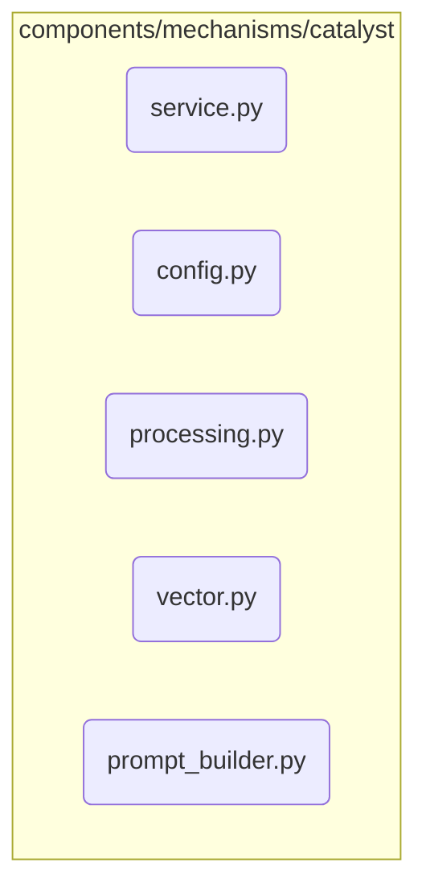

# Catalyst Mechanism Subsystem

**Description:** A synthesis-focused agent designed to foster creativity by blending concepts from different domains. The Catalyst takes an existing idea and "injects" influence from a specified cross-domain vector, creating a novel, hybrid concept. Its goal is to bridge disciplinary boundaries and spark interdisciplinary thinking.

---

## Public API / Contracts

- **`components.mechanisms.catalyst.service.CatalystMechanism`**: The main component class.
- **Accepted Signals:** Triggered by signals like `CATALYSIS_REQUEST`.
- **Produced Signals:** Emits `IdeaCatalyzedSignal` upon successful creation of a hybrid idea.

---

## Dependencies (Imports From)

- `Mechanism_Gateway`
- `Application_Services`
- `Event_and_Signal_System`
- `Domain_Model`
- `Kernel`

---

## Directory Layout (Conceptual)

