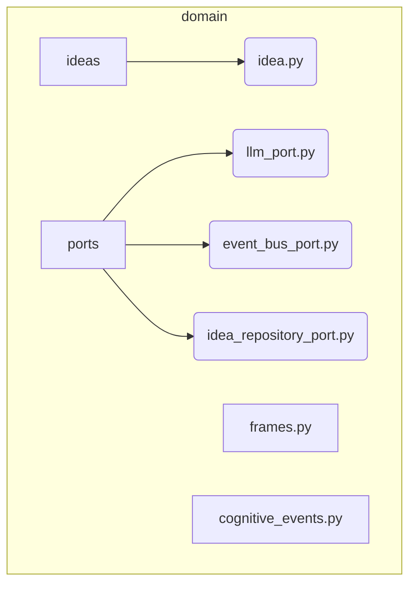

# Domain Model Subsystem

**Description:** This subsystem is the heart of Nireon's business logic. It defines the core data structures (e.g., `Idea`, `Frame`, `CognitiveEvent`) and, crucially, the abstract interfaces (Ports) that decouple the application services and mechanisms from the concrete infrastructure. This allows for interchangeable infrastructure components (e.g., swapping a local LLM for a remote API) without altering the core application logic.

---

## Public API / Contracts

- **`domain.ideas.idea.Idea`**: The central data object representing a single idea or concept within the system.
- **`domain.frames.Frame`**: The data object for contextualizing cognitive tasks, holding policies, budgets, and goals.
- **`domain.cognitive_events.CognitiveEvent`**: The primary object for requesting services from the `MechanismGateway`.
- **`domain.ports.*`**: The collection of abstract protocols (`LLMPort`, `EventBusPort`, `IdeaRepositoryPort`, etc.) that define the contracts for all infrastructure services. Any concrete implementation must adhere to these interfaces.
- **`domain.embeddings.vector.Vector`**: The standardized data structure for representing semantic embeddings.

---

## Dependencies (Imports From)

- `Kernel` (for base types if needed, though often it's dependency-free)

---

## Directory Layout (Conceptual)

