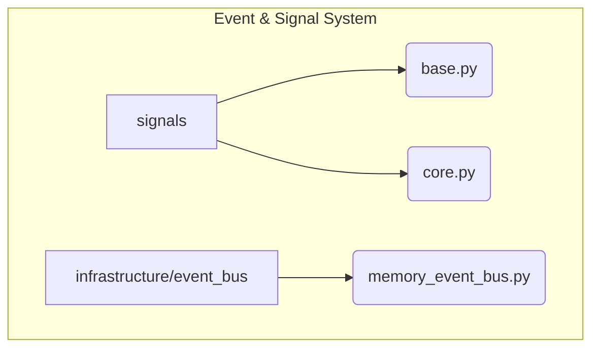

# Event and Signal System

**Description:** This subsystem manages the communication backbone of the system. It defines the hierarchy of signals (`EpistemicSignal`) that flow between components and provides the concrete event bus implementation for asynchronous, pub/sub-style communication. It is the primary means by which the `Reactor` is triggered.

---

## Public API / Contracts

- **`signals.base.EpistemicSignal`**: The base class for all signals in the system.
- **`signals.core.*`**: Specific, concrete signal types like `IdeaGeneratedSignal`, `TrustAssessmentSignal`, and `MathQuerySignal`.
- **`infrastructure.event_bus.memory_event_bus.MemoryEventBus`**: The concrete in-memory implementation of the `EventBusPort`.
- **`domain.ports.event_bus_port.EventBusPort`**: The abstract interface that all event bus implementations must satisfy.

---

## Dependencies (Imports From)

- `Domain_Model`

---

## Directory Layout (Conceptual)

