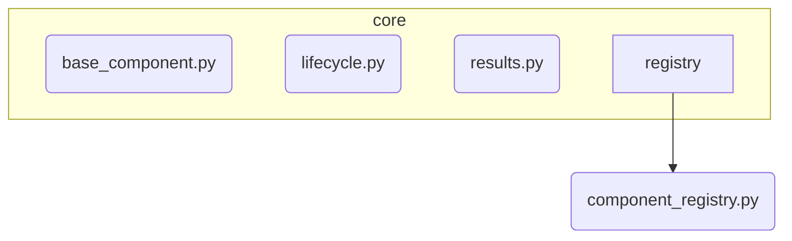

# Kernel Subsystem

**Description:** The absolute core of the Nireon V4 system. It defines the fundamental abstractions for all components, the component lifecycle, the central component registry, and standard result objects. As the foundational layer, it has **no dependencies** on other project subsystems and should only import from Python's standard library or third-party packages.

---

## Public API / Contracts

The Kernel's public contract consists of the essential base classes and data structures that the entire system is built upon.

- **`core.base_component.NireonBaseComponent`**: The abstract base class that all Nireon components must inherit from. It enforces the implementation of the standard component lifecycle methods (`initialize`, `process`, `analyze`, etc.).
- **`core.lifecycle.ComponentMetadata`**: The data class for describing a component's identity, capabilities, dependencies, and other static properties.
- **`core.registry.component_registry.ComponentRegistry`**: The concrete implementation of the central service registry where all components are stored and can be retrieved.
- **`core.results.ProcessResult`**: The standardized return object for any component's `process` method, indicating success/failure and carrying output data.
- **`core.results.AnalysisResult`**: The standardized return object for a component's `analyze` method, providing metrics and insights.

---

## Dependencies (Imports From)

- *None (stdlib and third-party only)*

---

## Directory Layout (Conceptual)

