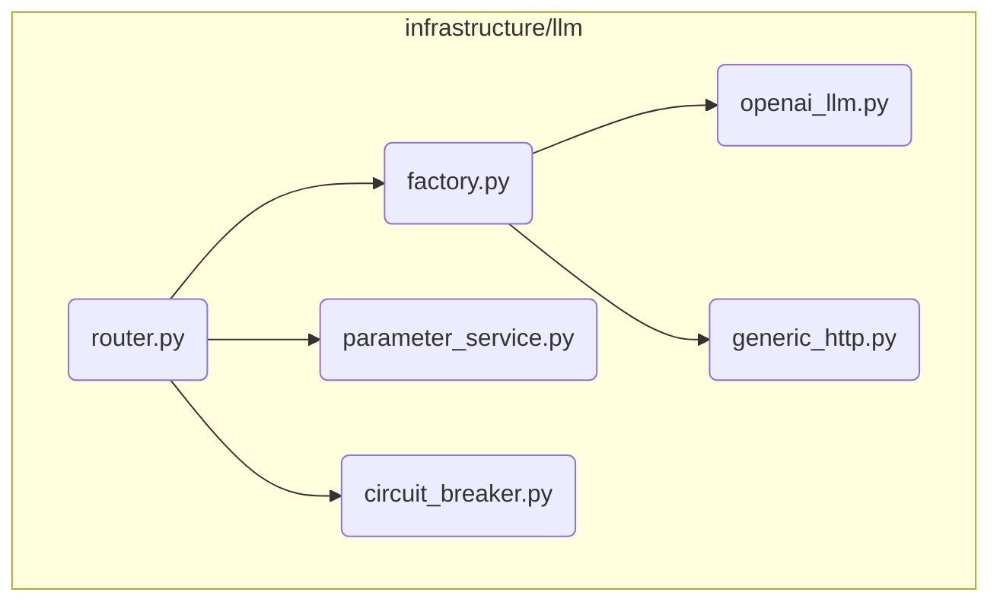

# LLM Subsystem

**Description:** This is a comprehensive subsystem for managing all interactions with Large Language Models. It is responsible for routing requests to different backends, applying context-specific parameters, handling failures with circuit breakers, and collecting performance metrics. It provides a unified and resilient interface to the rest of the application.

---

## Public API / Contracts

- **`infrastructure.llm.router.LLMRouter`**: The main entry point for making LLM calls. It implements the `LLMPort` interface and orchestrates the other components in this subsystem.
- **`infrastructure.llm.parameter_service.ParameterService`**: A service that resolves LLM parameters (e.g., temperature, max_tokens) based on the current `EpistemicStage` and agent role.
- **`infrastructure.llm.factory.create_llm_instance`**: A factory function used by the router to instantiate specific LLM backends based on configuration.
- **`domain.ports.llm_port.LLMPort`**: The abstract interface that all LLM backends (e.g., `OpenAILLMAdapter`) must implement.

---

## Dependencies (Imports From)

- `Domain_Model`
- `Kernel`
- `Event_and_Signal_System`

---

## Directory Layout (Conceptual)

