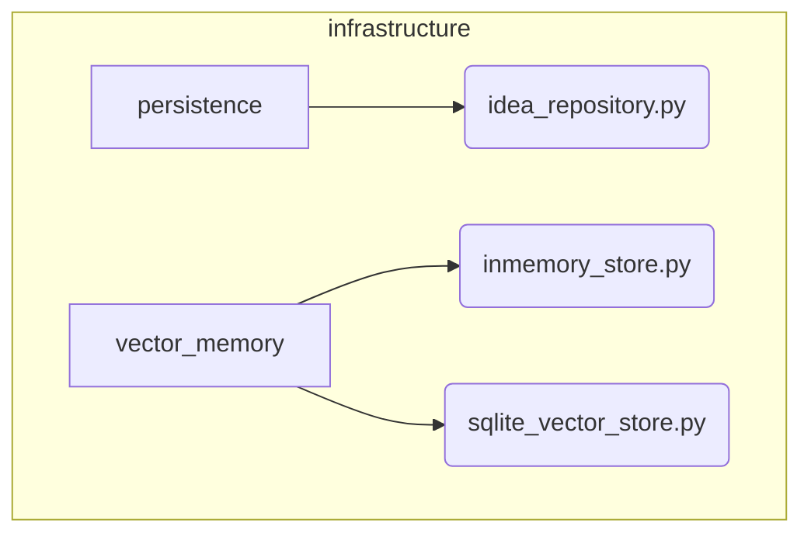

# Persistence and Storage Subsystem

**Description:** This infrastructure layer is responsible for the concrete implementation of data persistence and retrieval. It provides the backends for storing and querying `Idea` objects and their associated vector embeddings.

---

## Public API / Contracts

- **`infrastructure.persistence.idea_repository.IdeaRepository`**: The concrete SQLite-based implementation of the `IdeaRepositoryPort`.
- **`infrastructure.vector_memory.inmemory_store.InMemoryVectorStore`**: A concrete in-memory implementation of the `VectorMemoryPort`, suitable for testing and development.

---

## Dependencies (Imports From)

- `Domain_Model` (for `Idea`, `Vector`, and the port definitions)

---

## Directory Layout (Conceptual)

