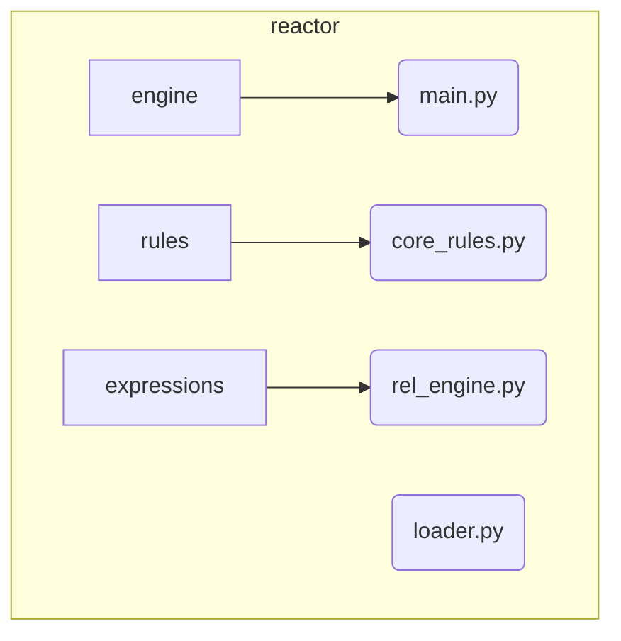

# Reactor Subsystem

**Description:** The Reactor is a declarative, rule-based engine that forms the central nervous system of Nireon. It listens for all signals on the event bus and triggers component actions based on a set of conditions defined in YAML rule files. This allows for complex, emergent behaviors to be defined and modified without changing core component code.

---

## Public API / Contracts

- **`reactor.engine.main.MainReactorEngine`**: The primary implementation of the reactor logic.
- **`reactor.loader.RuleLoader`**: The utility responsible for parsing rule definitions from `configs/reactor/rules/*.yaml` files.
- **`domain.ports.reactor_port.ReactorPort`**: The abstract interface for the reactor engine.

---

## Dependencies (Imports From)

- `Event_and_Signal_System`
- `Application_Services` (for the `ComponentRegistry`)
- `Kernel`

---

## Directory Layout (Conceptual)

