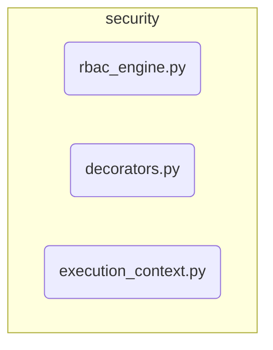

# Security RBAC Subsystem

**Description:** The Role-Based Access Control (RBAC) system for Nireon. It includes the policy engine responsible for evaluating permissions and the decorators used to protect sensitive functions and methods. Policies are defined in `bootstrap_rbac.yaml` and loaded during the bootstrap process.

---

## Public API / Contracts

- **`security.rbac_engine.RBACPolicyEngine`**: The engine that evaluates permissions based on loaded rules.
- **`security.decorators.requires_permission`**: The primary decorator used to enforce access control on functions and methods.
- **`security.execution_context`**: Manages the current subject (user/agent) for permission checks.

---

## Dependencies (Imports From)

- `Kernel` (for registry access, indirectly)

---

## Directory Layout (Conceptual)

