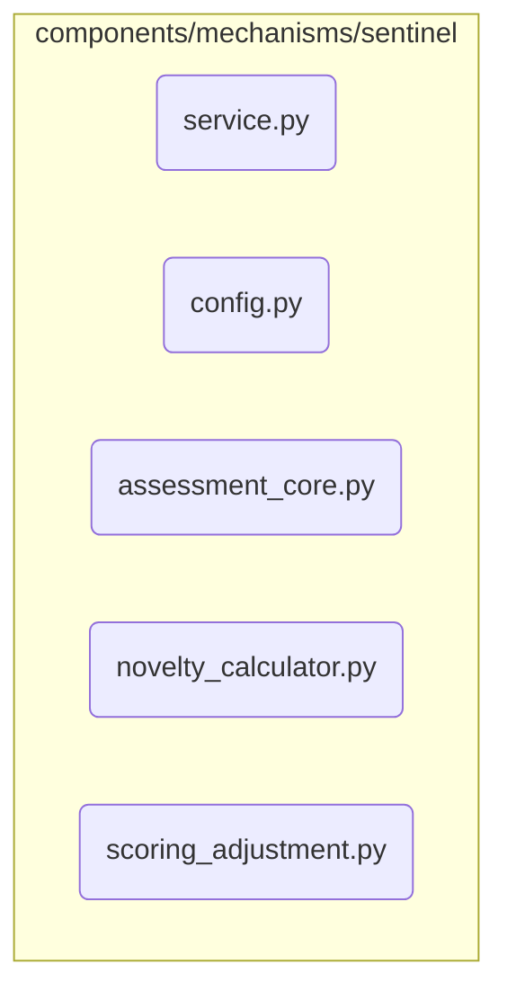

# Sentinel Mechanism Subsystem

**Description:** An evaluative agent responsible for quality control. The Sentinel assesses ideas against multiple axes—such as alignment with objectives, feasibility, and novelty—to produce a `trust_score`. This score determines whether an idea is "stable" enough to proceed or should be rejected.

---

## Public API / Contracts

- **`components.mechanisms.sentinel.service.SentinelMechanism`**: The main component class.
- **Accepted Signals:** Primarily triggered by an `IdeaGeneratedSignal` via a Reactor rule.
- **Produced Signals:** Emits a `TrustAssessmentSignal` containing the evaluation results for an idea.

---

## Dependencies (Imports From)

- `Mechanism_Gateway`
- `Application_Services`
- `Event_and_Signal_System`
- `Domain_Model`
- `Kernel`

---

## Directory Layout (Conceptual)

