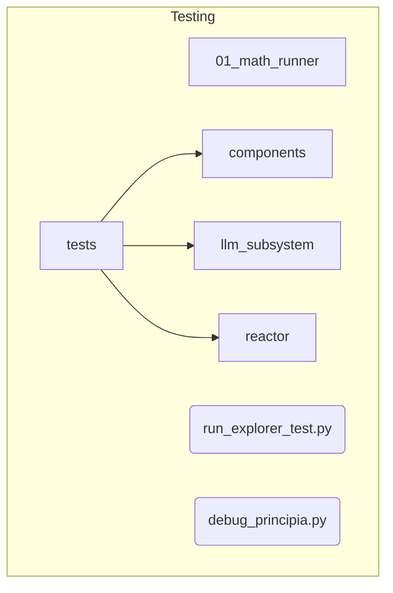

# Testing and Runners Subsystem

**Description:** This subsystem contains all code related to testing, debugging, and running specific parts of the system. It includes unit tests, integration tests, standalone runner scripts (like for the math engine), and development utilities. **None of this code should be part of the production runtime.**

---

## Public API / Contracts

- This subsystem does not have a public API. It is a collection of developer-facing tools and validation scripts.
- Key scripts include:
    - `01_math_runner/unified_math_loader.py`: A CLI for testing the `Math_Engine`.
    - `tests/llm_subsystem/llm_test_cli.py`: A CLI for testing the `LLM_Subsystem`.
    - `run_explorer_test.py`: A script to kick off a test run of the generative mechanisms.

---

## Dependencies (Imports From)

- *All other subsystems*, as it is designed to test them.

---

## Directory Layout (Conceptual)

