# Application Services Subsystem

**Description:** This subsystem contains high-level services that orchestrate domain logic and provide core application capabilities. These services act as the connective tissue between the abstract domain model and the concrete mechanisms, often encapsulating business rules that are not specific to any single mechanism. They are frequently used by many other parts of the system.

---

## Public API / Contracts

- **`application.services.frame_factory_service.FrameFactoryService`**: The primary service for creating, managing, and retrieving `Frame` objects, which provide execution context, budgets, and policies for cognitive tasks.
- **`application.services.idea_service.IdeaService`**: Manages the lifecycle of `Idea` objects, including creation, persistence, and relationship tracking.
- **`application.services.embedding_service.EmbeddingService`**: Provides a high-level interface for converting text into vector embeddings and performing novelty detection.
- **`application.services.budget_manager.InMemoryBudgetManager`**: A concrete implementation for managing and enforcing computational resource budgets within a `Frame`.
- **`application.services.stage_evaluation_service.StageEvaluationService`**: Provides contextual parameters and prompts for idea evaluation based on the current `EpistemicStage`.

---

## Dependencies (Imports From)

- `Kernel`
- `Domain_Model`
- `Persistence_and_Storage`
- `Event_and_Signal_System`

---

## Directory Layout (Conceptual)

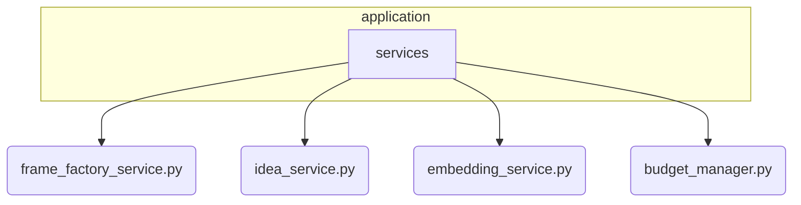


# Bootstrap System

**Description:** This subsystem is responsible for the entire startup sequence of the Nireon application. It orchestrates a series of well-defined phases to load configurations, instantiate all components, wire up their dependencies, and bring the system online in a predictable and reliable state.

---

## Public API / Contracts

- **`bootstrap.core.main.bootstrap_nireon_system()`**: The single, primary function to call to start the entire system.
- **`bootstrap.phases.*`**: A collection of phase classes (`AbiogenesisPhase`, `ManifestProcessingPhase`, etc.) that define the sequential steps of the startup process.
- **`bootstrap.processors.manifest_processor.ManifestProcessor`**: The engine for parsing component definitions from `standard.yaml` and other manifests.
- **`bootstrap.registry.registry_manager.RegistryManager`**: A helper that provides a higher-level API over the `ComponentRegistry` for bootstrap-specific tasks like self-certification.

---

## Dependencies (Imports From)

- *All other subsystems*, as it is responsible for instantiating and wiring them together.

---

## Directory Layout (Conceptual)

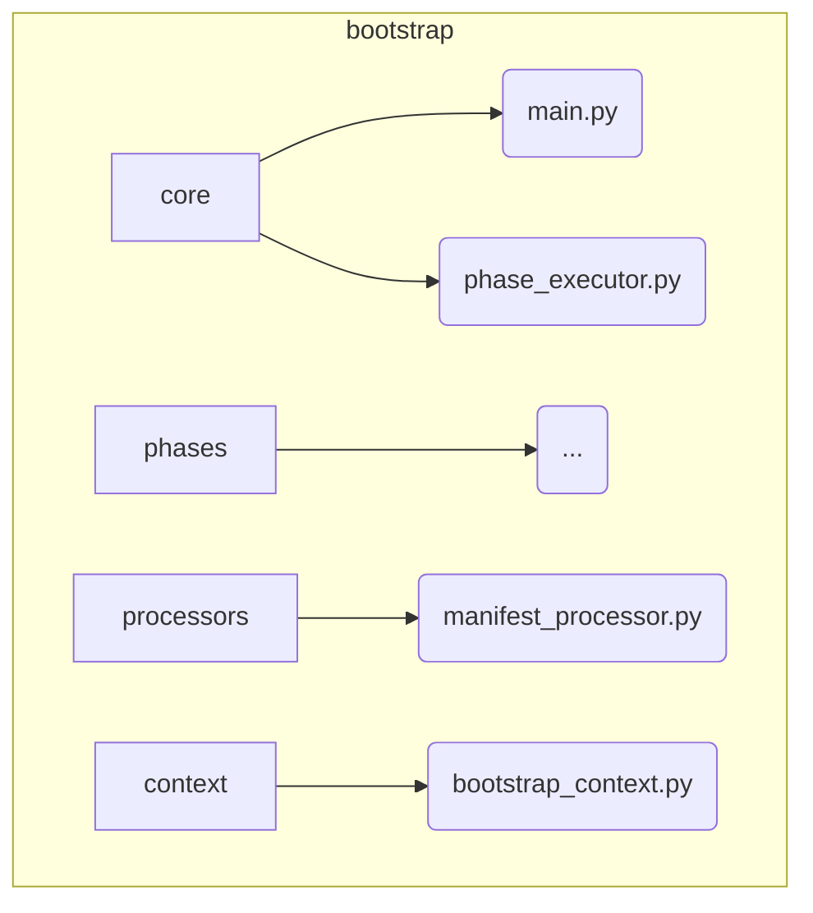


# Catalyst Mechanism Subsystem

**Description:** A synthesis-focused agent designed to foster creativity by blending concepts from different domains. The Catalyst takes an existing idea and "injects" influence from a specified cross-domain vector, creating a novel, hybrid concept. Its goal is to bridge disciplinary boundaries and spark interdisciplinary thinking.

---

## Public API / Contracts

- **`components.mechanisms.catalyst.service.CatalystMechanism`**: The main component class.
- **Accepted Signals:** Triggered by signals like `CATALYSIS_REQUEST`.
- **Produced Signals:** Emits `IdeaCatalyzedSignal` upon successful creation of a hybrid idea.

---

## Dependencies (Imports From)

- `Mechanism_Gateway`
- `Application_Services`
- `Event_and_Signal_System`
- `Domain_Model`
- `Kernel`

---

## Directory Layout (Conceptual)

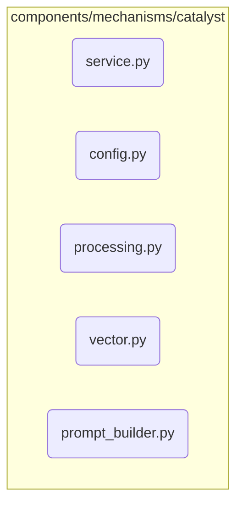


# Configuration Management Subsystem

**Description:** This subsystem is responsible for loading, merging, and providing access to all configuration files. It handles different environments (e.g., default, development), merges configurations in a specific order of precedence, and expands environment variables.

---

## Public API / Contracts

- **`configs.config_loader.ConfigLoader`**: The main class for loading global and component-specific configurations from YAML files.
- **`configs.config_utils.ConfigMerger`**: A utility for recursively merging configuration dictionaries, handling overrides correctly.

---

## Dependencies (Imports From)

- *None (stdlib and third-party only)*

---

## Directory Layout (Conceptual)

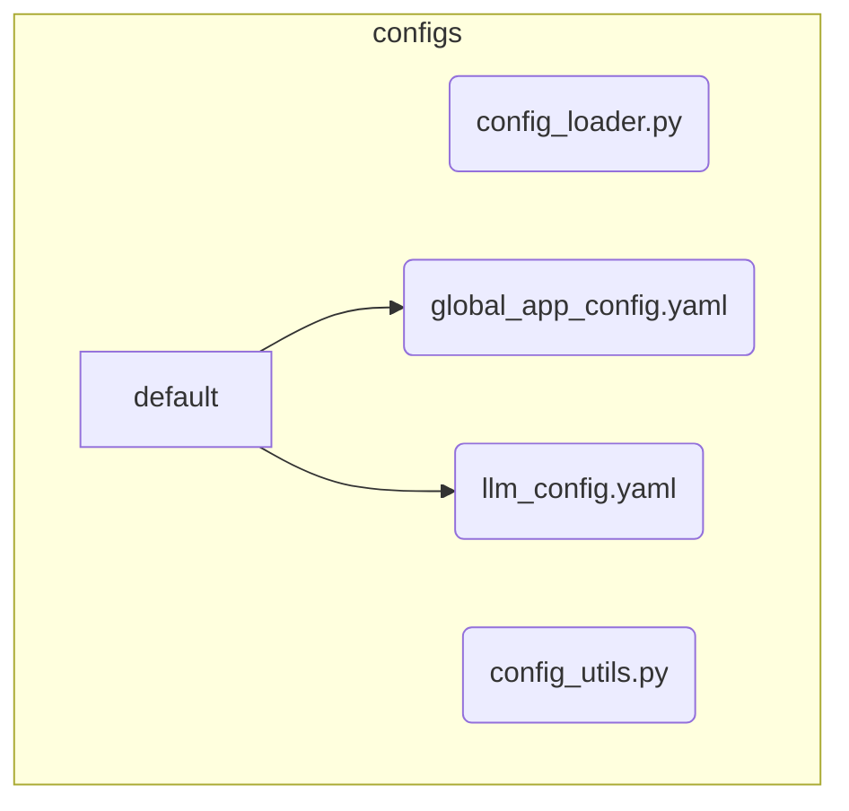


# Domain Model Subsystem

**Description:** This subsystem is the heart of Nireon's business logic. It defines the core data structures (e.g., `Idea`, `Frame`, `CognitiveEvent`) and, crucially, the abstract interfaces (Ports) that decouple the application services and mechanisms from the concrete infrastructure. This allows for interchangeable infrastructure components (e.g., swapping a local LLM for a remote API) without altering the core application logic.

---

## Public API / Contracts

- **`domain.ideas.idea.Idea`**: The central data object representing a single idea or concept within the system.
- **`domain.frames.Frame`**: The data object for contextualizing cognitive tasks, holding policies, budgets, and goals.
- **`domain.cognitive_events.CognitiveEvent`**: The primary object for requesting services from the `MechanismGateway`.
- **`domain.ports.*`**: The collection of abstract protocols (`LLMPort`, `EventBusPort`, `IdeaRepositoryPort`, etc.) that define the contracts for all infrastructure services. Any concrete implementation must adhere to these interfaces.
- **`domain.embeddings.vector.Vector`**: The standardized data structure for representing semantic embeddings.

---

## Dependencies (Imports From)

- `Kernel` (for base types if needed, though often it's dependency-free)

---

## Directory Layout (Conceptual)

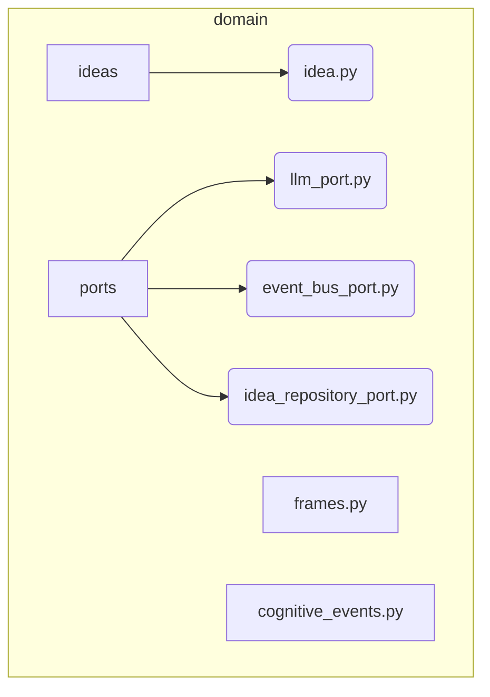


# Event and Signal System

**Description:** This subsystem manages the communication backbone of the system. It defines the hierarchy of signals (`EpistemicSignal`) that flow between components and provides the concrete event bus implementation for asynchronous, pub/sub-style communication. It is the primary means by which the `Reactor` is triggered.

---

## Public API / Contracts

- **`signals.base.EpistemicSignal`**: The base class for all signals in the system.
- **`signals.core.*`**: Specific, concrete signal types like `IdeaGeneratedSignal`, `TrustAssessmentSignal`, and `MathQuerySignal`.
- **`infrastructure.event_bus.memory_event_bus.MemoryEventBus`**: The concrete in-memory implementation of the `EventBusPort`.
- **`domain.ports.event_bus_port.EventBusPort`**: The abstract interface that all event bus implementations must satisfy.

---

## Dependencies (Imports From)

- `Domain_Model`

---

## Directory Layout (Conceptual)

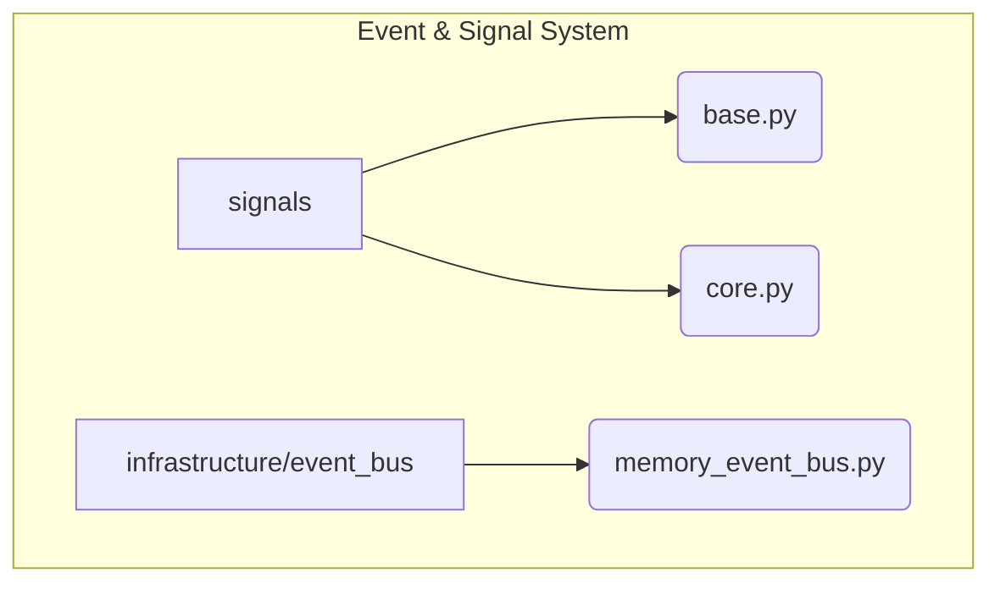


# Explorer Mechanism Subsystem

**Description:** A generative agent focused on creating novel variations of existing ideas. The Explorer's primary goal is to increase the diversity of the idea space by applying mutations and transformations, effectively "exploring" the conceptual neighborhood around a seed idea.

---

## Public API / Contracts

- **`components.mechanisms.explorer.service.ExplorerMechanism`**: The main component class, which implements the `NireonBaseComponent` lifecycle.
- **Accepted Signals:** Primarily triggered by a `SeedSignal` via a Reactor rule.
- **Produced Signals:** Emits `IdeaGeneratedSignal` for each new variation and `ExplorationCompleteSignal` upon finishing a task.

---

## Dependencies (Imports From)

- `Mechanism_Gateway`
- `Application_Services`
- `Event_and_Signal_System`
- `Domain_Model`
- `Kernel`

---

## Directory Layout (Conceptual)

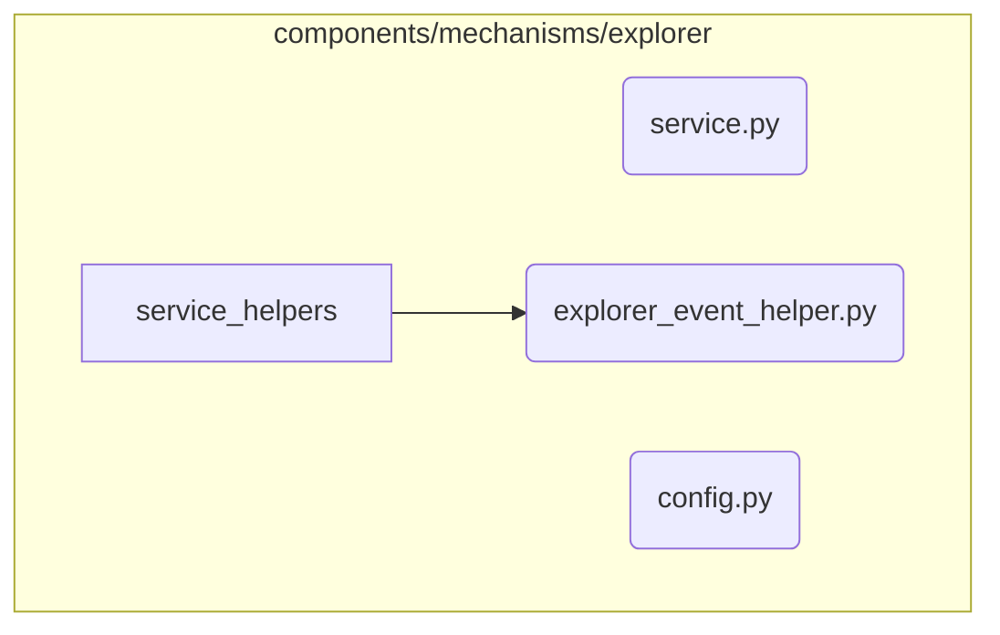


# Kernel Subsystem

**Description:** The absolute core of the Nireon V4 system. It defines the fundamental abstractions for all components, the component lifecycle, the central component registry, and standard result objects. As the foundational layer, it has **no dependencies** on other project subsystems and should only import from Python's standard library or third-party packages.

---

## Public API / Contracts

The Kernel's public contract consists of the essential base classes and data structures that the entire system is built upon.

- **`core.base_component.NireonBaseComponent`**: The abstract base class that all Nireon components must inherit from. It enforces the implementation of the standard component lifecycle methods (`initialize`, `process`, `analyze`, etc.).
- **`core.lifecycle.ComponentMetadata`**: The data class for describing a component's identity, capabilities, dependencies, and other static properties.
- **`core.registry.component_registry.ComponentRegistry`**: The concrete implementation of the central service registry where all components are stored and can be retrieved.
- **`core.results.ProcessResult`**: The standardized return object for any component's `process` method, indicating success/failure and carrying output data.
- **`core.results.AnalysisResult`**: The standardized return object for a component's `analyze` method, providing metrics and insights.

---

## Dependencies (Imports From)

- *None (stdlib and third-party only)*

---

## Directory Layout (Conceptual)

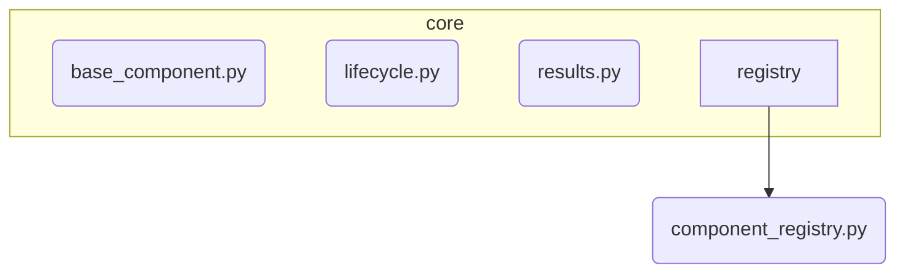


# LLM Subsystem

**Description:** This is a comprehensive subsystem for managing all interactions with Large Language Models. It is responsible for routing requests to different backends, applying context-specific parameters, handling failures with circuit breakers, and collecting performance metrics. It provides a unified and resilient interface to the rest of the application.

---

## Public API / Contracts

- **`infrastructure.llm.router.LLMRouter`**: The main entry point for making LLM calls. It implements the `LLMPort` interface and orchestrates the other components in this subsystem.
- **`infrastructure.llm.parameter_service.ParameterService`**: A service that resolves LLM parameters (e.g., temperature, max_tokens) based on the current `EpistemicStage` and agent role.
- **`infrastructure.llm.factory.create_llm_instance`**: A factory function used by the router to instantiate specific LLM backends based on configuration.
- **`domain.ports.llm_port.LLMPort`**: The abstract interface that all LLM backends (e.g., `OpenAILLMAdapter`) must implement.

---

## Dependencies (Imports From)

- `Domain_Model`
- `Kernel`
- `Event_and_Signal_System`

---

## Directory Layout (Conceptual)

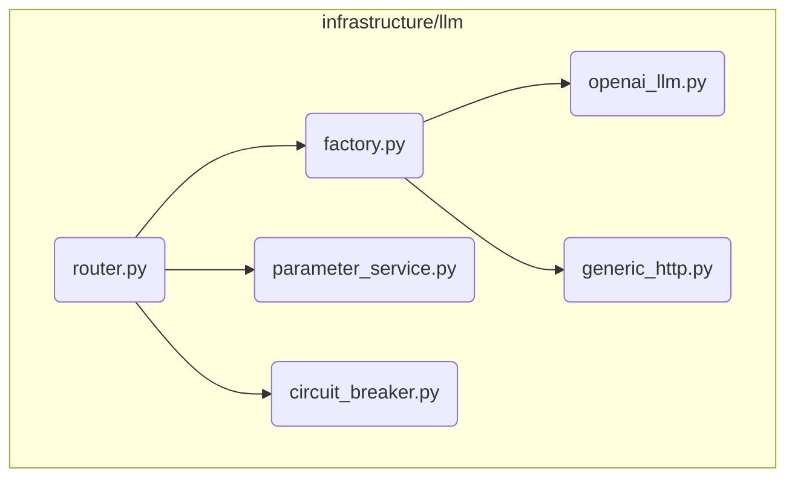


# Math Engine Subsystem

**Description:** A specialized subsystem for performing deterministic, symbolic mathematical computations. It is orchestrated by the `PrincipiaAgent`, which receives a `MathQuerySignal`, offloads the computation to a `MathPort` implementation (like the `SymPyAdapter`) via the Mechanism Gateway, and then uses an LLM to generate a human-readable explanation of the result, which is published as a `MathResultSignal`.

---

## Public API / Contracts

- **`components.mechanisms.math_agents.principia_agent.PrincipiaAgent`**: The agent that orchestrates the math task. It is the primary consumer of `MathQuerySignal`.
- **`infrastructure.math.sympy_adapter.SymPyAdapter`**: The concrete implementation of the `MathPort`, using the SymPy library for symbolic math.
- **Accepted Signals:** `MathQuerySignal` (defined in `signals/core.py`). This is the entry point for requesting a computation.
- **Produced Signals:** `MathResultSignal` (defined in `signals/core.py`). This is the final output containing the result and explanation.
- **Interface Port:** `domain.ports.math_port.MathPort`. This is the abstract contract that any math computation backend must implement.

---

## Dependencies (Imports From)

- `Mechanism_Gateway`: Used to make external calls for both computation (`MATH_COMPUTE`) and LLM-based explanation (`LLM_ASK`).
- `Event_and_Signal_System`: For defining and receiving the input/output signals (`MathQuerySignal`, `MathResultSignal`).
- `Domain_Model`: For the `MathPort` interface and `CognitiveEvent` structure.
- `Kernel`: For the `NireonBaseComponent` class.

---

## Directory Layout (Conceptual)

```mermaid
graph TD
    subgraph MathEngine [Math Engine]
        direction LR
        A[principia_agent.py] -- uses --> B((Gateway));
        B -- requests compute --> C[sympy_adapter.py];
        B -- requests explanation --> D((LLM Subsystem));
    end

    subgraph Signals
        E[MathQuerySignal] --> A;
        A --> F[MathResultSignal];
    end

    subgraph Domain
        G[MathPort]
    end

    C -- implements --> G;
# Mechanism Gateway Subsystem

**Description:** The Mechanism Gateway acts as a crucial façade, providing a single, controlled entry point for all cognitive mechanisms (`Explorer`, `Sentinel`, etc.) to interact with core system services. By routing all external calls through this gateway, we can enforce policies, manage budgets, and maintain a clean separation between mechanism logic and infrastructure concerns.

---

## Public API / Contracts

- **`infrastructure.gateway.mechanism_gateway.MechanismGateway`**: The concrete implementation of the gateway.
- **`domain.ports.mechanism_gateway_port.MechanismGatewayPort`**: The abstract interface that defines the gateway's capabilities.
- **`process_cognitive_event(CognitiveEvent)`**: The single method used by mechanisms to request services like LLM calls or event publishing.

---

## Dependencies (Imports From)

- `LLM_Subsystem`
- `Application_Services`
- `Event_and_Signal_System`
- `Domain_Model`
- `Kernel`

---

## Directory Layout (Conceptual)

```mermaid
graph TD
    subgraph MechanismGateway [infrastructure/gateway]
        A(mechanism_gateway.py)
        B(mechanism_gateway_metadata.py)
    end
```


# Observability Subsystem

**Description:** This subsystem contains all components related to monitoring system health, managing alerts, and collecting metrics. Its primary role is to provide insight into the system's operational status and performance.

---

## Public API / Contracts

- **`bootstrap.health.reporter.HealthReporter`**: The core class for collecting and reporting component health during the startup sequence.
- **`monitoring.placeholder_monitor.PlaceholderMonitor`**: A utility to detect if any placeholder/mock services are running in a production environment, which would indicate a misconfiguration.
- **`validation.tach.check_architecture.py`**: A script that uses `tach` to enforce architectural layer boundaries, ensuring modules do not have invalid dependencies.

---

## Dependencies (Imports From)

- `Kernel`
- `Application_Services`

---

## Directory Layout (Conceptual)

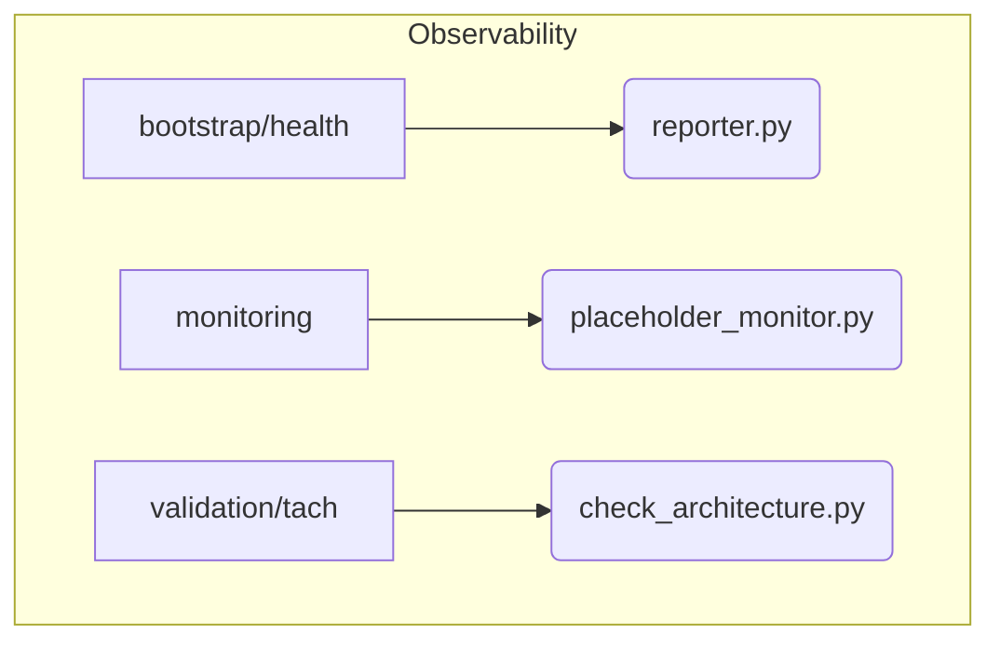


# Persistence and Storage Subsystem

**Description:** This infrastructure layer is responsible for the concrete implementation of data persistence and retrieval. It provides the backends for storing and querying `Idea` objects and their associated vector embeddings.

---

## Public API / Contracts

- **`infrastructure.persistence.idea_repository.IdeaRepository`**: The concrete SQLite-based implementation of the `IdeaRepositoryPort`.
- **`infrastructure.vector_memory.inmemory_store.InMemoryVectorStore`**: A concrete in-memory implementation of the `VectorMemoryPort`, suitable for testing and development.

---

## Dependencies (Imports From)

- `Domain_Model` (for `Idea`, `Vector`, and the port definitions)

---

## Directory Layout (Conceptual)

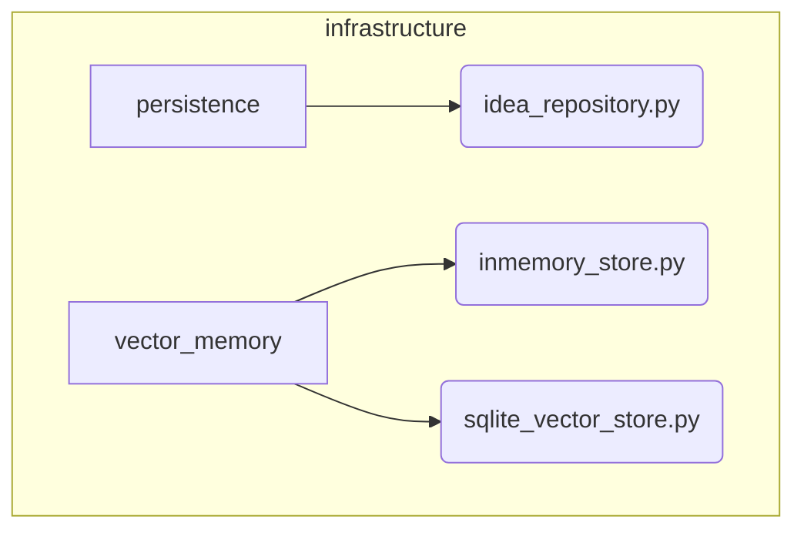


# Reactor Subsystem

**Description:** The Reactor is a declarative, rule-based engine that forms the central nervous system of Nireon. It listens for all signals on the event bus and triggers component actions based on a set of conditions defined in YAML rule files. This allows for complex, emergent behaviors to be defined and modified without changing core component code.

---

## Public API / Contracts

- **`reactor.engine.main.MainReactorEngine`**: The primary implementation of the reactor logic.
- **`reactor.loader.RuleLoader`**: The utility responsible for parsing rule definitions from `configs/reactor/rules/*.yaml` files.
- **`domain.ports.reactor_port.ReactorPort`**: The abstract interface for the reactor engine.

---

## Dependencies (Imports From)

- `Event_and_Signal_System`
- `Application_Services` (for the `ComponentRegistry`)
- `Kernel`

---

## Directory Layout (Conceptual)

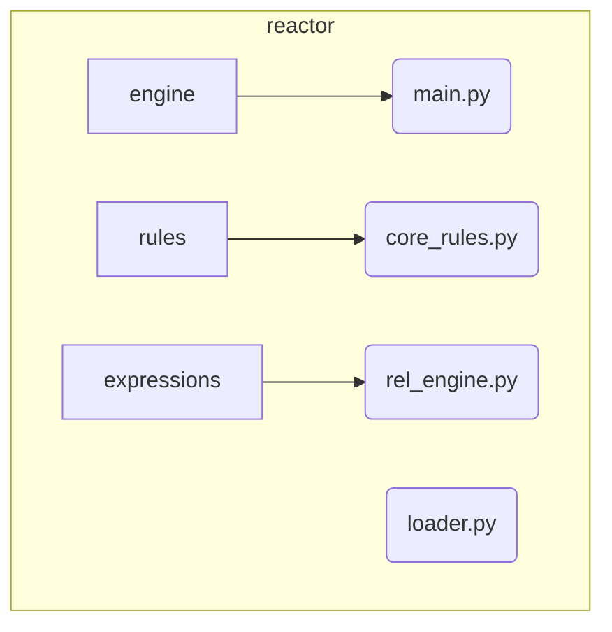


# Security RBAC Subsystem

**Description:** The Role-Based Access Control (RBAC) system for Nireon. It includes the policy engine responsible for evaluating permissions and the decorators used to protect sensitive functions and methods. Policies are defined in `bootstrap_rbac.yaml` and loaded during the bootstrap process.

---

## Public API / Contracts

- **`security.rbac_engine.RBACPolicyEngine`**: The engine that evaluates permissions based on loaded rules.
- **`security.decorators.requires_permission`**: The primary decorator used to enforce access control on functions and methods.
- **`security.execution_context`**: Manages the current subject (user/agent) for permission checks.

---

## Dependencies (Imports From)

- `Kernel` (for registry access, indirectly)

---

## Directory Layout (Conceptual)

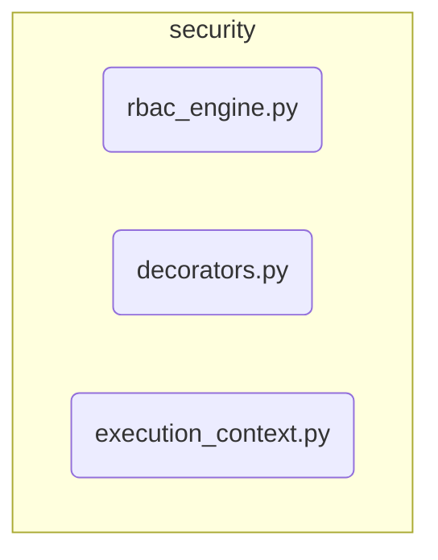


# Sentinel Mechanism Subsystem

**Description:** An evaluative agent responsible for quality control. The Sentinel assesses ideas against multiple axes—such as alignment with objectives, feasibility, and novelty—to produce a `trust_score`. This score determines whether an idea is "stable" enough to proceed or should be rejected.

---

## Public API / Contracts

- **`components.mechanisms.sentinel.service.SentinelMechanism`**: The main component class.
- **Accepted Signals:** Primarily triggered by an `IdeaGeneratedSignal` via a Reactor rule.
- **Produced Signals:** Emits a `TrustAssessmentSignal` containing the evaluation results for an idea.

---

## Dependencies (Imports From)

- `Mechanism_Gateway`
- `Application_Services`
- `Event_and_Signal_System`
- `Domain_Model`
- `Kernel`

---

## Directory Layout (Conceptual)

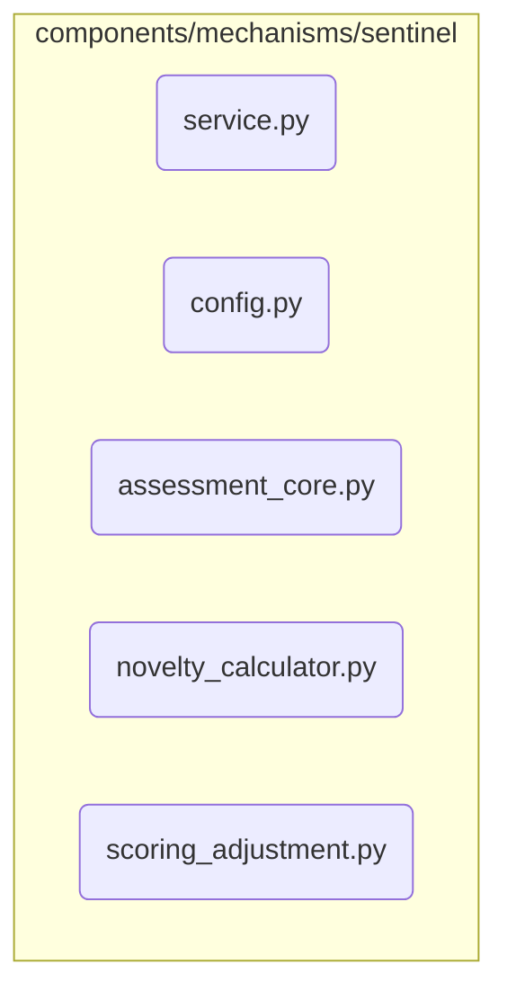


# Testing and Runners Subsystem

**Description:** This subsystem contains all code related to testing, debugging, and running specific parts of the system. It includes unit tests, integration tests, standalone runner scripts (like for the math engine), and development utilities. **None of this code should be part of the production runtime.**

---

## Public API / Contracts

- This subsystem does not have a public API. It is a collection of developer-facing tools and validation scripts.
- Key scripts include:
    - `01_math_runner/unified_math_loader.py`: A CLI for testing the `Math_Engine`.
    - `tests/llm_subsystem/llm_test_cli.py`: A CLI for testing the `LLM_Subsystem`.
    - `run_explorer_test.py`: A script to kick off a test run of the generative mechanisms.

---

## Dependencies (Imports From)

- *All other subsystems*, as it is designed to test them.

---

## Directory Layout (Conceptual)

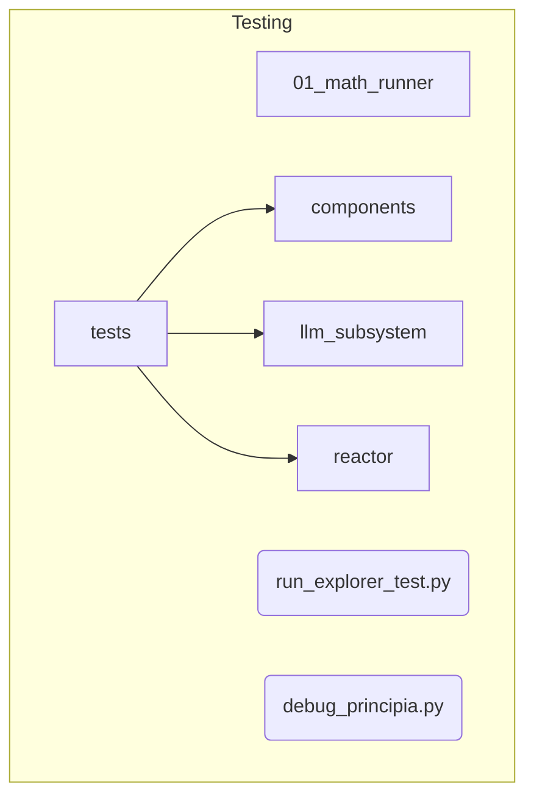


