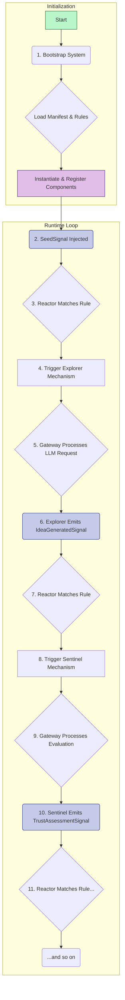
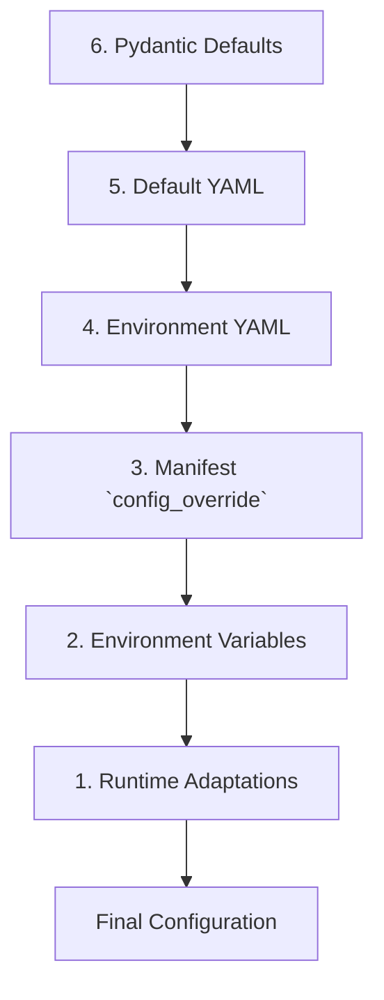
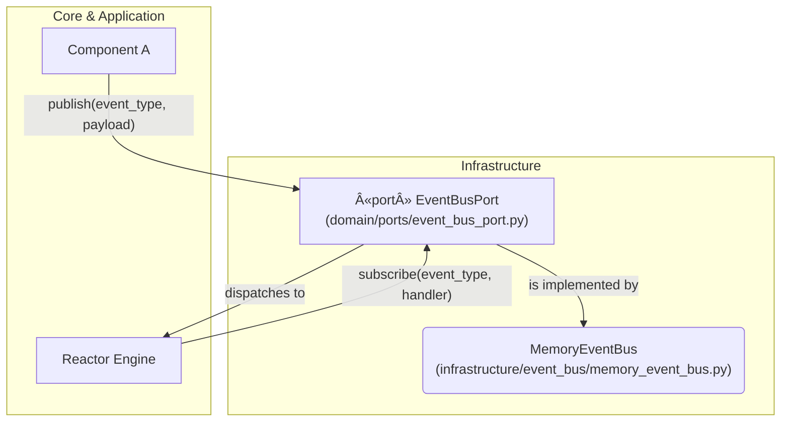
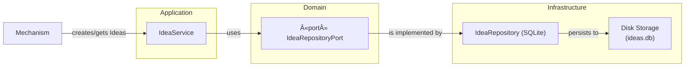

## **0. NIREON V4: An Architectural & Philosophical Overview**

This document serves as the technical reference and developer guide for NIREON V4, a system designed for the structured evolution and analysis of ideas. This introductory section outlines the project's core philosophy, high-level design intentions, and the key architectural paradigms that govern its implementation.

---

### **0.1. The Mission: Principled Idea Evolution**

NIREON is not merely a collection of AI agents; it is an **epistemic engine**. Its primary mission is to provide a robust, traceable, and configurable environment for exploring complex conceptual spaces. The system is built on the premise that true innovation arises from a structured, cyclical process of generation, critique, synthesis, and adaptation.

The core philosophy of NIREON V4 is to model this process explicitly through its architecture, ensuring that every step of an idea's lifecycle—from its initial seeding to its eventual stabilization or rejection—is a governed and observable event.

---

### **0.2. Key Architectural Pillars**

The architecture of NIREON V4 is founded on four key pillars that work in concert to achieve its mission.

1.  **Declarative Orchestration (The Reactor):**
    *   **Intention:** To separate the "what" from the "how." Instead of components being hardwired to call each other, their interactions are orchestrated by a central **Reactor** engine.
    *   **Implementation:** The Reactor listens for signals (events) and triggers component actions based on a set of human-readable YAML rules. This means the system's core reasoning loops can be modified, rewired, or extended by changing configuration files, not by rewriting Python code. This makes the system transparent, flexible, and adaptable.

2.  **Component-Based Modularity:**
    *   **Intention:** To treat every functional unit—whether it's a generative agent, an evaluator, or a core service—as a self-contained, swappable component with a clearly defined contract.
    *   **Implementation:** Every component inherits from a `NireonBaseComponent`, implementing a standard lifecycle (`initialize`, `process`, `health_check`, etc.). Components are registered in a central `ComponentRegistry` during a phased **Bootstrap** process, making them discoverable and manageable.

3.  **The AâžœFâžœCE Ontology (The Gateway):**
    *   **Intention:** To ensure that all significant cognitive work is contextualized, governed, and traceable. Unconstrained, "free-floating" actions are forbidden.
    *   **Implementation:** This is enforced by the **Agent ➜ Frame ➜ Cognitive Event (A➜F➜CE)** model. An **Agent** (a component) must operate within a **Frame** (a bounded context with goals, rules, and resource budgets). Every action the agent takes, such as calling an LLM or publishing a signal, is encapsulated in a **Cognitive Event**. The **Mechanism Gateway** is the single entry point that validates and processes these events, acting as a universal policy enforcement layer.

4.  **Port-and-Adapter Architecture (Decoupling):**
    *   **Intention:** To keep the core application logic pure and independent of any specific external technology (like a particular database, LLM provider, or message queue).
    *   **Implementation:** The `domain/` layer defines abstract interfaces called **Ports** (e.g., `LLMPort`, `IdeaRepositoryPort`). The `infrastructure/` layer provides concrete **Adapters** that implement these ports (e.g., `OpenAILLMAdapter`, `IdeaRepository` using SQLite). Components in the application layer only code against the abstract Ports, allowing the underlying technology to be swapped out with zero changes to the core logic.

---

### **0.3. The High-Level System Flow**

A typical generative cycle in NIREON V4 follows this high-level flow:



1.  **Bootstrap:** The system starts, loading all components and rules from configuration.
2.  **Seed:** An initial `SeedSignal` is injected into the system.
3.  **Reactor:** The Reactor catches the signal and, based on a rule in `core.yaml`, triggers the Explorer mechanism.
4.  **Explorer:** The Explorer, operating within a new `Frame`, uses the `MechanismGateway` to call an LLM to generate variations of the seed idea.
5.  **Signal Emission:** For each new variation, the Explorer emits an `IdeaGeneratedSignal` (again, via the Gateway).
6.  **Sentinel Trigger:** The Reactor catches each `IdeaGeneratedSignal` and triggers the Sentinel mechanism to evaluate the new idea.
7.  **Assessment:** The Sentinel assesses the idea's trust and stability and emits a `TrustAssessmentSignal`.
8.  **Further Action:** The Reactor catches the `TrustAssessmentSignal`. Depending on the result (e.g., if the trust score is high), it might trigger another component like the `Catalyst` or `QuantifierAgent`, or it might end the loop by emitting a `GenerativeLoopFinishedSignal`.

This signal-driven, rule-based flow allows for complex, multi-agent interactions to emerge from simple, declarative definitions.

---

### **0.4. What to Expect as a Developer**

*   **You will work with YAML:** The primary way to change system behavior is by editing configuration files in `configs/`, especially `standard.yaml` (for components) and files in `configs/reactor/rules/` (for logic).
*   **You will build decoupled components:** When creating a new mechanism, you will focus on its core logic and its interactions with the `MechanismGateway`, not on the specifics of how to call OpenAI or write to a database.
*   **You will think in terms of signals:** Communication is asynchronous. Your component will be triggered by incoming signals and will emit new signals to influence the system.
*   **You will write tests:** The modular architecture makes unit testing components in isolation a primary development practice.
*   **You will respect the layers:** The CI system enforces architectural boundaries. Understanding the roles of `domain`, `application`, and `infrastructure` is key to contributing effectively.

Welcome to NIREON V4. This guide will provide the details needed to navigate, understand, and extend the system.
### **Section 10: Operations & Deployment**

This new section provides guidance on deploying, scaling, and monitoring a NIREON V4 instance in a production environment.

#### **10.1. Deployment Strategy**

NIREON V4 is designed to be deployed as a containerized application.

*   **Recommended Environment:** A Docker or Kubernetes-based environment.
*   **Dockerfile:** A production-ready `Dockerfile` should be used to build the application image. It should:
    1.  Start from a stable Python base image (e.g., `python:3.12-slim`).
    2.  Install `poetry` and use it to install only production dependencies (`poetry install --no-dev`).
    3.  Copy the `nireon_v4/` application code into the image.
    4.  Set the working directory and a non-root user for security.
    5.  Define the `CMD` or `ENTRYPOINT` to launch the main application (e.g., via a master script that calls `bootstrap_nireon_system`).
*   **Configuration Management:**
    *   **Docker/Compose:** Use a `.env` file passed to `docker-compose.yml` to manage environment variables.
    *   **Kubernetes:** Use `ConfigMaps` for non-sensitive configuration and `Secrets` for API keys and database credentials. These should be mounted into the application container as environment variables.

#### **10.2. Scaling and Concurrency**

The architecture supports scaling at multiple levels:

*   **Vertical Scaling:** Increasing the CPU and memory allocated to the NIREON container will improve the performance of CPU-bound tasks and allow for larger in-memory caches (e.g., for `MemoryEventBus`, `InMemoryVectorStore`).
*   **Horizontal Scaling (Read-Only Workloads - Advanced):** While the default `MemoryEventBus` and `SQLite` repositories are single-instance, the system can be scaled for read-heavy or stateless workloads.
    *   **Stateless Mechanisms:** Multiple instances of NIREON can be run if they connect to a shared, production-grade `EventBus` (like RabbitMQ/Kafka) and `IdeaRepository` (like PostgreSQL).
    *   **Workload Partitioning:** Different NIREON instances could be configured to run only specific mechanisms by enabling/disabling them in their respective manifests, allowing for dedicated "generator" nodes and "evaluator" nodes.
*   **Proto-Engine Scaling:** The `DockerExecutor` for the Proto-Plane naturally scales, as each execution runs in its own isolated container. A powerful host machine can run many sandboxed `ProtoBlock` executions concurrently.

#### **10.3. Monitoring and Observability**

A comprehensive monitoring strategy is essential for production health.

1.  **Logging:**
    *   **Destination:** Configure the Python `logging` module to output structured JSON logs to `stdout`.
    *   **Ingestion:** Use a log aggregator like Fluentd, Logstash, or a cloud provider's native service (e.g., AWS CloudWatch Logs, Google Cloud Logging) to collect, index, and search logs from all running instances.
2.  **Metrics (Prometheus/Grafana):**
    *   **Exposition:** Implement a small web server (e.g., using FastAPI or Flask) within NIREON that exposes a `/metrics` endpoint.
    *   **Collector:** A dedicated metrics collector component would aggregate stats from key services (`LLMRouter`, `IdeaRepository`, `EventBus`) and format them for Prometheus scraping. The `LLMMetricsCollector` is a prime example of this pattern.
    *   **Dashboarding:** Use Grafana to build dashboards that visualize key SLIs (Service Level Indicators) like:
        *   `nireon_llm_calls_total` (with labels for model, success/failure)
        *   `nireon_llm_duration_ms_histogram`
        *   `nireon_event_bus_published_total`
        *   `nireon_idea_repository_count`
        *   `nireon_bootstrap_duration_seconds`
3.  **Health Checks:**
    *   The `health_check()` method on components can be exposed via an HTTP endpoint (e.g., `/health`).
    *   Container orchestrators like Kubernetes can use this endpoint for liveness and readiness probes to automatically manage application health.

#### **10.4. Performance Benchmarks**

While performance is hardware-dependent, the following are baseline expectations for a standard development environment (e.g., a modern laptop with an SSD and 16GB RAM):

*   **Bootstrap Time:** A full system bootstrap should complete in **under 10 seconds**. Times significantly longer may indicate issues with I/O or network dependencies during initialization.
*   **Idea Generation Cycle (Single):** From `SeedSignal` to the first `TrustAssessmentSignal` for a generated idea, the p95 latency should be **under 5 seconds** (heavily dependent on LLM provider latency).
*   **Reactor Throughput:** The Reactor should be able to process several hundred signals per second for simple routing rules.
*   **Embedding Throughput (Local):** The `SentenceTransformerAdapter` should be able to encode **50-100+ embeddings per second** in batch mode.

### **Section 11: Troubleshooting & Integration**

This new section provides solutions to common problems and guides for advanced integration.

#### **11.1. Common Errors & Troubleshooting Guide**

*   **Error: `Bootstrap failed: Component ... not found in registry`**
    *   **Cause:** A component declared a dependency that was not successfully registered.
    *   **Solution:** Check the bootstrap logs for earlier errors. Did the missing component fail to instantiate? Is it correctly defined in `standard.yaml`? Is it marked `enabled: true`?

*   **Error: `Reactor rule ... did not trigger`**
    *   **Cause:** The conditions for the rule were not met.
    *   **Solution:**
        1.  Check the signal type: Does `signal_type_match` in your rule exactly match the `signal_type` of the signal being emitted?
        2.  Debug the `payload_expression`: Add logging inside `reactor/expressions/rel_engine.py` to print the expression and the context it's being evaluated against.
        3.  Check rule priority: Is another, higher-priority rule catching the signal first and stopping propagation?

*   **Error: `MechanismGateway: BudgetExceededError`**
    *   **Cause:** A `Frame` has exhausted its allocated resources (e.g., `llm_calls`).
    *   **Solution:** Increase the `resource_budget` for the `Frame` being created in the component that initiates the task (e.g., in the `ExplorerMechanism`'s `_process_impl` method).

*   **Error: `ProtoEngine: ImageNotFound`**
    *   **Cause:** The Docker image required for a Proto-Block's dialect (e.g., `nireon-proto-math:latest`) has not been built locally.
    *   **Solution:** Navigate to the `docker/` directory for that dialect and run `docker build -t <image_name> .`.

#### **11.2. Integration with External Data Sources**

To integrate a new data source (e.g., a SQL database, a REST API), follow the Port-and-Adapter pattern:

1.  **Define the Port:** In `domain/ports/`, create a new protocol defining the methods you need (e.g., `class UserDataPort(Protocol): def get_user_profile(user_id: str) -> dict: ...`).
2.  **Create the Adapter:** In `infrastructure/`, create a new directory (e.g., `infrastructure/user_data/`) and implement a concrete class that adheres to your new Port (e.g., `class SqlUserDataAdapter(UserDataPort): ...`). This class will contain the specific logic for connecting to and querying your data source.
3.  **Register in Manifest:** In `standard.yaml`, add your new adapter as a `shared_service`.
    ```yaml
    shared_services:
      UserDataPort: # Register it by its Port type
        class: "infrastructure.user_data.sql_adapter:SqlUserDataAdapter"
        config:
          connection_string: "${USER_DB_URL}"
    ```
4.  **Inject and Use:** In any component's `_initialize_impl` method, resolve your service via the registry and use it.
    ```python
    async def _initialize_impl(self, context: NireonExecutionContext):
        self.user_data_service = context.component_registry.get_service_instance(UserDataPort)
    ```

#### **11.3. Migration Guide for Custom Components**

When a new MAJOR version of NIREON is released, core contracts may change. To migrate your custom components:

1.  **Review the Changelog:** The release notes will detail all breaking changes to `NireonBaseComponent`, core signals, and essential `Ports`.
2.  **Update `NireonBaseComponent` Methods:** If method signatures in the base class have changed (e.g., a new parameter was added to `_process_impl`), update your component's implementation to match.
3.  **Update Signal Usage:** If `EpistemicSignal` schemas have changed, update the code that creates or consumes those signals.
4.  **Update Pydantic Configs:** Use Pydantic's `@validator(..., pre=True)` to create backward-compatible configuration models that can load older YAML files by renaming or transforming fields on the fly.
5.  **Run Tests:** The CI test suite is the best way to catch integration issues after a migration. Run `pytest` and fix any failures related to your component.
## **1. Developer Onboarding & Getting Started**

This section provides a practical guide for developers to set up, run, and begin contributing to the NIREON V4 project.

---

### **1.1. Prerequisites**

Before you begin, ensure you have the following installed on your system:

*   **Python:** Version 3.12 or higher.
*   **Poetry:** The recommended dependency and environment manager for this project.
*   **Git:** For version control.
*   **Docker:** (Recommended) For running components in a sandboxed environment, especially the `ProtoEngine`.
*   **(Optional) An OpenAI API Key:** To use the default LLM configurations, you will need an OpenAI API key.

---

### **1.2. Initial Setup**

Follow these steps to get your local development environment running.

1.  **Clone the Repository:**
    ```sh
    git clone <your_repository_url>
    cd nireon_v4
    ```

2.  **Install Dependencies:**
    Use Poetry to create a virtual environment and install all required packages from `pyproject.toml`.
    ```sh
    poetry install
    ```

3.  **Activate the Virtual Environment:**
    To work with the installed dependencies, activate the Poetry shell.
    ```sh
    poetry shell
    ```

4.  **Set Up Environment Variables:**
    The system uses environment variables for secrets like API keys. Create a `.env` file in the project root (`nireon_v4/`) to manage them locally.
    ```sh
    # In your new .env file
    OPENAI_API_KEY="sk-..."
    ```
    The application will automatically load this file on startup.

---

### **1.3. Running Core Tests**

Before making any changes, verify that the system is in a good state by running the core test suites.

1.  **Run All Unit & Integration Tests:**
    From the project root (`nireon_v4/`), run `pytest`.
    ```sh
    pytest
    ```
    All tests should pass. This confirms that the core logic and component interactions are working as expected.

2.  **Check Architectural Hygiene:**
    NIREON V4 uses `tach` to enforce its layered architecture. This check ensures that no module improperly imports from another, maintaining clean dependencies.
    ```sh
    tach check
    ```
    This command should exit with a "checks passed" message.

---

### **1.4. First Run: The Explorer Test Script**

The easiest way to see the full system in action is to run the end-to-end explorer test script. This script bootstraps the entire application, injects a seed idea, and runs a full generative loop through the Reactor, Explorer, and Sentinel.

```sh
# From the nireon_v4/ directory
python run_explorer_test.py
```

**What to Expect:**

1.  Logs showing the **Bootstrap** process initializing all components.
2.  Logs from the **Reactor** matching the initial `SeedSignal` to a rule.
3.  Logs from the **ExplorerMechanism** indicating it's generating idea variations.
4.  Logs from the **SentinelMechanism** showing it's assessing the newly generated ideas.
5.  If a high-trust idea is generated, you may see logs from the **QuantifierAgent** and **ProtoEngine** as they are triggered.
6.  A final JSON result file will be saved in the `runtime/` directory, containing a tree of the generated ideas and their trust scores.

This script is your primary tool for verifying that the core epistemic loop is functioning correctly after you've made changes.

---

### **1.5. Using the LLM Test CLI**

To test specific LLM models or routes without running the full system, use the `llm_test_cli.py` script. This is invaluable for debugging prompts and validating your `llm_config.yaml`.

*   **Validate your LLM config:**
    ```sh
    python -m tests.llm_subsystem.llm_test_cli validate-config
    ```

*   **Test connectivity to a specific model:**
    ```sh
    python -m tests.llm_subsystem.llm_test_cli test-connectivity --model nano_default
    ```

*   **Send an interactive prompt:**
    ```sh
    python -m tests.llm_subsystem.llm_test_cli interactive
    ```
    This will drop you into a shell where you can test different models and prompts directly.

---

### **1.6. Key Directories for Developers**

*   `bootstrap/`: The system startup logic. Modify this if you need to change the initialization sequence.
*   `configs/`: All declarative configuration.
    *   `manifests/standard.yaml`: The primary file for registering components.
    *   `reactor/rules/`: Where all signal-to-action logic lives.
    *   `default/llm_config.yaml`: The central hub for all LLM configuration.
*   `components/`: The home for all core mechanisms, observers, and managers. Start here when adding new agents.
*   `domain/`: The heart of the application's business logic, containing data models (`Idea`, `Frame`) and abstract interfaces (`Ports`).
*   `infrastructure/`: Concrete implementations of the `Ports` defined in the domain (e.g., `MemoryEventBus`, `LLMRouter`, `IdeaRepository`).
*   `signals/`: Definitions for all `EpistemicSignal` types that flow through the system.
*   `tests/`: All unit and integration tests. New code should be accompanied by new tests here.

---

**(The rest of the documentation would follow, starting with Section 2: NIREON V4 Subsystem Contracts & Responsibilities)**
## **2. NIREON V4 Subsystem Contracts & Responsibilities**

This section defines the public contracts, responsibilities, and architectural role for every major subsystem in the NIREON V4 repository. It is the authoritative reference for what each module does, what it exposes, and how it interacts with the rest of the system.

---

### **2.1. Kernel**

*   **Description:** The absolute core of the Nireon V4 system. Defines fundamental abstractions, the component lifecycle, the central component registry, and result objects. As the foundational layer, it has no dependencies on other project subsystems.
*   **🔑 Key Concepts:** `NireonBaseComponent`, `ComponentLifecycle`, `ComponentMetadata`, `ProcessResult`, `ComponentHealth`, `ComponentRegistry`.
*   **📄 Key Files:**
    *   `nireon_v4/core/base_component.py`
    *   `nireon_v4/core/lifecycle.py`
    *   `nireon_v4/core/registry/component_registry.py`
    *   `nireon_v4/core/results.py`
*   **🔗 Depends On:** None.

---

### **2.2. Domain Model**

*   **Description:** Defines the core business logic concepts (e.g., `Idea`, `Frame`, `CognitiveEvent`) and the abstract interfaces (`Ports`) that decouple the application from the infrastructure. This layer ensures the application's core is independent of specific technologies.
*   **🔑 Key Concepts:** `Idea`, `Frame`, `CognitiveEvent`, `LLMRequestPayload`, `NireonExecutionContext`, and all `...Port` protocols (e.g., `LLMPort`, `EventBusPort`, `MechanismGatewayPort`).
*   **📄 Key Files:**
    *   `nireon_v4/domain/ideas/idea.py`
    *   `nireon_v4/domain/frames.py`
    *   `nireon_v4/domain/cognitive_events.py`
    *   `nireon_v4/domain/context.py`
    *   `nireon_v4/domain/ports/` (entire directory)
*   **🔗 Depends On:** `Kernel`.

---

### **2.3. Event & Signal System**

*   **Description:** Manages the communication backbone of the system. It defines the hierarchy of signals (`EpistemicSignal`) that flow between components and provides the concrete event bus implementation for asynchronous, pub/sub-style communication.
*   **🔑 Key Concepts:** `EpistemicSignal` (and all subclasses like `IdeaGeneratedSignal`, `TrustAssessmentSignal`), `EventBusPort`, `MemoryEventBus`.
*   **📄 Key Files:**
    *   `nireon_v4/signals/base.py`, `nireon_v4/signals/core.py`
    *   `nireon_v4/infrastructure/event_bus/memory_event_bus.py`
*   **🔗 Depends On:** `Domain Model`.

---

### **2.4. Application Services**

*   **Description:** Contains high-level services that orchestrate domain logic and provide core application capabilities. These services act as the connective tissue between the abstract domain model and the concrete mechanisms, often encapsulating business rules that are not specific to any single mechanism.
*   **🔑 Key Concepts:** `FrameFactoryService`, `IdeaService`, `EmbeddingService`, `BudgetManagerPort`.
*   **📄 Key Files:**
    *   `nireon_v4/application/services/frame_factory_service.py`
    *   `nireon_v4/application/services/idea_service.py`
    *   `nireon_v4/application/services/embedding_service.py`
    *   `nireon_v4/application/services/budget_manager.py`
    *   `nireon_v4/application/services/stage_evaluation_service.py`
*   **🔗 Depends On:** `Kernel`, `Domain Model`, `Event_and_Signal_System`.

---

### **2.5. LLM Subsystem**

*   **Description:** A comprehensive subsystem for managing all interactions with Large Language Models. It is responsible for routing requests to different backends, applying context-specific parameters, handling failures with circuit breakers, and collecting performance metrics.
*   **🔑 Key Concepts:** `LLMRouter`, `ParameterService`, `CircuitBreaker`, `GenericHttpLLM`.
*   **📄 Key Files:**
    *   `nireon_v4/infrastructure/llm/router.py`
    *   `nireon_v4/infrastructure/llm/parameter_service.py`
    *   `nireon_v4/infrastructure/llm/factory.py`
    *   `nireon_v4/infrastructure/llm/generic_http.py`
*   **🔗 Depends On:** `Domain Model`, `Kernel`.
*   **🧠 LLM Guidance:** When reasoning about this subsystem, understand that its primary goal is resilience and flexibility. The router abstracts away specific LLM backends, so changes should focus on routing logic, parameter resolution, or circuit-breaking policies, not on hardcoding provider-specific details.

---

### **2.6. Mechanism Gateway**

*   **Description:** A crucial architectural façade that provides a single, controlled entry point for all cognitive mechanisms to interact with core system services. By routing all external calls through this gateway, we can enforce policies (like budgets), manage context (via Frames), and maintain a clean separation between mechanism logic and infrastructure concerns.
*   **🔑 Key Concepts:** `MechanismGatewayPort`, `MechanismGateway`, `CognitiveEvent`. This is the primary interface used by all mechanisms.
*   **📄 Key Files:**
    *   `nireon_v4/infrastructure/gateway/mechanism_gateway.py`
    *   `nireon_v4/domain/ports/mechanism_gateway_port.py`
*   **🔗 Depends On:** `LLM_Subsystem`, `Application_Services`, `Event_and_Signal_System`, `Domain_Model`.

---

### **2.7. Reactor Subsystem**

*   **Description:** A declarative, rule-based engine that forms the central nervous system of Nireon. It listens for all signals on the event bus and triggers component actions based on a set of conditions defined in YAML rule files. This allows for complex, emergent behaviors to be defined without changing core component code.
*   **🔑 Key Concepts:** `ReactorEngine`, `ReactorRule`, `RuleLoader`, `REL (Rule Expression Language)`.
*   **📄 Key Files:**
    *   `nireon_v4/reactor/engine/main.py`
    *   `nireon_v4/reactor/loader.py`
    *   `nireon_v4/reactor/core_rules.py`
    *   `nireon_v4/configs/reactor/rules/` (directory)
*   **🔗 Depends On:** `Event_and_Signal_System`, `Kernel`.

---

### **2.8. Explorer Mechanism**

*   **Description:** A generative agent focused on creating novel variations of existing ideas. The Explorer's primary goal is to increase the diversity of the idea space by applying mutations and transformations, effectively "exploring" the conceptual neighborhood around a seed idea. It operates within a `Frame` and uses the `MechanismGateway` for all external interactions.
*   **🔑 Key Concepts:** `ExplorerMechanism`, `ExplorerConfig`, `IdeaGeneratedSignal`.
*   **📄 Key Files:**
    *   `nireon_v4/components/mechanisms/explorer/service.py`
    *   `nireon_v4/components/mechanisms/explorer/config.py`
*   **🔗 Depends On:** `Mechanism_Gateway`, `Application_Services`, `Event_and_Signal_System`.
*   **💡 LLM Guidance:** The core intent is to generate novel and divergent variations. When analyzing or refactoring, prioritize logic that enhances creativity and exploration breadth/depth. Avoid adding logic that is overly critical or evaluative, as that is the Sentinel's role.

---

### **2.9. Sentinel Mechanism**

*   **Description:** An evaluative agent responsible for quality control. The Sentinel assesses ideas against multiple axes—such as alignment with objectives, feasibility, and novelty—to produce a `trust_score`. This score determines whether an idea is "stable" enough to proceed or should be rejected. It is the primary gatekeeper in the idea lifecycle.
*   **🔑 Key Concepts:** `SentinelMechanism`, `IdeaAssessment`, `TrustAssessmentSignal`.
*   **📄 Key Files:**
    *   `nireon_v4/components/mechanisms/sentinel/service.py`
    *   `nireon_v4/components/mechanisms/sentinel/assessment_core.py`
    *   `nireon_v4/components/mechanisms/sentinel/config.py`
*   **🔗 Depends On:** `Mechanism_Gateway`, `Application_Services`, `Event_and_Signal_System`.
*   **💡 LLM Guidance:** The core intent is critical, objective evaluation against defined axes. The LLM's role here is to provide structured, parseable JSON output, not creative text.

---

### **2.10. Catalyst Mechanism**

*   **Description:** A synthesis-focused agent designed to foster creativity by blending concepts from different domains. The Catalyst takes an existing idea and "injects" influence from a specified cross-domain vector, creating a novel, hybrid concept. Its goal is to bridge disciplinary boundaries and spark interdisciplinary thinking.
*   **🔑 Key Concepts:** `CatalystMechanism`, `CatalystConfig`, Vector Blending.
*   **📄 Key Files:**
    *   `nireon_v4/components/mechanisms/catalyst/service.py`
    *   `nireon_v4/components/mechanisms/catalyst/vector.py`
    *   `nireon_v4/components/mechanisms/catalyst/config.py`
*   **🔗 Depends On:** `Mechanism_Gateway`, `Application_Services`, `Event_and_Signal_System`.
*   **💡 LLM Guidance:** The core intent is creative synthesis and the blending of disparate concepts. The goal is a surprising but coherent hybrid idea. When analyzing, focus on the effectiveness of the vector blending and the quality of the LLM-generated hybrid text.

---

### **2.11. Math Engine (Principia)**

*   **Description:** A specialized subsystem for performing deterministic, symbolic mathematical computations. It is orchestrated by the `PrincipiaAgent`, which receives a `MathQuerySignal`, offloads the computation to a `MathPort` implementation (like the `SymPyAdapter`) via the Mechanism Gateway, and then uses an LLM to generate a human-readable explanation of the result, which is published as a `MathResultSignal`.
*   **🔑 Key Concepts:** `PrincipiaAgent`, `MathPort`, `SymPyAdapter`, `MathQuerySignal`, `MathResultSignal`.
*   **📄 Key Files:**
    *   `nireon_v4/components/mechanisms/math_agents/principia_agent.py`
    *   `nireon_v4/infrastructure/math/sympy_adapter.py`
*   **🔗 Depends On:** `Mechanism_Gateway`, `Event_and_Signal_System`.
*   **💡 LLM Guidance:** The LLM's role in this subsystem is strictly for explanation. It translates the structured, symbolic output from the math computation into a clear, human-readable, step-by-step explanation. It should not perform any computation itself.

---

### **2.12. Proto-Plane (Execution & Generation)**

*   **Description:** A powerful subsystem for executing arbitrary, declarative tasks ("Proto blocks") in a secure, sandboxed environment. It consists of the `ProtoGenerator`, which translates natural language into a YAML Proto block, and the `ProtoEngine`, which executes these blocks. This allows for dynamic, on-the-fly creation of complex computational tasks.
*   **🔑 Key Concepts:** `ProtoBlock`, `ProtoEngine`, `ProtoGenerator`, `ProtoTaskSignal`, `ProtoResultSignal`.
*   **📄 Key Files:**
    *   `nireon_v4/proto_engine/service.py`
    *   `nireon_v4/proto_engine/executors/docker.py`
    *   `nireon_v4/proto_generator/service.py`
    *   `nireon_v4/domain/proto/base_schema.py`
*   **🔗 Depends On:** `LLM_Subsystem`, `Event_and_Signal_System`, `Application_Services`.

---

### **2.13. Security & RBAC**

*   **Description:** The Role-Based Access Control (RBAC) system for Nireon. It includes the policy engine responsible for evaluating permissions and the decorators used to protect sensitive functions and methods. Policies are defined in `bootstrap_rbac.yaml` and loaded during the bootstrap process.
*   **🔑 Key Concepts:** `RBACPolicyEngine`, `RBACRule`, `@requires_permission` decorator.
*   **📄 Key Files:**
    *   `nireon_v4/security/rbac_engine.py`
    *   `nireon_v4/security/decorators.py`
    *   `nireon_v4/configs/default/bootstrap_rbac.yaml`
*   **🔗 Depends On:** `Kernel`.

---

### **2.14. Bootstrap System**

*   **Description:** This subsystem is responsible for the entire startup sequence of the Nireon application. It orchestrates a series of well-defined phases to load configurations, instantiate all components, wire up their dependencies, and bring the system online in a predictable and reliable state.
*   **🔑 Key Concepts:** `BootstrapOrchestrator`, `BootstrapPhase`, `BootstrapResult`, `ManifestProcessor`.
*   **📄 Key Files:**
    *   `nireon_v4/bootstrap/core/main.py`
    *   `nireon_v4/bootstrap/phases/` (entire directory)
    *   `nireon_v4/bootstrap/processors/` (entire directory)
    *   `nireon_v4/bootstrap/context/bootstrap_context_builder.py`
*   **🔗 Depends On:** All other subsystems. It is the master orchestrator.

---

### **2.15. Testing & Runners**

*   **Description:** A collection of scripts, test cases, and fixtures used for testing, debugging, and running specific parts of the system. This subsystem is not part of the production runtime and contains all developer-facing tools for validation.
*   **🔑 Key Concepts:** Unit tests, integration tests, standalone runners for specific subsystems.
*   **📄 Key Files:**
    *   `nireon_v4/tests/` (entire directory)
    *   `nireon_v4/01_math_runner/` (entire directory)
    *   `nireon_v4/02_proto_runner/` (entire directory)
    *   `nireon_v4/run_explorer_test.py`
*   **🔗 Depends On:** All other subsystems (for testing purposes).
### **3. Configuration Management**

This section explains the configuration hierarchy, best practices, and how different configuration sources interact in NIREON V4. A clear understanding of this subsystem is crucial for customizing, extending, and debugging the application.

---

#### **3.1. Core Concepts**

NIREON's configuration is designed to be **declarative** and **layered**.

*   **Declarative:** The system's components and their behaviors are defined in YAML files, not hardcoded in Python. This allows for significant changes to the system's architecture and logic without modifying the core source code.
*   **Layered:** Configuration values are merged from multiple sources, allowing for a clear separation of concerns between default settings, environment-specific overrides, and instance-specific tweaks.

---

#### **3.2. The Manifest File (`standard.yaml`)**

The manifest is the primary entry point for defining the system's architecture. It specifies which components to load, their Python class implementations, and their initial configurations. It resides in `configs/manifests/`.

A standard manifest is organized into sections:

*   `version`, `metadata`: Standard descriptive fields.
*   `shared_services`: Core, singleton components available across the system (e.g., `LLMRouter`, `EventBusPort`, `FrameFactoryService`).
*   `proto_engines`: Specialized engines for executing `ProtoBlock` tasks (e.g., the math engine).
*   `mechanisms`: The primary epistemic agents of the system (e.g., `Explorer`, `Sentinel`, `Catalyst`).
*   `composites`, `observers`, `managers`: Other component categories.
*   `orchestration_commands`: Definitions for high-level system commands.
*   `environment_overrides`: A special section to change component definitions based on the environment (e.g., using placeholder services for development).

**Component Entry Breakdown:**

Each component entry within a section (e.g., `llm_router_main` under `shared_services`) defines a component instance with the following key fields:

*   `enabled` (bool): If `false`, this component will not be loaded.
*   `preload` (bool): If `true`, this component is instantiated in the `AbiogenesisPhase` before most others, making it available very early in the bootstrap sequence. Crucial for foundational services like the Event Bus.
*   `class` (str): The full Python import path to the component's class (e.g., `infrastructure.llm.router:LLMRouter`).
*   `port_type` (str, optional): The full Python import path to the abstract `Port` this component implements. This registers the component for dependency injection by its interface, not just its name.
*   `metadata_definition` (str, optional): The full import path to a `ComponentMetadata` object, providing rich, self-describing information about the component.
*   `config` (str, optional): A path to a separate YAML file containing detailed configuration for this *specific instance*. The token `{id}` is replaced with the component's key (e.g., `explorer_instance_01`).
*   `config_override` (dict, optional): A dictionary of configuration values that will be merged over (and take precedence over) the values from the file specified in `config`.

---

#### **3.3. The Reactor Rule File (`core.yaml`, `advanced.yaml`, etc.)**

The original "Template" system has been superseded by the more powerful and flexible **Reactor Subsystem**. The Reactor listens for signals and executes actions based on rules defined in YAML files located in `configs/reactor/rules/`.

A rule file contains a list of rules, each with the following structure:

*   `id`: A unique identifier for the rule.
*   `description`: A human-readable explanation of the rule's purpose.
*   `namespace`: A category for grouping related rules (e.g., `core`, `trust`, `health`).
*   `priority`: An integer determining the execution order (lower numbers run first).
*   `enabled`: If `false`, the rule is ignored.
*   `conditions`: A list of conditions that must *all* be true for the rule to match.
    *   `type: "signal_type_match"`: The primary condition, matching a specific signal (e.g., `TrustAssessmentSignal`).
    *   `type: "payload_expression"`: A powerful condition that evaluates a [Rule Expression Language (REL)](#) expression against the signal's data.
*   `actions`: A list of actions to perform if all conditions match.
    *   `type: "trigger_component"`: Calls the `.process()` method of a specified component.
    *   `type: "emit_signal"`: Creates and publishes a new signal to the event bus.

**Example Rule from `advanced.yaml`:**

```yaml
- id: "route_business_idea_to_quantifier_fixed"
  description: "When a high-trust idea about business is stable, send it to the QuantifierAgent."
  namespace: "synthesis_loop"
  priority: 40
  enabled: true
  conditions:
    - type: "signal_type_match"
      signal_type: "TrustAssessmentSignal"
    - type: "payload_expression"
      expression: "payload.is_stable == True and payload.trust_score > 6.0"
  actions:
    - type: "trigger_component"
      component_id: "quantifier_agent_primary"
      input_data_mapping:
        idea_id: "payload.idea_id"
        idea_text: "payload.idea_text"
        assessment_details: "payload"
```

This rule demonstrates:
*   **Triggering:** It listens for a `TrustAssessmentSignal`.
*   **Complex Conditions:** It uses a REL expression to check for stability and a high trust score.
*   **Action:** It triggers the `quantifier_agent_primary` component.
*   **Data Mapping:** The `input_data_mapping` dynamically constructs the input for the triggered component by pulling data directly from the matched signal's payload.

---

#### **3.4. Configuration Hierarchy & Precedence**

NIREON uses a layered configuration system with the following precedence (**highest to lowest**):

1.  **Runtime Adaptations:** Dynamic changes made during execution via `AdaptationAction` signals.
2.  **Environment Variables:** `${ENV_VAR}` substitutions within YAML files.
3.  **Manifest `config_override`:** Inline key-value pairs in `standard.yaml` for a specific component instance.
4.  **Environment-Specific Config File:** `configs/<env>/...` (e.g., `configs/development/mechanisms/explorer_primary.yaml`).
5.  **Default Config File:** `configs/default/...` (e.g., `configs/default/mechanisms/explorer_primary.yaml`).
6.  **Pydantic Model Defaults:** Hardcoded defaults in a component's `config.py` file.



---

#### **3.5. Component Configuration (Pydantic)**

Each component **must** define its configuration using a Pydantic `BaseModel` in its respective `config.py` file. This provides automatic validation, type safety, and clear documentation.

**Example from `components/mechanisms/explorer/config.py`:**

```python
from pydantic import BaseModel, Field, Literal

class ExplorerConfig(BaseModel):
    """Configuration for the Explorer mechanism."""
    
    divergence_strength: float = Field(
        ..., ge=0.001, le=1.0, 
        description='Base mutation strength for vector perturbation.'
    )
    
    exploration_strategy: Literal['depth_first', 'breadth_first', 'random', 'llm_guided'] = Field(
        ..., description='Strategy for traversing the idea space.'
    )

    class Config:
        extra = "forbid"  # Fail on unknown fields
        validate_assignment = True
```

---

#### **3.6. Environment Variable Usage**

Use environment variables for secrets, API keys, and environment-specific values.

*   **Syntax:** `${VAR_NAME:-default_value}` (the `:-default` is optional).
*   **Implementation:** The `ConfigLoader` automatically expands these variables before the configuration is passed to the component.
*   **Data Types:** All environment variables are read as strings. The Pydantic model is responsible for coercing them into the correct type (e.g., `int`, `bool`).

**Example in YAML:**

```yaml
# In llm_config.yaml
models:
  nano_default:
    auth_token_env: "OPENAI_API_KEY" # Specifies which env var to read
    
# In another config
database:
  url: "${DATABASE_URL:-sqlite:///runtime/local.db}" # Uses a default
```

---

#### **3.7. Schema Validation**

NIREON uses JSON Schema to validate the structure of its configuration files, particularly for the RBAC policies. This is partially implemented and will be expanded to cover all major configuration types.

*   **Current Implementation:** The `RBACSetupPhase` uses `schemas/rbac_policy.schema.json` to validate `bootstrap_rbac.yaml`.
*   **Benefits:**
    *   Catches structural errors before runtime.
    *   Enforces a consistent configuration contract.
    *   Enables IDE auto-completion and validation with the right plugins.

---

#### **3.8. Best Practices**

✅ **DO:**

*   **Pydantic First:** Define all component configurations in a Pydantic model for type safety and validation.
*   **Document Fields:** Use the `description` field in Pydantic to explain the purpose of every configuration option.
*   **Sensible Defaults:** Provide reasonable defaults in your Pydantic models to make configuration easier.
*   **Secrets in Env:** Use environment variables for all secrets (API keys, passwords).
*   **Use `config_override`:** For small, instance-specific tweaks in the manifest, use `config_override`.
*   **Use `config` File Path:** For larger, reusable configurations, point to a dedicated YAML file using the `config` key.
*   **Environment Folders:** Keep `configs/default/` as the baseline and use `configs/development/` or `configs/production/` for overrides.

❌ **DON'T:**

*   **Hardcode Secrets:** Never commit API keys or other secrets to YAML files.
*   **Mutable Defaults:** Avoid `default=[]` or `default={}` in Pydantic. Use `default_factory=list` or `default_factory=dict` instead.
*   **Mix Logic:** Keep configuration separate from business logic within component code.
*   **Overly Complex Nesting:** Avoid excessively deep configuration structures that are difficult to manage and override.
*   **Allow Arbitrary Fields:** Use `extra="forbid"` in Pydantic `Config` to prevent typos and unexpected configuration keys.
## **4. Developing NIREON V4 Components**

This section outlines the standard process for implementing a component (mechanism, observer, manager, or core service) that participates in the NIREON V4 runtime, aligns with its philosophy, and integrates with the bootstrap, gateway, and reactor systems.

---

### **4.1. Core Principles of a NIREON Component**

Every component in NIREON V4 is designed around a set of core principles that ensure consistency, testability, and architectural integrity.

*   **Standard Lifecycle:** All components inherit from `NireonBaseComponent`, which provides a consistent set of lifecycle methods (`initialize`, `process`, `analyze`, etc.). This guarantees predictable behavior during bootstrap and runtime.
*   **Centralized Configuration:** All configuration is managed through Pydantic models and loaded from YAML files. Components should never hardcode parameters; they should be configurable.
*   **Gateway-Mediated Interactions:** Mechanisms do not directly call services like LLMs or the event bus. Instead, they create a `CognitiveEvent` and send it to the `MechanismGateway`, which enforces policies (like budgets) and handles the actual service interaction.
*   **Declarative Registration:** Components are not manually instantiated in code. They are declared in a manifest file (`standard.yaml`), and the bootstrap process is responsible for creating and registering them.
*   **Self-Description:** Each component is associated with a `ComponentMetadata` object that describes its purpose, capabilities, and dependencies.

---

### **4.2. The `NireonBaseComponent` Lifecycle Contract**

By inheriting from `nireon_v4/core/base_component.py:NireonBaseComponent`, your component automatically adheres to the NIREON lifecycle. You only need to implement the `_..._impl` methods for the behaviors you need.

```python
# In your component's service.py
from core.base_component import NireonBaseComponent
from core.results import ProcessResult
from domain.context import NireonExecutionContext

class MyMechanism(NireonBaseComponent):
    # This is called by the bootstrap process after the component is created.
    # Use it to resolve dependencies from the registry.
    async def _initialize_impl(self, context: NireonExecutionContext) -> None:
        self.gateway = context.component_registry.get_service_instance(...)
        # ... other initial setup
    
    # This is the primary method for processing data.
    # The 'data' payload is typically determined by the Reactor rule that triggers it.
    async def _process_impl(self, data: Any, context: NireonExecutionContext) -> ProcessResult:
        # ... your core logic here ...
        return ProcessResult(success=True, message="Processing complete.")

    # Other optional lifecycle methods you can override:
    async def analyze(self, context: NireonExecutionContext) -> AnalysisResult: ...
    async def react(self, context: NireonExecutionContext) -> List[SystemSignal]: ...
    async def adapt(self, context: NireonExecutionContext) -> List[AdaptationAction]: ...
    async def health_check(self, context: NireonExecutionContext) -> ComponentHealth: ...
    async def shutdown(self, context: NireonExecutionContext) -> None: ...
```

---

### **4.3. The Mechanism Gateway Pattern**

A key architectural pattern in NIREON V4 is that **mechanisms do not directly call services**. Instead, they formulate a `CognitiveEvent` and pass it to the `MechanismGateway`.

**Why?**

*   **Policy Enforcement:** The Gateway can check budgets, apply rate limits, and enforce other policies before allowing the call to proceed.
*   **Context Management:** The Gateway ensures all interactions happen within the context of a `Frame`, providing traceability and resource scoping.
*   **Decoupling:** Mechanisms only need to know how to "ask" the Gateway for an action, not how to implement that action. This makes mechanisms simpler and more reusable.

**Example: Requesting an LLM Response**

```python
# Inside a mechanism's _process_impl method
from domain.cognitive_events import CognitiveEvent, LLMRequestPayload
from domain.epistemic_stage import EpistemicStage

# 1. Create the LLM payload
llm_payload = LLMRequestPayload(
    prompt="Generate a creative variation of this idea...",
    stage=EpistemicStage.EXPLORATION,
    role="idea_generator"
)

# 2. Create the CognitiveEvent, specifying the Frame ID and the service call type
cognitive_event = CognitiveEvent(
    frame_id=current_frame.id, # The active frame for this task
    owning_agent_id=self.component_id,
    service_call_type='LLM_ASK',
    payload=llm_payload
)

# 3. Send the event to the Gateway and await the response
# 'self.gateway' should be resolved during initialization
llm_response = await self.gateway.process_cognitive_event(cognitive_event, context)

# 4. Use the result
new_idea_text = llm_response.text
```

---

### **4.4. Step-by-Step: Creating a New Mechanism**

Let's create a new mechanism called `Synthesizer`.

#### **✅ Step 1: Scaffold the Component's Module**

Create the directory and files for your new component.

```sh
mkdir -p nireon_v4/components/mechanisms/synthesizer
cd nireon_v4/components/mechanisms/synthesizer
touch __init__.py service.py config.py metadata.py
```

*   `__init__.py`: Exports key classes.
*   `service.py`: Contains the `SynthesizerMechanism` class.
*   `config.py`: Defines `SynthesizerConfig` using Pydantic.
*   `metadata.py`: Defines the `SYNTHESIZER_METADATA` object.

#### **✅ Step 2: Define Configuration (`config.py`)**

Use Pydantic to define the configuration schema.

```python
# nireon_v4/components/mechanisms/synthesizer/config.py
from pydantic import BaseModel, Field

class SynthesizerConfig(BaseModel):
    """Configuration for the Synthesizer mechanism."""
    synthesis_depth: int = Field(default=2, ge=1, le=5, description="How many ideas to combine.")
    enable_novelty_boost: bool = Field(default=True, description="Boost trust for highly novel synthesized ideas.")

    class Config:
        extra = "forbid"
```

#### **✅ Step 3: Define Metadata (`metadata.py`)**

Create a `ComponentMetadata` instance. This object makes the component self-describing.

```python
# nireon_v4/components/mechanisms/synthesizer/metadata.py
from core.lifecycle import ComponentMetadata

SYNTHESIZER_METADATA = ComponentMetadata(
    id="synthesizer_mechanism_default",
    name="Synthesizer Mechanism",
    version="1.0.0",
    description="Combines multiple ideas to create a novel synthesis.",
    category="mechanism",
    epistemic_tags=["synthesizer", "combiner", "integrator"],
    requires_initialize=True,
    dependencies={'MechanismGatewayPort': '*'} # Declares a dependency
)
```

#### **✅ Step 4: Implement the Component (`service.py`)**

Inherit from `NireonBaseComponent` and implement the required logic.

```python
# nireon_v4/components/mechanisms/synthesizer/service.py
from core.base_component import NireonBaseComponent
from core.results import ProcessResult
from domain.context import NireonExecutionContext
from domain.ports.mechanism_gateway_port import MechanismGatewayPort
from .config import SynthesizerConfig
from .metadata import SYNTHESIZER_METADATA

class SynthesizerMechanism(NireonBaseComponent):
    METADATA_DEFINITION = SYNTHESIZER_METADATA
    ConfigModel = SynthesizerConfig

    def __init__(self, config, metadata_definition, **kwargs):
        super().__init__(config, metadata_definition)
        self.cfg: SynthesizerConfig = self.ConfigModel(**self.config)
        self.gateway: MechanismGatewayPort | None = None

    async def _initialize_impl(self, context: NireonExecutionContext) -> None:
        self.gateway = context.component_registry.get_service_instance(MechanismGatewayPort)
        context.logger.info(f"Synthesizer '{self.component_id}' initialized.")

    async def _process_impl(self, data: Any, context: NireonExecutionContext) -> ProcessResult:
        self.logger.info(f"Synthesizer '{self.component_id}' processing data...")
        # Your logic here, using self.gateway to interact with other services
        # e.g., create a CognitiveEvent and call self.gateway.process_cognitive_event(...)
        return ProcessResult(success=True, message="Synthesis complete.")
```

#### **✅ Step 5: Add to Manifest (`standard.yaml`)**

Define an instance of your new component in `configs/manifests/standard.yaml`.

```yaml
# In configs/manifests/standard.yaml, under the 'mechanisms' section:
mechanisms:
  # ... other mechanisms
  synthesizer_instance_01:
    enabled: true
    class: "components.mechanisms.synthesizer.service:SynthesizerMechanism"
    metadata_definition: "components.mechanisms.synthesizer.metadata:SYNTHESIZER_METADATA"
    config: "configs/default/mechanisms/{id}.yaml" # Path to default config
    config_override: # Optional inline overrides
      synthesis_depth: 3 
```

#### **✅ Step 6: Create a Default Config File**

Create the default configuration file referenced in the manifest.

```yaml
# In configs/default/mechanisms/synthesizer_instance_01.yaml
synthesis_depth: 2
enable_novelty_boost: true
```

#### **✅ Step 7: Add a Reactor Rule to Trigger It**

In a file like `configs/reactor/rules/core.yaml`, add a rule to trigger your new mechanism.

```yaml
# In configs/reactor/rules/core.yaml
- id: "high_trust_to_synthesizer"
  description: "When a high-trust idea is assessed, trigger the Synthesizer."
  namespace: "core"
  priority: 30
  enabled: true
  conditions:
    - type: "signal_type_match"
      signal_type: "TrustAssessmentSignal"
    - type: "payload_expression"
      expression: "payload.trust_score > 7.5 and payload.is_stable == True"
  actions:
    - type: "trigger_component"
      component_id: "synthesizer_instance_01" # Matches the ID from the manifest
      input_data_mapping:
        idea_to_synthesize_id: "payload.idea_id"
```

#### **✅ Step 8: Write Tests**

Create unit and integration tests for your component in the `tests/` directory to ensure its logic is correct and it integrates properly with the system. Your tests should mock dependencies like the `MechanismGateway` to isolate the component's logic.
## **5. Core Systems Implementation Details**

This section provides a detailed look into the implementation of NIREON V4's foundational subsystems: the Bootstrap process, the Reactor engine, the Mechanism Gateway, and the LLM Subsystem.

---

### **5.1. Bootstrap System**

The NIREON V4 bootstrap component, located in `nireon_v4/bootstrap/`, is responsible for initializing the entire system from configuration files into a ready-to-run state.

*   **🔑 Key Concepts:** `BootstrapOrchestrator`, `BootstrapPhase`, `BootstrapResult`, `ManifestProcessor`.
*   **📄 Key Files:**
    *   `bootstrap/core/main.py`: The main entry point and orchestrator.
    *   `bootstrap/phases/`: Directory containing all individual startup phases.
    *   `bootstrap/processors/manifest_processor.py`: Logic for parsing `standard.yaml`.
    *   `bootstrap/result_builder.py`: Constructs the final `BootstrapResult`.

#### **5.1.1. Phased Execution**

Bootstrap operates through a sequence of well-defined phases, ensuring a predictable and ordered startup. The `BootstrapOrchestrator` executes these phases sequentially:

1.  **`AbiogenesisPhase`:** The very first phase. Its critical role is to perform "preloading" of essential services declared in the manifest with `preload: true`. This ensures that foundational services like the `EventBusPort` are available to all subsequent phases.
2.  **`ContextFormationPhase`:** Establishes the core `BootstrapContext`, which provides a shared environment (registry, health reporter, etc.) for all subsequent phases.
3.  **`RegistrySetupPhase`:** Prepares the `ComponentRegistry` for operation, enabling features like metadata tracking and self-certification.
4.  **`FactorySetupPhase`:** Instantiates and registers core factories and services that are required by mechanisms but are not defined in the manifest, such as the `FrameFactoryService` and `MechanismGateway`.
5.  **`ManifestProcessingPhase`:** The main component loading phase. It parses the `standard.yaml` manifest, discovers all declared components (services, mechanisms, etc.), and uses processors to instantiate and register them.
6.  **`ComponentInitializationPhase`:** Iterates through all registered components that have `requires_initialize: true` and calls their `.initialize()` method, allowing them to resolve dependencies and set up their internal state.
7.  **`InterfaceValidationPhase`:** Performs a validation pass on all initialized components to ensure they conform to their declared contracts and metadata.
8.  **`RBACSetupPhase`:** Loads Role-Based Access Control policies from `bootstrap_rbac.yaml` and sets up the `RBACPolicyEngine`.
9.  **`ReactorSetupPhase`:** Loads all rule definitions from `configs/reactor/rules/` and initializes the `MainReactorEngine`. It also bridges the Reactor to the `EventBusPort`, subscribing it to all relevant signals.
10. **`LateRebindingPhase`:** A final "cleanup" phase that iterates through components to replace any placeholder dependencies (like a `PlaceholderLLMPort`) with the real instances that were loaded during the bootstrap process.

---

### **5.2. Reactor Engine & Rules**

The Reactor is the central nervous system of NIREON, orchestrating component interactions in a declarative, event-driven manner.

*   **🔑 Key Concepts:** `MainReactorEngine`, `ConditionalRule`, `Action`, `Rule Expression Language (REL)`.
*   **📄 Key Files:**
    *   `reactor/engine/main.py`: The core engine implementation.
    *   `reactor/loader.py`: Loads and parses YAML rule files.
    *   `reactor/core_rules.py`: Defines the Python class for rules.
    *   `reactor/expressions/rel_engine.py`: The simple expression parser.

#### **5.2.1. Rule-Based Architecture**

Instead of components calling each other directly, they emit **signals**. The Reactor listens for these signals and triggers actions based on **rules** defined in YAML. This decouples components and allows for complex, emergent behavior to be configured without changing code.

#### **5.2.2. Rule Anatomy (YAML)**

All rules are defined in YAML files within `configs/reactor/rules/`. A rule consists of two main parts: `conditions` and `actions`.

```yaml
# In configs/reactor/rules/core.yaml
- id: "idea_generated_to_trust_eval"
  description: "Evaluate trust for newly generated ideas"
  priority: 20
  conditions:
    # 1. The signal must be of this type.
    - type: "signal_type_match"
      signal_type: "IdeaGeneratedSignal"
  actions:
    # 2. If it matches, trigger this component.
    - type: "trigger_component"
      component_id: "sentinel_instance_01"
      # 3. Map data from the signal to the component's input.
      input_data_mapping:
        target_idea_id: "signal.payload.id" 
```

#### **5.2.3. Rule Expression Language (REL)**

For more complex conditions, the Reactor uses a simple, safe expression language (REL) in the `payload_expression` condition.

*   **Syntax:** Python-like expressions.
*   **Context:** You can access the signal's data using dot notation (e.g., `signal.trust_score`, `payload.is_stable`).
*   **Safety:** The engine is sandboxed and only allows safe operations (comparisons, basic math, boolean logic).

**Example using REL:**

```yaml
- id: "route_business_idea_to_quantifier_fixed"
  conditions:
    - type: "signal_type_match"
      signal_type: "TrustAssessmentSignal"
    - type: "payload_expression"
      # This entire string is evaluated by the REL engine.
      expression: >
        payload.is_stable == True and
        payload.trust_score > 6.0 and
        'business' in lower(payload.idea_text)
```

---

### **5.3. Mechanism Gateway & The AâžœFâžœCE Framework**

The `MechanismGateway` is a critical façade that standardizes how all mechanisms interact with the rest of the system, enforcing the **Agent ➜ Frame ➜ Cognitive Event (A➜F➜CE)** model.

*   **🔑 Key Concepts:** `MechanismGateway`, `Frame`, `CognitiveEvent`.
*   **📄 Key Files:**
    *   `infrastructure/gateway/mechanism_gateway.py`: The concrete implementation.
    *   `domain/frames.py`: The `Frame` data structure.
    *   `domain/cognitive_events.py`: The `CognitiveEvent` data structure.

#### **5.3.1. The AâžœFâžœCE Ontology**

1.  **Agent:** An active component (like a Mechanism) that performs cognitive work.
2.  **Frame:** A bounded context for that work. A Frame contains goals, rules, resource budgets, and an audit trail. All significant actions must occur within a Frame.
3.  **Cognitive Event (CE):** A record of a single, atomic action taken by an Agent within a Frame.

Instead of a mechanism calling an LLM directly, it does this:

1.  **Gets a Frame:** It requests a new, specific `Frame` from the `FrameFactoryService`.
2.  **Creates a CE:** It packages its request (e.g., an LLM prompt) into a `CognitiveEvent`, referencing the Frame's ID.
3.  **Submits to Gateway:** It sends the `CognitiveEvent` to the `MechanismGateway`.

The Gateway then validates the event against the Frame's budget and policies before dispatching it to the appropriate service (e.g., the `LLMRouter`). This ensures all actions are contextualized, traceable, and governed.

---

### **5.4. LLM Subsystem**

The LLM subsystem is designed for flexibility, resilience, and context-awareness.

*   **🔑 Key Concepts:** `LLMRouter`, `ParameterService`, `GenericHttpLLM`, `CircuitBreaker`.
*   **📄 Key Files:**
    *   `infrastructure/llm/router.py`: The main routing logic.
    *   `infrastructure/llm/parameter_service.py`: Resolves LLM settings based on context.
    *   `infrastructure/llm/generic_http.py`: A flexible adapter for calling any HTTP-based LLM API.
    *   `configs/default/llm_config.yaml`: The central configuration file for all models and routes.

#### **5.4.1. Configuration-Driven Routing**

The `llm_config.yaml` file defines everything:

*   **Models:** Defines specific backends (e.g., `nano_default`), their provider, API endpoint, payload template, and authentication method.
*   **Routes:** Creates logical aliases (e.g., `chat_fast`, `sentinel_axis_scorer`) that map to specific models. This allows system behavior to be changed without modifying component code.
*   **Parameters:** Specifies default `temperature`, `max_tokens`, etc., with overrides based on the `EpistemicStage` of the request.

#### **5.4.2. Call Flow**

1.  A mechanism creates a `CognitiveEvent` for an `LLM_ASK`.
2.  The `MechanismGateway` receives it.
3.  The Gateway consults the `ParameterService` to resolve the final LLM settings based on the event's `stage` and `role`, as well as the active `Frame`'s `llm_policy`.
4.  The Gateway calls the `LLMRouter`'s `call_llm_async` method.
5.  The `LLMRouter` uses the `route` specified in the settings to select the correct backend (e.g., `nano_default`).
6.  It calls the backend instance (e.g., a `GenericHttpLLM` adapter).
7.  The adapter makes the actual HTTP request to the LLM provider and returns the `LLMResponse`.


### **5.5. Proto-Plane Subsystem**

The Proto-Plane is a powerful, specialized subsystem within NIREON V4 designed for the secure, sandboxed execution of declarative, on-the-fly computational tasks. It allows the system to generate and run code to perform complex analysis, simulations, or visualizations that go beyond the capabilities of the core mechanisms.

*   **🔑 Key Concepts:** `ProtoBlock`, `ProtoEngine`, `ProtoGenerator`, `ProtoTaskSignal`.
*   **📄 Key Files:**
    *   `proto_engine/service.py`: The `ProtoEngine` and `ProtoGateway` implementations.
    *   `proto_generator/service.py`: The `ProtoGenerator` implementation.
    *   `domain/proto/base_schema.py`: Pydantic models for `ProtoBlock` and its dialects.
    *   `proto_engine/executors/`: Directory containing the sandboxed executors (`DockerExecutor`, `SubprocessExecutor`).
    *   `02_proto_runner/run_proto_test.py`: The primary test script for this subsystem.

#### **5.5.1. The Proto-Plane Philosophy: Declarative & Sandboxed Execution**

The core idea of the Proto-Plane is to enable the system to **write code to solve its own problems**. Instead of pre-programming every possible analytical function, NIREON can define a task in natural language, have an LLM translate it into a self-contained, executable script (a `ProtoBlock`), and then run that script in a secure sandbox.

This provides two major benefits:

1.  **Extensibility:** The system can perform new types of analysis (e.g., financial modeling, graph analysis, scientific simulation) without requiring changes to the core Python codebase.
2.  **Security:** All generated code is executed in a sandboxed environment (like a Docker container) with strict resource limits (CPU, memory) and no access to the host file system or network, preventing malicious or poorly-written code from impacting the main application.

#### **5.5.2. Architecture & Workflow**

The Proto-Plane consists of two main components that work in tandem:

1.  **`ProtoGenerator`:** An agent that takes a natural language request (e.g., "Plot the impact of a 25% tariff on a business") and uses an LLM to generate a valid YAML `ProtoBlock`.
2.  **`ProtoGateway` & `ProtoEngine`:**
    *   The `ProtoGateway` is a simple router that listens for `ProtoTaskSignal`s.
    *   It routes the task to the appropriate `ProtoEngine` based on the `ProtoBlock`'s `eidos` (dialect), such as `'math'`.
    *   The `ProtoEngine` takes the `ProtoBlock` and uses an **Executor** (`DockerExecutor` or `SubprocessExecutor`) to run the code in a sandbox.
    *   Upon completion, the `ProtoEngine` emits either a `ProtoResultSignal` (on success) or a `ProtoErrorSignal` (on failure).

**High-Level Workflow:**

```mermaid
graph TD
    A(1. High-Trust Idea) -->|Triggers QuantifierAgent| B(2. ProtoGenerator);
    B -->|Generates YAML| C(3. ProtoBlock);
    C -->|Emits ProtoTaskSignal| D[4. ProtoGateway];
    D -->|Routes by Dialect| E[5. ProtoEngine (e.g., Math Engine)];
    E -->|Uses Executor| F(6. Sandboxed Execution);
    F -- Success --> G(7. ProtoResultSignal);
    F -- Failure --> H(8. ProtoErrorSignal);
```

#### **5.5.3. The `ProtoBlock` Schema**

A `ProtoBlock` is a declarative YAML structure that defines a complete, executable task.

**Example `ProtoBlock`:**
```yaml
# In examples/math_proto_example.yaml
schema_version: proto/1.0
id: proto_math_plot_sine_wave
eidos: math # The dialect determines which engine and validator to use.
description: "Generates and saves a plot of a sine wave."
objective: "Visualize the sine function over one period."
function_name: plot_sine_wave # The entry point function within the code.
inputs: # Parameters passed to the function.
  output_filename: "sine_wave.png"
code: | # The Python code to be executed.
  import numpy as np
  import matplotlib.pyplot as plt
  def plot_sine_wave(output_filename: str):
      # ... function logic ...
      plt.savefig(output_filename)
      plt.close()
      return {"status": "success"}
requirements: ["numpy", "matplotlib"] # Pip requirements for the sandbox.
limits: # Resource limits for the sandbox.
  timeout_sec: 15
  memory_mb: 256
```

#### **5.5.4. Execution and Sandboxing**

The `ProtoEngine` uses an **Executor** to run the code.

*   **`DockerExecutor` (Recommended for Production):**
    1.  Creates a temporary workspace directory.
    2.  Writes the `code` from the `ProtoBlock` into an `execute.py` script.
    3.  Writes the `inputs` into an `inputs.json` file.
    4.  If `requirements` are specified, it writes them to `requirements.txt`.
    5.  It spins up a Docker container from a pre-built image (e.g., `nireon-proto-math:latest`), mounting the workspace.
    6.  It runs a command inside the container that first installs requirements and then executes the Python script.
    7.  It captures the `stdout` from the container, which contains a special `RESULT_JSON:` line with the execution output.
    8.  It copies any generated files (artifacts) out of the workspace into a persistent `artifacts/` directory before cleaning up the workspace.

*   **`SubprocessExecutor` (For Local Development):**
    *   Follows a similar process but runs the `execute.py` script in a local `subprocess` instead of a Docker container.
    *   **Warning:** This mode is less secure and does not enforce memory limits on Windows. It is intended for development and testing where Docker may not be available.

This robust execution model ensures that even dynamically generated code runs in a safe, predictable, and resource-constrained environment.

### **5.6. Developer's Guide to Proto-Blocks**

This guide provides a practical, step-by-step process for developers to create, test, and integrate new `ProtoBlock` tasks into the NIREON V4 system.

#### **5.6.1. When to Use a Proto-Block**

A Proto-Block is the right tool for the job when you need to perform a task that is:

*   **Computational & Deterministic:** Ideal for tasks involving mathematics, data analysis, simulations, or complex calculations that have a clear input and a structured output.
*   **Self-Contained:** The logic can be expressed in a single Python script with well-defined dependencies.
*   **Sandboxed:** The task requires external libraries (`numpy`, `matplotlib`, etc.) that you don't want to install in the main NIREON environment, or you want to run it with strict resource limits for security and stability.
*   **Declarative:** You want to define the *what* (the task) in a simple YAML file, leaving the *how* (the execution environment) to the `ProtoEngine`.

It is **not** the right tool for tasks that require complex interactions with multiple, live NIREON services or long-running stateful processes.

#### **5.6.2. Step-by-Step: Creating a New Proto-Block**

Let's create a new `ProtoBlock` to calculate and plot the Mandelbrot set, a classic computational task perfect for this system.

**Step 1: Define the Goal**

Our goal is to create a Proto-Block that:
1.  Calculates the Mandelbrot set for a given image size and iteration count.
2.  Saves the resulting image as a PNG artifact.
3.  Returns statistics about the computation (e.g., standard deviation of iterations).

**Step 2: Write the Python Code**

First, write the core logic as a self-contained Python script. The key is to have a single entry-point function that takes all necessary parameters as arguments.

```python
# This is the code that will eventually go inside the Proto-Block's `code` field.

import numpy as np
import matplotlib.pyplot as plt

def generate_mandelbrot(width, height, max_iterations):
    """
    Generates the Mandelbrot set and saves it as an image.
    """
    x = np.linspace(-2.025, 0.6, width)
    y = np.linspace(-1.125, 1.125, height)
    c = x[:, np.newaxis] + 1j * y[np.newaxis, :]
    z = c
    
    # The escape-time algorithm
    escape_times = np.full(c.shape, max_iterations, dtype=np.int32)
    for i in range(max_iterations):
        z = z**2 + c
        diverged = np.abs(z) > 2.0
        # Update escape times for newly diverged points
        escape_times[diverged & (escape_times == max_iterations)] = i
        z[diverged] = 2.0 # Prevent overflow

    # Create and save the plot
    plt.figure(figsize=(width / 100, height / 100))
    plt.imshow(escape_times.T, cmap='magma', extent=[-2.025, 0.6, -1.125, 1.125])
    plt.axis('off')
    plt.tight_layout(pad=0)
    plt.savefig('mandelbrot_set.png', dpi=100)
    plt.close()

    # Return structured results
    return {
        "status": "success",
        "message": "Mandelbrot set generated and saved.",
        "image_size": f"{width}x{height}",
        "boundary_stats": {
            "mean_iterations": float(np.mean(escape_times)),
            "std_dev_iterations": float(np.std(escape_times)),
            "boundary_pixels": int(np.sum(escape_times < max_iterations))
        }
    }
```

**Step 3: Create the Proto-Block YAML File**

Now, wrap this code and its metadata into a YAML file. We can save this as `mandelbrot_proto_example.yaml` in the `examples/` directory for testing.

```yaml
# In examples/mandelbrot_proto_example.yaml
schema_version: proto/1.0
id: proto_mandelbrot_high_res
eidos: math # Use the 'math' dialect for its pre-installed libraries.
description: "Generates a high-resolution image of the Mandelbrot set."
objective: "Visualize the complexity of the Mandelbrot set boundary."
function_name: generate_mandelbrot # Must match the function name in the code.
inputs:
  width: 1200
  height: 800
  max_iterations: 150
code: |
  # --- Paste the entire Python script from Step 2 here ---
  import numpy as np
  import matplotlib.pyplot as plt

  def generate_mandelbrot(width, height, max_iterations):
      """
      Generates the Mandelbrot set and saves it as an image.
      """
      x = np.linspace(-2.025, 0.6, width)
      y = np.linspace(-1.125, 1.125, height)
      c = x[:, np.newaxis] + 1j * y[np.newaxis, :]
      z = c
      
      escape_times = np.full(c.shape, max_iterations, dtype=np.int32)
      for i in range(max_iterations):
          z = z**2 + c
          diverged = np.abs(z) > 2.0
          escape_times[diverged & (escape_times == max_iterations)] = i
          z[diverged] = 2.0

      plt.figure(figsize=(width / 100, height / 100))
      plt.imshow(escape_times.T, cmap='magma', extent=[-2.025, 0.6, -1.125, 1.125])
      plt.axis('off')
      plt.tight_layout(pad=0)
      plt.savefig('mandelbrot_set.png', dpi=100)
      plt.close()

      return {
          "status": "success",
          "message": "Mandelbrot set generated and saved.",
          "image_size": f"{width}x{height}",
          "boundary_stats": {
              "mean_iterations": float(np.mean(escape_times)),
              "std_dev_iterations": float(np.std(escape_times)),
              "boundary_pixels": int(np.sum(escape_times < max_iterations))
          }
      }
requirements:
  # numpy and matplotlib are already in the 'math' dialect's Docker image,
  # but it's good practice to list them.
  - numpy
  - matplotlib
limits:
  timeout_sec: 25 # This might take longer than the default 10 seconds.
  memory_mb: 512  # Use more memory for the large numpy array.
```

**Step 4: Test the Proto-Block with the Runner Script**

The easiest way to test a new Proto-Block is with the dedicated runner script. This bootstraps the system and executes the task directly.

Run this command from the `nireon_v4/` root directory:

```sh
python -m 02_proto_runner.run_proto_test --proto examples/mandelbrot_proto_example.yaml
```

**Expected Output:**

The script will:
1.  Bootstrap the NIREON system.
2.  Publish a `ProtoTaskSignal` containing your YAML block.
3.  The `ProtoEngine` will pick it up and execute it.
4.  You will see a "SUCCESS" message with the JSON result from your Python function.
5.  Crucially, it will list the **artifact** that was created: `mandelbrot_set.png`.
6.  You can find this generated image inside the `runtime/proto/artifacts/` directory.

#### **5.6.3. Integrating with the Reactor**

Once your Proto-Block is tested and working, you can create a `Reactor` rule to trigger it automatically.

For example, a rule in `configs/reactor/rules/advanced.yaml` could trigger our Mandelbrot generator:

```yaml
- id: "trigger_mandelbrot_on_complexity_query"
  description: "When an idea mentions 'fractal complexity', generate a Mandelbrot set."
  namespace: "analysis_triggers"
  priority: 60
  enabled: true
  conditions:
    - type: "signal_type_match"
      signal_type: "IdeaGeneratedSignal"
    - type: "payload_expression"
      expression: "'fractal' in lower(payload.idea_content) and 'complexity' in lower(payload.idea_content)"
  actions:
    - type: "emit_signal"
      signal_type: "ProtoTaskSignal"
      payload:
        # Here, you can either embed the whole block or, more cleanly,
        # have a system to load it from a file. For simplicity, we embed.
        proto_block:
          schema_version: proto/1.0
          id: proto_mandelbrot_from_rule
          eidos: math
          description: "Auto-triggered Mandelbrot set generation."
          objective: "Visualize fractal complexity based on an incoming idea."
          function_name: generate_mandelbrot
          # ... rest of the proto block from Step 3 ...
```
With this rule in place, any `IdeaGeneratedSignal` containing the right keywords will automatically trigger the execution of your Proto-Block, demonstrating the power of combining the Reactor with the Proto-Plane.
## **6. Infrastructure Services Implementation Guides**

This section provides detailed implementation guides for NIREON's foundational infrastructure services. Each guide covers the service's objectives, architecture, public contracts, and governance, blending design intent with the reality of the current implementation.

---

### **6.1. Event Bus (System Bus)**

The Event Bus is the central nervous system for asynchronous, decoupled communication in NIREON V4.

#### **6.1.1. Objectives & Success Criteria**

| ID    | Objective                                                               | Complete When                                                                    |
| :---- | :---------------------------------------------------------------------- | :------------------------------------------------------------------------------- |
| SB-1  | Provide a port-based EventBus API usable by any component               | In-memory bus + unit tests green                                                 |
| SB-2  | Support multiple back-ends chosen via manifest                          | Manifest swap smoke test passes w/out code change in core components             |
| SB-3  | Enforce at-least-once delivery guarantee inside a single process        | Integration test shows zero lost messages under load                             |
| SB-4  | Persist event history (configurable) and expose metrics                 | A test observer can read stats and verify history presence/size                  |
| SB-5  | Support subscribe/unsubscribe with back-pressure-safe handler execution | Stress test (e.g., ≥1k events/s) passes without unhandled handler exceptions     |
| SB-6  | Publish all core system events (e.g., `BOOTSTRAP_COMPLETED`)            | Smoke run shows expected core events on bus via a test subscriber                |
| SB-7  | Adhere to Layering & RBAC rules; ≥90% unit-test coverage                | CI passes `grimp` import-graph & `pytest-cov` coverage gates                     |

#### **6.1.2. Architecture & Key Components**

*   **`EventBusPort` (Interface):** The protocol defined in `domain/ports/event_bus_port.py`. All components interact with the event bus through this interface, ensuring they are decoupled from the concrete implementation.
*   **`MemoryEventBus` (Implementation):** The default, in-memory implementation located in `infrastructure/event_bus/memory_event_bus.py`. It uses a dictionary to manage subscribers and a `deque` to maintain a history of recent events.

**Architectural Diagram:**



#### **6.1.3. Implementation Details & Contracts**

**`EventBusPort` Protocol:**
The contract ensures that any event bus implementation provides these core methods.

```python
# In domain/ports/event_bus_port.py
from typing import Protocol, Any, Callable

class EventBusPort(Protocol):
    def publish(self, event_type: str, payload: Any) -> None:
        """Publishes an event to all subscribers of event_type."""
        ...

    def subscribe(self, event_type: str, handler: Callable[[Any], None]) -> None:
        """Subscribes a handler to a specific event_type."""
        ...
```

**`MemoryEventBus` Highlights:**

*   **Publishing:** The `publish` method is synchronous. It immediately finds all handlers for a given `signal_name` and, if an asyncio event loop is running, schedules an internal `_dispatch` coroutine to run as a new task. This prevents the publisher from being blocked by slow subscribers.
*   **Dispatching:** The `_dispatch` coroutine handles the actual execution. It safely calls each handler, catching and logging any exceptions to prevent one faulty subscriber from crashing the system. It correctly handles both regular functions and `async` coroutine functions.
*   **History:** A `collections.deque` stores the most recent events, which can be configured for size. This is invaluable for debugging.

#### **6.1.4. Core Events & Compliance**

*   **Core Events:** The bus is used for critical system lifecycle signals like `BOOTSTRAP_STARTED`, `BOOTSTRAP_COMPLETED`, and `COMPONENT_REGISTERED`, in addition to all `EpistemicSignal` types.
*   **Compliance Checklist:**
    *   [✔] **Port Contract:** `MemoryEventBus` implements `EventBusPort`.
    *   [✔] **Layering:** Code adheres to the `Domain -> Infrastructure` dependency rule.
    *   [✔] **History Bounds:** `deque` with `maxlen` correctly enforces history limits.
    *   [✔] **Async Handlers:** The `_dispatch` logic correctly `await`s coroutine handlers.
    *   [ ] **Coverage:** Unit test coverage should be maintained at ≥90%.

---

### **6.2. Embedding Subsystem**

This subsystem provides a unified service for converting text into semantic vectors and managing a vector memory for similarity searches and novelty calculations.

#### **6.2.1. Objectives & Success Criteria**

| ID    | Objective                                                                | Complete When                                                                |
| :---- | :----------------------------------------------------------------------- | :--------------------------------------------------------------------------- |
| OBJ-1 | Provide semantic embeddings to any component via `EmbeddingPort`         | Unit tests for `encode`/`encode_batch` pass.                                 |
| OBJ-2 | Persist embeddings + novelty metrics via `VectorMemoryPort`              | Embeddings are visible in vector store after a run; `stats()` returns data.  |
| OBJ-3 | Emit observability signals (`EMBEDDING_COMPUTED`, `HIGH_NOVELTY_DETECTED`) | Signals appear on the EventBus, validated by a test subscriber.             |
| OBJ-4 | Allow swappable providers (e.g., SentenceTransformers, OpenAI) via manifest | Switching provider in manifest passes smoke test without code changes.       |
| OBJ-5 | Enforce strict layering compliance                                       | `grimp` CI check passes with zero violations for this rule.                  |
| OBJ-6 | ≥90% unit-test coverage                                                  | CI coverage gate passes for all related files.                               |

#### **6.2.2. Architecture & Key Components**

This subsystem has a clear separation of concerns between the application service, domain ports, and infrastructure implementations.

*   **`EmbeddingService` (Application):** The central orchestrator in `application/services/embedding_service.py`. It coordinates encoding, novelty calculation, storage, and event emission.
*   **`EmbeddingPort` (Domain):** The interface for any text-embedding provider, defined in `domain/ports/embedding_port.py`.
*   **`VectorMemoryPort` (Domain):** The interface for any vector database, defined in `domain/ports/vector_memory_port.py`.
*   **`EmbeddingAdapter` (Infrastructure):** A concrete `EmbeddingPort` implementation in `infrastructure/embeddings/embeddings.py` that can use different providers.
*   **`InMemoryVectorStore` (Infrastructure):** A concrete `VectorMemoryPort` implementation in `infrastructure/vector_memory/inmemory_store.py`.

**Architectural Diagram:**



```mermaid
flowchart LR
    subgraph Application
        ES["EmbeddingService"]
    end
    subgraph Domain
        EP["«port» EmbeddingPort"]
        VMP["«port» VectorMemoryPort"]
    end
    subgraph Infrastructure
        Adapter["EmbeddingAdapter\n(e.g., using Sentence-Transformers)"]
        Store["InMemoryVectorStore"]
    end

    OtherComponent -->|"requests embedding"| ES
    ES -->|uses| EP
    ES -->|stores/queries| VMP
    EP --is implemented by--> Adapter
    VMP --is implemented by--> Store
```

#### **6.2.3. `EmbeddingService` Implementation Details**

*   **`initialize(context)`:** During initialization, the `EmbeddingService` resolves its dependencies (`EmbeddingPort`, `VectorMemoryPort`, `EventBusPort`) from the `ComponentRegistry`. It fails fast if a required port (like `EmbeddingPort`) is missing.
*   **`process(data, context)`:** This is the primary method.
    1.  It accepts text input (a single string, a list of strings, or a dict like `{'text': ...}`).
    2.  It uses an internal `_LRUVectorCache` to avoid re-computing embeddings for recently seen text.
    3.  For uncached text, it calls `self.embedding_port.encode()` or `encode_batch()`. It includes a retry-with-backoff mechanism to handle transient provider failures.
    4.  After getting a `Vector`, it calls `_compute_novelty()`, which queries the `VectorMemoryPort` for the most similar existing vector and calculates a novelty score (1.0 - max_similarity).
    5.  It then calls `_after_embedding()`, which `upsert`s the new vector into the `VectorMemoryPort` and publishes `EmbeddingComputedEvent` and (if applicable) `HighNoveltyDetectedEvent` to the event bus.
*   **Health & Stats:** The `health_check()` method reports the status of its dependencies and provides key metrics like total embeddings computed, cache size, and error counts.


---

### **6.3. Persistence (Idea Repository)**

This subsystem is responsible for storing and managing `Idea` objects, their relationships (forming a Directed Acyclic Graph), and associated metadata.

#### **6.3.1. Objectives & Success Criteria**

| ID    | Objective                                                               | Complete When                                                                |
| :---- | :---------------------------------------------------------------------- | :--------------------------------------------------------------------------- |
| PR-1  | Provide CRUD and relationship storage for `Idea` objects via `IdeaRepositoryPort` | Unit tests pass for all `save`, `get`, and relationship methods.             |
| PR-2  | Maintain parent/child DAG integrity                                     | Tests show that deleting a parent idea correctly cascades to the relationship table. |
| PR-3  | Support `world_fact` associations                                       | `add_world_fact` method works and queries reveal the linkage.                |
| PR-4  | Expose repository stats and maintenance operations                      | `get_stats()` returns accurate counts; `vacuum_database()` runs without error. |
| PR-5  | Allow swappable backends via manifest                                   | A smoke test with a (future) different provider key works as expected.       |
| PR-6  | Enforce strict layering compliance                                      | `grimp` CI check passes with zero relevant `infra` to `core`/`app` violations. |
| PR-7  | ≥90% unit-test coverage                                                 | CI coverage gate passes for the `idea_repository.py` file.                   |

#### **6.3.2. Architecture & Key Components**

*   **`Idea` (Domain):** The core data class defined in `domain/ideas/idea.py`.
*   **`IdeaRepositoryPort` (Domain):** The abstract interface in `domain/ports/idea_repository_port.py`.
*   **`IdeaRepository` (Infrastructure):** The concrete SQLite-backed implementation in `infrastructure/persistence/idea_repository.py`.
*   **`IdeaService` (Application):** The service in `application/services/idea_service.py` that uses the `IdeaRepositoryPort` to perform business logic related to ideas.

**Architectural Diagram:**



#### **6.3.3. Implementation Details & Contracts**

**`IdeaRepositoryPort` Protocol:**
The port defines the essential methods for interacting with `Idea` storage.

```python
# In domain/ports/idea_repository_port.py
from typing import Protocol, List, Optional
from domain.ideas.idea import Idea

class IdeaRepositoryPort(Protocol):
    def save(self, idea: Idea) -> None: ...
    def get_by_id(self, idea_id: str) -> Optional[Idea]: ...
    def get_all(self) -> List[Idea]: ...
    def get_by_parent_id(self, parent_id: str) -> List[Idea]: ...
    def add_child_relationship(self, parent_id: str, child_id: str) -> bool: ...
    def add_world_fact(self, idea_id: str, fact_id: str) -> bool: ...
```

**SQLite `IdeaRepository` Implementation:**

*   **Provider Logic:** The `__init__` method checks the `provider` key in its configuration and calls the appropriate initialization method (`_init_sqlite`, `_init_memory`, etc.). The default is a robust SQLite implementation.
*   **SQLite Schema:** The `_init_sqlite_database` method is idempotent (uses `CREATE TABLE IF NOT EXISTS`) and defines the core `ideas` table, along with `idea_relationships` and `idea_world_facts` for managing connections. It creates several indexes on foreign keys and timestamps to ensure query performance.
*   **Data Handling:**
    *   **Serialization:** When `save()` is called, complex Python objects in an `Idea` (like `parent_ids` and `metadata`) are serialized into JSON strings before being written to the database.
    *   **Deserialization:** The internal `_row_to_idea()` method is the counterpart. It reads a database row, safely parses the JSON text columns back into Python lists and dictionaries, and reconstructs a complete `Idea` object. This is a critical step for maintaining data integrity.
*   **Concurrency:** The repository enables SQLite's Write-Ahead Logging (WAL) mode by default (`PRAGMA journal_mode=WAL;`), which allows readers to continue operating while a write is in progress, significantly improving performance in a multi-threaded or multi-process environment.
## **7. CI/CD and Operational Practices**

This section defines the CI/CD strategy for NIREON V4, ensuring code quality, correctness, and adherence to architectural principles.

---

### **7.1. CI Job Overview**

The Continuous Integration (CI) pipeline for NIREON includes several jobs designed to ensure the system is correct, robust, and maintainable.

| CI Job                   | Purpose                                                                                | Tools / Notes                                                               |
| :----------------------- | :------------------------------------------------------------------------------------- | :-------------------------------------------------------------------------- |
| **Lint & Formatting**    | Enforce style consistency, typing rules, and import order.                             | `ruff` (for linting, formatting, and import sorting)                        |
| **Type Safety**          | Verify adherence to Protocols and strict type checking.                                | `mypy --strict`                                                             |
| **Architectural Hygiene**| Block violations of modular import boundaries defined in `subsystem_mapping.yaml`.       | `tach check` (using `tach.toml` for configuration)                          |
| **Test Suite**           | Run all unit, component, and integration tests. Measure code coverage.                 | `pytest`, `coverage.py`                                                     |
| **Smoke Run**            | Bootstrap the full system and run an end-to-end generative loop.                       | `run_explorer_test.py` (or a similar end-to-end script)                     |
| **Rule Inspection**      | (Currently for diagnostics) Ensure Reactor rules are loadable and syntactically correct. | `scripts/inspect_rules.py` (planned to enforce signal coverage)             |
| **Diagram Generation**   | Auto-create architecture diagrams from system metadata.                                | `scripts/gen_diagram.py` (uploads artifact)                                 |

---

### **7.2. Required CI Invariants**

The CI pipeline must enforce the following invariants, blocking Pull Requests that violate them:

*   **No Layering Violations:** The import graph of the codebase must adhere to the dependency rules defined in `tach.toml` (which is based on `subsystem_mapping.yaml`). For example, a `domain` module cannot import from an `infrastructure` module. This is enforced by `tach check`.
*   **Protocol Adherence:** All components must correctly implement their respective `Port` or `NireonBaseComponent` interfaces. This is enforced by `mypy`.
*   **Smoke Test Success:** The primary smoke test (`run_explorer_test.py`) must complete successfully. This proves that the system can be bootstrapped, a generative loop can be initiated via the Reactor, and the core mechanisms (Explorer, Sentinel) can interact to produce and assess ideas.
*   **Full Test Suite Passage:** All unit and integration tests must pass with a code coverage percentage above a defined threshold (e.g., 90%).

---

### **7.3. Core CI Scripts Explained**

#### **Architectural Hygiene (`validation/tach/check_architecture.py`)**

This script is a simple runner for the `tach` tool, which is the primary enforcer of our architectural layering.

*   **How it works:** `tach` reads the `tach.toml` configuration file, which defines the modules within each subsystem (e.g., "Kernel", "Domain_Model"). It then analyzes the Python import graph to ensure that no module imports from a module it is not supposed to depend on. For example, it will fail the build if a file in `domain/` tries to `import` a file from `infrastructure/`.
*   **CI Usage:** `tach check` is run in the pipeline. A non-zero exit code fails the build, preventing architectural violations from being merged.

#### **Rule & Signal Coverage (`scripts/inspect_rules.py`)**

This script is vital for maintaining the health of the Reactor's logic.

*   **Current Function:** It loads all YAML rule files from `configs/reactor/rules/` to ensure they are syntactically valid and can be parsed by the `RuleLoader`. This catches basic errors in rule definitions.
*   **Future Enforcement (CI Invariant):** The script's role will be expanded to enforce that every `EpistemicSignal` defined in `signals/` is handled by at least one Reactor rule. When run with a future `--enforce` flag in CI, it will fail the build if any "unmapped signals" are detected, ensuring the system's "nervous system" has no dead ends.

#### **Smoke Test (`run_explorer_test.py`)**

This is not a simple unit test; it is a minimal but complete end-to-end run of the NIREON system.

*   **How it works:**
    1.  It calls `bootstrap_nireon_system` to load the `standard.yaml` manifest and bring the entire application online.
    2.  It creates and publishes an initial `SeedSignal`.
    3.  It listens on the event bus for the subsequent `IdeaGeneratedSignal` and `TrustAssessmentSignal` events that are orchestrated by the Reactor.
    4.  It may even listen for the final `GenerativeLoopFinishedSignal`, which indicates a full reasoning cycle has completed.
    5.  It captures the results and saves them to a file in `runtime/` for inspection.
*   **Purpose:** This test validates that the bootstrap process, event bus, reactor, and core mechanisms are all integrated and functioning correctly. A failure here indicates a critical, system-level problem.

---

### **7.4. GitHub Actions Workflow (`.github/workflows/ci.yaml`)**

This is a suggested layout for the main CI workflow file.

```yaml
name: NIREON V4 CI

on: [push, pull_request]

jobs:
  lint-and-validate:
    name: Lint, Type & Architecture Check
    runs-on: ubuntu-latest
    steps:
      - uses: actions/checkout@v4
      - name: Set up Python 3.12
        uses: actions/setup-python@v4
        with:
          python-version: '3.12'
      - name: Install Dependencies
        run: |
          python -m pip install --upgrade pip
          pip install poetry tach
          poetry install --no-root
      - name: Run Ruff (Lint & Format Check)
        run: poetry run ruff check . && poetry run ruff format --check .
      - name: Run MyPy (Strict Type Check)
        run: poetry run mypy nireon_v4/
      - name: Run Tach (Architecture Check)
        run: tach check

  unit-and-integration-tests:
    name: Test Suite & Coverage
    runs-on: ubuntu-latest
    needs: lint-and-validate
    steps:
      - uses: actions/checkout@v4
      - name: Set up Python 3.12
        uses: actions/setup-python@v4
        with:
          python-version: '3.12'
      - name: Install Dependencies
        run: |
          pip install poetry
          poetry install --no-root
      - name: Run tests with coverage
        run: poetry run pytest --cov=nireon_v4 --cov-report=xml
      - name: Upload coverage to Codecov
        uses: codecov/codecov-action@v4
        with:
          token: ${{ secrets.CODECOV_TOKEN }}
          files: ./coverage.xml

  smoke-test:
    name: System Smoke Run
    runs-on: ubuntu-latest
    needs: unit-and-integration-tests
    steps:
      - uses: actions/checkout@v4
      - name: Set up Python 3.12
        uses: actions/setup-python@v4
        with:
          python-version: '3.12'
      - name: Install Dependencies
        run: |
          pip install poetry
          poetry install --no-root
      - name: Execute end-to-end smoke run
        run: python run_explorer_test.py --iterations 1
      - name: Upload smoke run artifacts
        uses: actions/upload-artifact@v4
        with:
          name: smoke-run-results
          path: runtime/idea_evolution_*.json
```

---

### **7.5. Future CI Jobs & Enhancements**

As the system matures, the CI pipeline can be extended:

*   **Performance Regression:** Use `pytest-benchmark` to run performance tests and fail the build if key operations (e.g., bootstrap time, signal processing latency) regress beyond a certain threshold.
*   **Security Scanning:** Integrate tools like `pip-audit` and `bandit` to automatically scan for vulnerable dependencies and common security issues in the code.
*   **Live DAG Tracer:** Enhance the smoke test to capture the idea graph generated during the run and compare it against a "golden" fixture to detect unintended changes in the system's reasoning path.
*   **Bootstrap Footprint:** Monitor the memory usage and time taken by the bootstrap process to prevent bloat over time.
## **8. Governance, Security, and Migration**

This section defines the processes for managing change, securing the system, and understanding the architectural evolution of NIREON V4.

---

### **8.1. API Governance (NIP Process - Planned)**

To ensure that changes to NIREON's core contracts are well-documented, reviewed, and aligned with the project's goals, a **NIREON Improvement Proposal (NIP)** process is planned for the future.

#### **8.1.1. Scope of "API"**

In the context of NIREON V4, "API" refers to several key contracts:

*   **Python API:** The public methods of core classes like `NireonBaseComponent`, `MechanismGateway`, and core services.
*   **Signal Schemas:** The structure and fields of `EpistemicSignal` subclasses.
*   **Configuration Schemas:** The structure of YAML files (manifests, rule files, component configs).
*   **Data Models:** The structure of core domain objects like `Idea` and `Frame`.

#### **8.1.2. The NIP Process (Future)**

The NIP process will provide a formal lifecycle for proposing and implementing significant changes.

1.  **Draft:** An initial proposal is created as a GitHub issue or dedicated document.
2.  **Discussion:** A community feedback period for review and debate.
3.  **Review & Decision:** Core maintainers evaluate the proposal's technical merit, architectural alignment, and community feedback, then vote to accept, reject, or request changes.
4.  **Implementation:** An accepted NIP is implemented via a Pull Request that references the proposal.

#### **8.1.3. Versioning & Deprecation Policy**

NIREON V4 adheres to **Semantic Versioning (X.Y.Z)** for its core contracts.

*   **MAJOR (X):** Breaking changes to the public API (e.g., removing a method from `NireonBaseComponent`, significantly altering the `Frame` schema).
*   **MINOR (Y):** New, backward-compatible features (e.g., adding a new optional method to a Port, adding a new field to a signal with a default value).
*   **PATCH (Z):** Backward-compatible bug fixes and non-functional improvements.

A clear deprecation policy will be established, providing runtime warnings and detailed release notes for any feature planned for removal in a future major version.

---

### **8.2. Security & Role-Based Access Control (RBAC)**

NIREON V4 includes a foundational RBAC system to control actions within the application. This system is loaded during bootstrap and is used to govern component-level permissions.

*   **🔑 Key Concepts:** `RBACPolicyEngine`, `RBACRule`, `@requires_permission` decorator.
*   **📄 Key Files:**
    *   `configs/default/bootstrap_rbac.yaml`: The central policy definition file.
    *   `bootstrap/phases/rbac_setup_phase.py`: The bootstrap phase that loads policies.
    *   `security/rbac_engine.py`: The engine that evaluates permissions.
    *   `security/decorators.py`: The decorators used to protect methods.

#### **8.2.1. RBAC Design & Flow**

The current RBAC system focuses on **intra-system authorization**. It determines whether a given *subject* (e.g., a component ID like `explorer_instance_01`) is allowed to perform an *action* (e.g., `write`) on a *resource* (e.g., `ideas`). It does not currently handle end-user authentication (AuthN).

**Permission Check Flow:**

```mermaid
graph TD
    A[Component calls a protected method] --> B{Decorator @requires_permission('resource', 'action')};
    B --> C{Get current subject (e.g., component_id from context)};
    C --> D{Get RBACPolicyEngine from registry};
    D --> E{engine.is_allowed(subject, resource, action)?};
    E -- Yes --> F[Execute Method];
    E -- No --> G[Raise RBACPermissionError];
```

#### **8.2.2. Policy Definition (`bootstrap_rbac.yaml`)**

Policies are defined in a simple YAML format. Each rule grants or denies permissions.

```yaml
# In configs/default/bootstrap_rbac.yaml
version: "1.0"
rules:
  - id: "system_admin_full_access"
    subjects: ["system_admin", "admin", "system"]
    resources: ["*"]
    actions: ["*"]
    effect: "allow"
    description: "System administrators have full access to all resources."

  - id: "explorer_permissions"
    subjects: ["explorer", "explorer_mechanism"] # Matches component ID or its tags
    resources: ["ideas", "exploration"]
    actions: ["read", "write", "execute"]
    effect: "allow"
    description: "Explorer mechanisms can read/write ideas and execute explorations."
```

*   `subjects`: A list of roles or component IDs. Wildcards (`*`) are supported.
*   `resources`: The target resource (e.g., `ideas`, `components`, `config`).
*   `actions`: The verb (e.g., `read`, `write`, `execute`, `delete`).
*   `effect`: Must be `allow` or `deny`. **`deny` rules always take precedence.**

#### **8.2.3. Credential Management**

*   **Current Practice:** All secrets, especially LLM API keys, **must** be managed through environment variables. The configuration files reference these variables (e.g., `${OPENAI_API_KEY}`).
*   **Future Direction:** For production deployments, integrating with a dedicated secrets manager like HashiCorp Vault or a cloud provider's KMS is the recommended path.

---

### **8.3. NIREON V4 Migration Summary**

The move from NIREON V3 to V4 was a strategic refactoring to establish a more robust, modular, and scalable architecture. The V3 codebase was frozen, and the `nireon_v4/` directory was created to house the new system.

#### **8.3.1. Key Architectural Shifts**

The migration introduced several fundamental changes that define the V4 architecture:

1.  **Strict Layering and Domain-Driven Design:** The codebase was strictly segregated into `domain`, `application`, `infrastructure`, and `core` layers. The `domain` layer contains pure business logic and abstract ports, making it independent of any specific technology. This is enforced by the `tach` architecture linter in CI.
2.  **The A➜F➜CE Model and Mechanism Gateway:** Direct service calls from mechanisms were eliminated. All mechanism interactions are now mediated by the `MechanismGateway` using the **Agent ➜ Frame ➜ Cognitive Event** model. This provides a single point for policy enforcement, context management, and observability.
3.  **Declarative Reactor Engine:** The V3's programmatic orchestration logic was replaced by the V4 Reactor. System behavior is now defined declaratively in YAML rule files (`configs/reactor/rules/`), which map signals to component actions. This makes the system's control flow more transparent and easier to modify.
4.  **Centralized Bootstrap Process:** The startup sequence was formalized into a series of distinct, ordered phases managed by the `BootstrapOrchestrator`. This ensures a predictable and reliable system initialization.
5.  **Pydantic-Driven Configuration:** All component configurations are now defined by Pydantic models, providing automatic validation, type safety, and better self-documentation.

#### **8.3.2. Migration Outcome**

The result of the migration is a system that is:

*   **More Modular:** Clear separation between components and layers reduces coupling and makes the system easier to maintain and extend.
*   **More Testable:** The use of ports and a central gateway allows for easier mocking and isolated testing of components.
*   **More Flexible:** The declarative Reactor allows for complex behaviors to be rewired by changing YAML files instead of Python code.
*   **More Robust:** Centralized policy enforcement via the Gateway and a predictable bootstrap process improve system reliability and governance.
## **9. Glossary & Quick Reference**

This final section serves as a quick reference for the key concepts, terminology, and syntax used throughout the NIREON V4 system.

---

### **9.1. Glossary of Core Concepts**

*   **Adapter:** A concrete implementation of a `Port` that connects NIREON's domain logic to a specific external technology (e.g., `SentenceTransformerAdapter` is an adapter for the `EmbeddingPort`). Resides in the `infrastructure/` layer.

*   **Agent:** An autonomous component that performs cognitive work, such as a `Mechanism`. It is the primary initiator of `CognitiveEvents`.

*   **A➜F➜CE (Agent ➜ Frame ➜ Cognitive Event):** The core architectural ontology of NIREON V4. It mandates that any action (`CognitiveEvent`) by an `Agent` must occur within a defined `Frame`. This model is enforced by the `MechanismGateway`.

*   **Bootstrap:** The process of initializing the entire NIREON V4 system from configuration files. It is orchestrated by the `BootstrapOrchestrator` and executed in a series of `BootstrapPhase`s.

*   **Cognitive Event (CE):** A structured, atomic, and traceable record of a cognitive act (e.g., an LLM call, a signal publication). CEs are created by `Agents` and processed by the `MechanismGateway`.

*   **Component:** The fundamental building block of NIREON. A component can be a service, mechanism, observer, or manager. All active components inherit from `NireonBaseComponent`.

*   **ComponentRegistry:** A central, singleton service that holds all instantiated `Component`s and their `ComponentMetadata`. It enables service discovery and system introspection.

*   **Domain:** The architectural layer containing the core business logic and concepts of the system, such as the `Idea` and `Frame` data models and the abstract `Port` interfaces. It is completely independent of any specific infrastructure.

*   **Epistemic Signal:** A data structure representing an event that has occurred within the system. Signals are the primary means of asynchronous communication, published to the `EventBus` and processed by the `Reactor`.

*   **Frame:** A bounded, interpretive context for cognitive work. A `Frame` defines goals, resource budgets, and policies that govern the `CognitiveEvents` occurring within it.

*   **FrameFactoryService:** The application service responsible for creating, managing, and retrieving `Frames`.

*   **Infrastructure:** The architectural layer that contains concrete implementations of `Ports` (i.e., `Adapters`). This layer deals with external technologies like databases, file systems, and third-party APIs.

*   **Kernel (`core/`):** The foundational layer of the system. It defines the absolute core abstractions like `NireonBaseComponent`, `ComponentRegistry`, and `ProcessResult`, and has no dependencies on other NIREON subsystems.

*   **LLM Router:** The central component within the LLM Subsystem responsible for receiving all LLM requests, applying parameters, and routing them to the appropriate backend model based on configuration.

*   **Mechanism:** A specialized type of `Component` that directly participates in the idea evolution lifecycle (e.g., `Explorer`, `Sentinel`, `Catalyst`).

*   **Mechanism Gateway:** A critical façade that mediates all interactions between `Mechanisms` and core system services. It enforces the A➜F➜CE model.

*   **Port:** An abstract interface defined in the `domain/` layer that specifies a contract for a service (e.g., `LLMPort`, `IdeaRepositoryPort`). This allows the application to be decoupled from specific implementations.

*   **Proto-Block:** A declarative, YAML-defined task that can be executed in a secure, sandboxed environment by the `ProtoEngine`.

*   **Reactor:** The rule-based engine that serves as the system's central nervous system. It listens for all `EpistemicSignals` and triggers `Component` actions based on a set of declarative YAML rules.

*   **Rule Expression Language (REL):** A simple, safe, and sandboxed expression language used in `Reactor` rules to evaluate conditions against a signal's payload (e.g., `payload.trust_score > 0.8`).

---

### **9.2. Quick Reference: Rule Expression Language (REL)**

Used in the `payload_expression` condition of a Reactor rule.

| Category         | Examples                                                  | Notes                                                              |
| :--------------- | :-------------------------------------------------------- | :----------------------------------------------------------------- |
| **Context Access** | `payload.is_stable` <br> `signal.trust_score`               | Access data from the triggering signal using dot notation.         |
| **Operators**      | `==`, `!=`, `>`, `<`, `>=`, `<=`, `and`, `or`, `not`, `in` | Standard Python operators.                                         |
| **Functions**      | `exists(payload.optional_field)`<br>`lower(payload.text)` | `exists()` checks if a value is not None. `lower()` is for strings. |

**Example:**
```yaml
# This expression checks three conditions on a TrustAssessmentSignal
expression: "payload.is_stable == True and signal.trust_score > 0.8 and 'business' in lower(payload.idea_text)"
```

---

### **9.3. Quick Reference: Core Signals**

These are some of the most important signals that drive the main epistemic loop.

| Signal Name                  | Emitter(s)                                 | Purpose                                                            |
| :--------------------------- | :----------------------------------------- | :----------------------------------------------------------------- |
| `SeedSignal`                 | External, Test Scripts                     | To inject a new seed idea and kick off an exploration cycle.       |
| `IdeaGeneratedSignal`        | `ExplorerMechanism`                        | To announce that a new idea variation has been created.            |
| `TrustAssessmentSignal`      | `SentinelMechanism`                        | To announce the result of an idea's evaluation.                    |
| `ProtoTaskSignal`            | `ProtoGenerator`, `QuantifierAgent`        | To request the execution of a sandboxed `Proto-Block`.             |
| `ProtoResultSignal`          | `ProtoEngine`                              | To announce the successful result of a `Proto-Block` execution.    |
| `MathResultSignal`           | `PrincipiaAgent`                           | To announce the result and explanation of a math computation.      |
| `GenerativeLoopFinishedSignal` | `QuantifierAgent`, `Reactor` Rules       | To signal that a branch of the reasoning process has concluded.    |

---

### **9.4. System Architecture Diagram**

This diagram provides a high-level visual summary of the key subsystems and their interactions in NIREON V4.

```mermaid
graph TD
    subgraph User/External
        A[External Trigger / User]
    end

    subgraph Declarative Plane
        B(Bootstrap)
        C(YAML Configs)
        D(Reactor Rules)
        B -- reads --> C
        B -- loads --> D
    end
    
    subgraph Application Core
        E(Component Registry)
        F(Event Bus)
        G(Reactor Engine)
        B -- populates --> E
        G -- listens to --> F
        G -- reads --> D
    end

    subgraph Mechanisms
        H(Explorer)
        I(Sentinel)
        J(Quantifier / Principia)
        K(Catalyst)
    end

    subgraph Gateway & Services
        L(Mechanism Gateway)
        M(Frame Factory)
        N(LLM Subsystem)
        O(Persistence Layer)
        P(Embedding Subsystem)
        L -- uses --> M & N & O & P & F
    end

    A --> F
    H & I & J & K -- "sends CognitiveEvent" --> L
    L -- "publishes Signal" --> F
    F -- "notifies" --> G
    G -- "triggers Component" --> H & I & J & K

    classDef core fill:#E8EAF6,stroke:#3F51B5,stroke-width:2px;
    classDef mech fill:#E0F2F1,stroke:#00796B,stroke-width:2px;
    classDef decl fill:#FFF3E0,stroke:#F57C00,stroke-width:2px;
    classDef gateway fill:#FCE4EC,stroke:#D81B60,stroke-width:2px;
    
    class B,C,D decl;
    class E,F,G core;
    class H,I,J,K mech;
    class L,M,N,O,P gateway;
