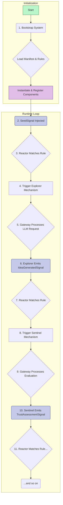

## **0. NIREON V4: An Architectural & Philosophical Overview**

This document serves as the technical reference and developer guide for NIREON V4, a system designed for the structured evolution and analysis of ideas. This introductory section outlines the project's core philosophy, high-level design intentions, and the key architectural paradigms that govern its implementation.

---

### **0.1. The Mission: Principled Idea Evolution**

NIREON is not merely a collection of AI agents; it is an **epistemic engine**. Its primary mission is to provide a robust, traceable, and configurable environment for exploring complex conceptual spaces. The system is built on the premise that true innovation arises from a structured, cyclical process of generation, critique, synthesis, and adaptation.

The core philosophy of NIREON V4 is to model this process explicitly through its architecture, ensuring that every step of an idea's lifecycle—from its initial seeding to its eventual stabilization or rejection—is a governed and observable event.

---

### **0.2. Key Architectural Pillars**

The architecture of NIREON V4 is founded on four key pillars that work in concert to achieve its mission.

1.  **Declarative Orchestration (The Reactor):**
    *   **Intention:** To separate the "what" from the "how." Instead of components being hardwired to call each other, their interactions are orchestrated by a central **Reactor** engine.
    *   **Implementation:** The Reactor listens for signals (events) and triggers component actions based on a set of human-readable YAML rules. This means the system's core reasoning loops can be modified, rewired, or extended by changing configuration files, not by rewriting Python code. This makes the system transparent, flexible, and adaptable.

2.  **Component-Based Modularity:**
    *   **Intention:** To treat every functional unit—whether it's a generative agent, an evaluator, or a core service—as a self-contained, swappable component with a clearly defined contract.
    *   **Implementation:** Every component inherits from a `NireonBaseComponent`, implementing a standard lifecycle (`initialize`, `process`, `health_check`, etc.). Components are registered in a central `ComponentRegistry` during a phased **Bootstrap** process, making them discoverable and manageable.

3.  **The A➜F➜CE Ontology (The Gateway):**
    *   **Intention:** To ensure that all significant cognitive work is contextualized, governed, and traceable. Unconstrained, "free-floating" actions are forbidden.
    *   **Implementation:** This is enforced by the **Agent ➜ Frame ➜ Cognitive Event (A➜F➜CE)** model. An **Agent** (a component) must operate within a **Frame** (a bounded context with goals, rules, and resource budgets). Every action the agent takes, such as calling an LLM or publishing a signal, is encapsulated in a **Cognitive Event**. The **Mechanism Gateway** is the single entry point that validates and processes these events, acting as a universal policy enforcement layer.

4.  **Port-and-Adapter Architecture (Decoupling):**
    *   **Intention:** To keep the core application logic pure and independent of any specific external technology (like a particular database, LLM provider, or message queue).
    *   **Implementation:** The `domain/` layer defines abstract interfaces called **Ports** (e.g., `LLMPort`, `IdeaRepositoryPort`). The `infrastructure/` layer provides concrete **Adapters** that implement these ports (e.g., `OpenAILLMAdapter`, `IdeaRepository` using SQLite). Components in the application layer only code against the abstract Ports, allowing the underlying technology to be swapped out with zero changes to the core logic.

---

### **0.3. The High-Level System Flow**

A typical generative cycle in NIREON V4 follows this high-level flow:

1.  **Bootstrap:** The system starts, loading all components and rules from configuration.
2.  **Seed:** An initial `SeedSignal` is injected into the system.
3.  **Reactor:** The Reactor catches the signal and, based on a rule in `core.yaml`, triggers the Explorer mechanism.
4.  **Explorer:** The Explorer, operating within a new `Frame`, uses the `MechanismGateway` to call an LLM to generate variations of the seed idea.
5.  **Signal Emission:** For each new variation, the Explorer emits an `IdeaGeneratedSignal` (again, via the Gateway).
6.  **Sentinel Trigger:** The Reactor catches each `IdeaGeneratedSignal` and triggers the Sentinel mechanism to evaluate the new idea.
7.  **Assessment:** The Sentinel assesses the idea's trust and stability and emits a `TrustAssessmentSignal`.
8.  **Further Action:** The Reactor catches the `TrustAssessmentSignal`. Depending on the result (e.g., if the trust score is high), it might trigger another component like the `Catalyst` or `QuantifierAgent`, or it might end the loop by emitting a `GenerativeLoopFinishedSignal`.

This signal-driven, rule-based flow allows for complex, multi-agent interactions to emerge from simple, declarative definitions.

---

### **0.4. What to Expect as a Developer**

*   **You will work with YAML:** The primary way to change system behavior is by editing configuration files in `configs/`, especially `standard.yaml` (for components) and files in `configs/reactor/rules/` (for logic).
*   **You will build decoupled components:** When creating a new mechanism, you will focus on its core logic and its interactions with the `MechanismGateway`, not on the specifics of how to call OpenAI or write to a database.
*   **You will think in terms of signals:** Communication is asynchronous. Your component will be triggered by incoming signals and will emit new signals to influence the system.
*   **You will write tests:** The modular architecture makes unit testing components in isolation a primary development practice.
*   **You will respect the layers:** The CI system enforces architectural boundaries. Understanding the roles of `domain`, `application`, and `infrastructure` is key to contributing effectively.

Welcome to NIREON V4. This guide will provide the details needed to navigate, understand, and extend the system.