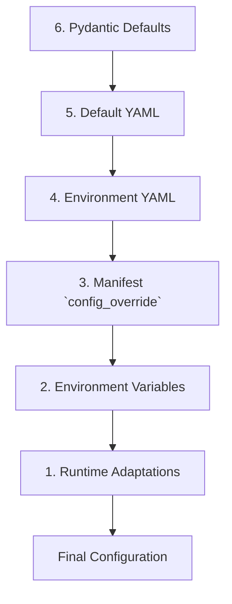

### **3. Configuration Management**

This section explains the configuration hierarchy, best practices, and how different configuration sources interact in NIREON V4. A clear understanding of this subsystem is crucial for customizing, extending, and debugging the application.

---

#### **3.1. Core Concepts**

NIREON's configuration is designed to be **declarative** and **layered**.

*   **Declarative:** The system's components and their behaviors are defined in YAML files, not hardcoded in Python. This allows for significant changes to the system's architecture and logic without modifying the core source code.
*   **Layered:** Configuration values are merged from multiple sources, allowing for a clear separation of concerns between default settings, environment-specific overrides, and instance-specific tweaks.

---

#### **3.2. The Manifest File (`standard.yaml`)**

The manifest is the primary entry point for defining the system's architecture. It specifies which components to load, their Python class implementations, and their initial configurations. It resides in `configs/manifests/`.

A standard manifest is organized into sections:

*   `version`, `metadata`: Standard descriptive fields.
*   `shared_services`: Core, singleton components available across the system (e.g., `LLMRouter`, `EventBusPort`, `FrameFactoryService`).
*   `proto_engines`: Specialized engines for executing `ProtoBlock` tasks (e.g., the math engine).
*   `mechanisms`: The primary epistemic agents of the system (e.g., `Explorer`, `Sentinel`, `Catalyst`).
*   `composites`, `observers`, `managers`: Other component categories.
*   `orchestration_commands`: Definitions for high-level system commands.
*   `environment_overrides`: A special section to change component definitions based on the environment (e.g., using placeholder services for development).

**Component Entry Breakdown:**

Each component entry within a section (e.g., `llm_router_main` under `shared_services`) defines a component instance with the following key fields:

*   `enabled` (bool): If `false`, this component will not be loaded.
*   `preload` (bool): If `true`, this component is instantiated in the `AbiogenesisPhase` before most others, making it available very early in the bootstrap sequence. Crucial for foundational services like the Event Bus.
*   `class` (str): The full Python import path to the component's class (e.g., `infrastructure.llm.router:LLMRouter`).
*   `port_type` (str, optional): The full Python import path to the abstract `Port` this component implements. This registers the component for dependency injection by its interface, not just its name.
*   `metadata_definition` (str, optional): The full import path to a `ComponentMetadata` object, providing rich, self-describing information about the component.
*   `config` (str, optional): A path to a separate YAML file containing detailed configuration for this *specific instance*. The token `{id}` is replaced with the component's key (e.g., `explorer_instance_01`).
*   `config_override` (dict, optional): A dictionary of configuration values that will be merged over (and take precedence over) the values from the file specified in `config`.

---

#### **3.3. The Reactor Rule File (`core.yaml`, `advanced.yaml`, etc.)**

The original "Template" system has been superseded by the more powerful and flexible **Reactor Subsystem**. The Reactor listens for signals and executes actions based on rules defined in YAML files located in `configs/reactor/rules/`.

A rule file contains a list of rules, each with the following structure:

*   `id`: A unique identifier for the rule.
*   `description`: A human-readable explanation of the rule's purpose.
*   `namespace`: A category for grouping related rules (e.g., `core`, `trust`, `health`).
*   `priority`: An integer determining the execution order (lower numbers run first).
*   `enabled`: If `false`, the rule is ignored.
*   `conditions`: A list of conditions that must *all* be true for the rule to match.
    *   `type: "signal_type_match"`: The primary condition, matching a specific signal (e.g., `TrustAssessmentSignal`).
    *   `type: "payload_expression"`: A powerful condition that evaluates a [Rule Expression Language (REL)](#) expression against the signal's data.
*   `actions`: A list of actions to perform if all conditions match.
    *   `type: "trigger_component"`: Calls the `.process()` method of a specified component.
    *   `type: "emit_signal"`: Creates and publishes a new signal to the event bus.

**Example Rule from `advanced.yaml`:**

```yaml
- id: "route_business_idea_to_quantifier_fixed"
  description: "When a high-trust idea about business is stable, send it to the QuantifierAgent."
  namespace: "synthesis_loop"
  priority: 40
  enabled: true
  conditions:
    - type: "signal_type_match"
      signal_type: "TrustAssessmentSignal"
    - type: "payload_expression"
      expression: "payload.is_stable == True and payload.trust_score > 6.0"
  actions:
    - type: "trigger_component"
      component_id: "quantifier_agent_primary"
      input_data_mapping:
        idea_id: "payload.idea_id"
        idea_text: "payload.idea_text"
        assessment_details: "payload"
```

This rule demonstrates:
*   **Triggering:** It listens for a `TrustAssessmentSignal`.
*   **Complex Conditions:** It uses a REL expression to check for stability and a high trust score.
*   **Action:** It triggers the `quantifier_agent_primary` component.
*   **Data Mapping:** The `input_data_mapping` dynamically constructs the input for the triggered component by pulling data directly from the matched signal's payload.

---

#### **3.4. Configuration Hierarchy & Precedence**

NIREON uses a layered configuration system with the following precedence (**highest to lowest**):

1.  **Runtime Adaptations:** Dynamic changes made during execution via `AdaptationAction` signals.
2.  **Environment Variables:** `${ENV_VAR}` substitutions within YAML files.
3.  **Manifest `config_override`:** Inline key-value pairs in `standard.yaml` for a specific component instance.
4.  **Environment-Specific Config File:** `configs/<env>/...` (e.g., `configs/development/mechanisms/explorer_primary.yaml`).
5.  **Default Config File:** `configs/default/...` (e.g., `configs/default/mechanisms/explorer_primary.yaml`).
6.  **Pydantic Model Defaults:** Hardcoded defaults in a component's `config.py` file.



---

#### **3.5. Component Configuration (Pydantic)**

Each component **must** define its configuration using a Pydantic `BaseModel` in its respective `config.py` file. This provides automatic validation, type safety, and clear documentation.

**Example from `components/mechanisms/explorer/config.py`:**

```python
from pydantic import BaseModel, Field, Literal

class ExplorerConfig(BaseModel):
    """Configuration for the Explorer mechanism."""
    
    divergence_strength: float = Field(
        ..., ge=0.001, le=1.0, 
        description='Base mutation strength for vector perturbation.'
    )
    
    exploration_strategy: Literal['depth_first', 'breadth_first', 'random', 'llm_guided'] = Field(
        ..., description='Strategy for traversing the idea space.'
    )

    class Config:
        extra = "forbid"  # Fail on unknown fields
        validate_assignment = True
```

---

#### **3.6. Environment Variable Usage**

Use environment variables for secrets, API keys, and environment-specific values.

*   **Syntax:** `${VAR_NAME:-default_value}` (the `:-default` is optional).
*   **Implementation:** The `ConfigLoader` automatically expands these variables before the configuration is passed to the component.
*   **Data Types:** All environment variables are read as strings. The Pydantic model is responsible for coercing them into the correct type (e.g., `int`, `bool`).

**Example in YAML:**

```yaml
# In llm_config.yaml
models:
  nano_default:
    auth_token_env: "OPENAI_API_KEY" # Specifies which env var to read
    
# In another config
database:
  url: "${DATABASE_URL:-sqlite:///runtime/local.db}" # Uses a default
```

---

#### **3.7. Schema Validation**

NIREON uses JSON Schema to validate the structure of its configuration files, particularly for the RBAC policies. This is partially implemented and will be expanded to cover all major configuration types.

*   **Current Implementation:** The `RBACSetupPhase` uses `schemas/rbac_policy.schema.json` to validate `bootstrap_rbac.yaml`.
*   **Benefits:**
    *   Catches structural errors before runtime.
    *   Enforces a consistent configuration contract.
    *   Enables IDE auto-completion and validation with the right plugins.

---

#### **3.8. Best Practices**

✅ **DO:**

*   **Pydantic First:** Define all component configurations in a Pydantic model for type safety and validation.
*   **Document Fields:** Use the `description` field in Pydantic to explain the purpose of every configuration option.
*   **Sensible Defaults:** Provide reasonable defaults in your Pydantic models to make configuration easier.
*   **Secrets in Env:** Use environment variables for all secrets (API keys, passwords).
*   **Use `config_override`:** For small, instance-specific tweaks in the manifest, use `config_override`.
*   **Use `config` File Path:** For larger, reusable configurations, point to a dedicated YAML file using the `config` key.
*   **Environment Folders:** Keep `configs/default/` as the baseline and use `configs/development/` or `configs/production/` for overrides.

❌ **DON'T:**

*   **Hardcode Secrets:** Never commit API keys or other secrets to YAML files.
*   **Mutable Defaults:** Avoid `default=[]` or `default={}` in Pydantic. Use `default_factory=list` or `default_factory=dict` instead.
*   **Mix Logic:** Keep configuration separate from business logic within component code.
*   **Overly Complex Nesting:** Avoid excessively deep configuration structures that are difficult to manage and override.
*   **Allow Arbitrary Fields:** Use `extra="forbid"` in Pydantic `Config` to prevent typos and unexpected configuration keys.