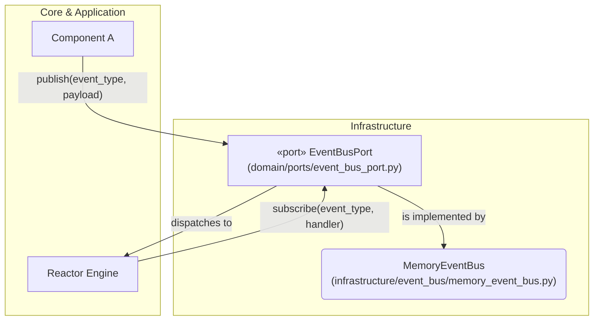
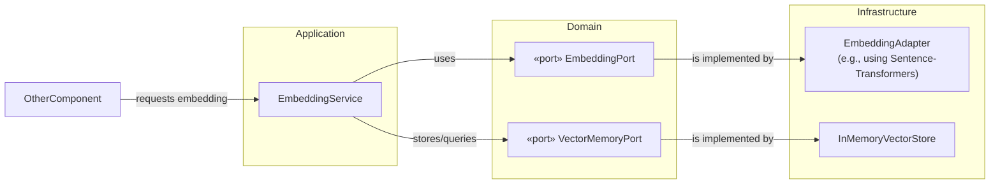
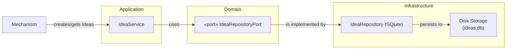

## **6. Infrastructure Services Implementation Guides**

This section provides detailed implementation guides for NIREON's foundational infrastructure services. Each guide covers the service's objectives, architecture, public contracts, and governance, blending design intent with the reality of the current implementation.

---

### **6.1. Event Bus (System Bus)**

The Event Bus is the central nervous system for asynchronous, decoupled communication in NIREON V4.

#### **6.1.1. Objectives & Success Criteria**

| ID    | Objective                                                               | Complete When                                                                    |
| :---- | :---------------------------------------------------------------------- | :------------------------------------------------------------------------------- |
| SB-1  | Provide a port-based EventBus API usable by any component               | In-memory bus + unit tests green                                                 |
| SB-2  | Support multiple back-ends chosen via manifest                          | Manifest swap smoke test passes w/out code change in core components             |
| SB-3  | Enforce at-least-once delivery guarantee inside a single process        | Integration test shows zero lost messages under load                             |
| SB-4  | Persist event history (configurable) and expose metrics                 | A test observer can read stats and verify history presence/size                  |
| SB-5  | Support subscribe/unsubscribe with back-pressure-safe handler execution | Stress test (e.g., ≥1k events/s) passes without unhandled handler exceptions     |
| SB-6  | Publish all core system events (e.g., `BOOTSTRAP_COMPLETED`)            | Smoke run shows expected core events on bus via a test subscriber                |
| SB-7  | Adhere to Layering & RBAC rules; ≥90% unit-test coverage                | CI passes `grimp` import-graph & `pytest-cov` coverage gates                     |

#### **6.1.2. Architecture & Key Components**

*   **`EventBusPort` (Interface):** The protocol defined in `domain/ports/event_bus_port.py`. All components interact with the event bus through this interface, ensuring they are decoupled from the concrete implementation.
*   **`MemoryEventBus` (Implementation):** The default, in-memory implementation located in `infrastructure/event_bus/memory_event_bus.py`. It uses a dictionary to manage subscribers and a `deque` to maintain a history of recent events.

**Architectural Diagram:**



#### **6.1.3. Implementation Details & Contracts**

**`EventBusPort` Protocol:**
The contract ensures that any event bus implementation provides these core methods.

```python
# In domain/ports/event_bus_port.py
from typing import Protocol, Any, Callable

class EventBusPort(Protocol):
    def publish(self, event_type: str, payload: Any) -> None:
        """Publishes an event to all subscribers of event_type."""
        ...

    def subscribe(self, event_type: str, handler: Callable[[Any], None]) -> None:
        """Subscribes a handler to a specific event_type."""
        ...
```

**`MemoryEventBus` Highlights:**

*   **Publishing:** The `publish` method is synchronous. It immediately finds all handlers for a given `signal_name` and, if an asyncio event loop is running, schedules an internal `_dispatch` coroutine to run as a new task. This prevents the publisher from being blocked by slow subscribers.
*   **Dispatching:** The `_dispatch` coroutine handles the actual execution. It safely calls each handler, catching and logging any exceptions to prevent one faulty subscriber from crashing the system. It correctly handles both regular functions and `async` coroutine functions.
*   **History:** A `collections.deque` stores the most recent events, which can be configured for size. This is invaluable for debugging.

#### **6.1.4. Core Events & Compliance**

*   **Core Events:** The bus is used for critical system lifecycle signals like `BOOTSTRAP_STARTED`, `BOOTSTRAP_COMPLETED`, and `COMPONENT_REGISTERED`, in addition to all `EpistemicSignal` types.
*   **Compliance Checklist:**
    *   [✔] **Port Contract:** `MemoryEventBus` implements `EventBusPort`.
    *   [✔] **Layering:** Code adheres to the `Domain -> Infrastructure` dependency rule.
    *   [✔] **History Bounds:** `deque` with `maxlen` correctly enforces history limits.
    *   [✔] **Async Handlers:** The `_dispatch` logic correctly `await`s coroutine handlers.
    *   [ ] **Coverage:** Unit test coverage should be maintained at ≥90%.

---

### **6.2. Embedding Subsystem**

This subsystem provides a unified service for converting text into semantic vectors and managing a vector memory for similarity searches and novelty calculations.

#### **6.2.1. Objectives & Success Criteria**

| ID    | Objective                                                                | Complete When                                                                |
| :---- | :----------------------------------------------------------------------- | :--------------------------------------------------------------------------- |
| OBJ-1 | Provide semantic embeddings to any component via `EmbeddingPort`         | Unit tests for `encode`/`encode_batch` pass.                                 |
| OBJ-2 | Persist embeddings + novelty metrics via `VectorMemoryPort`              | Embeddings are visible in vector store after a run; `stats()` returns data.  |
| OBJ-3 | Emit observability signals (`EMBEDDING_COMPUTED`, `HIGH_NOVELTY_DETECTED`) | Signals appear on the EventBus, validated by a test subscriber.             |
| OBJ-4 | Allow swappable providers (e.g., SentenceTransformers, OpenAI) via manifest | Switching provider in manifest passes smoke test without code changes.       |
| OBJ-5 | Enforce strict layering compliance                                       | `grimp` CI check passes with zero violations for this rule.                  |
| OBJ-6 | ≥90% unit-test coverage                                                  | CI coverage gate passes for all related files.                               |

#### **6.2.2. Architecture & Key Components**

This subsystem has a clear separation of concerns between the application service, domain ports, and infrastructure implementations.

*   **`EmbeddingService` (Application):** The central orchestrator in `application/services/embedding_service.py`. It coordinates encoding, novelty calculation, storage, and event emission.
*   **`EmbeddingPort` (Domain):** The interface for any text-embedding provider, defined in `domain/ports/embedding_port.py`.
*   **`VectorMemoryPort` (Domain):** The interface for any vector database, defined in `domain/ports/vector_memory_port.py`.
*   **`EmbeddingAdapter` (Infrastructure):** A concrete `EmbeddingPort` implementation in `infrastructure/embeddings/embeddings.py` that can use different providers.
*   **`InMemoryVectorStore` (Infrastructure):** A concrete `VectorMemoryPort` implementation in `infrastructure/vector_memory/inmemory_store.py`.

**Architectural Diagram:**



#### **6.2.3. `EmbeddingService` Implementation Details**

*   **`initialize(context)`:** During initialization, the `EmbeddingService` resolves its dependencies (`EmbeddingPort`, `VectorMemoryPort`, `EventBusPort`) from the `ComponentRegistry`. It fails fast if a required port (like `EmbeddingPort`) is missing.
*   **`process(data, context)`:** This is the primary method.
    1.  It accepts text input (a single string, a list of strings, or a dict like `{'text': ...}`).
    2.  It uses an internal `_LRUVectorCache` to avoid re-computing embeddings for recently seen text.
    3.  For uncached text, it calls `self.embedding_port.encode()` or `encode_batch()`. It includes a retry-with-backoff mechanism to handle transient provider failures.
    4.  After getting a `Vector`, it calls `_compute_novelty()`, which queries the `VectorMemoryPort` for the most similar existing vector and calculates a novelty score (1.0 - max_similarity).
    5.  It then calls `_after_embedding()`, which `upsert`s the new vector into the `VectorMemoryPort` and publishes `EmbeddingComputedEvent` and (if applicable) `HighNoveltyDetectedEvent` to the event bus.
*   **Health & Stats:** The `health_check()` method reports the status of its dependencies and provides key metrics like total embeddings computed, cache size, and error counts.


---

### **6.3. Persistence (Idea Repository)**

This subsystem is responsible for storing and managing `Idea` objects, their relationships (forming a Directed Acyclic Graph), and associated metadata.

#### **6.3.1. Objectives & Success Criteria**

| ID    | Objective                                                               | Complete When                                                                |
| :---- | :---------------------------------------------------------------------- | :--------------------------------------------------------------------------- |
| PR-1  | Provide CRUD and relationship storage for `Idea` objects via `IdeaRepositoryPort` | Unit tests pass for all `save`, `get`, and relationship methods.             |
| PR-2  | Maintain parent/child DAG integrity                                     | Tests show that deleting a parent idea correctly cascades to the relationship table. |
| PR-3  | Support `world_fact` associations                                       | `add_world_fact` method works and queries reveal the linkage.                |
| PR-4  | Expose repository stats and maintenance operations                      | `get_stats()` returns accurate counts; `vacuum_database()` runs without error. |
| PR-5  | Allow swappable backends via manifest                                   | A smoke test with a (future) different provider key works as expected.       |
| PR-6  | Enforce strict layering compliance                                      | `grimp` CI check passes with zero relevant `infra` to `core`/`app` violations. |
| PR-7  | ≥90% unit-test coverage                                                 | CI coverage gate passes for the `idea_repository.py` file.                   |

#### **6.3.2. Architecture & Key Components**

*   **`Idea` (Domain):** The core data class defined in `domain/ideas/idea.py`.
*   **`IdeaRepositoryPort` (Domain):** The abstract interface in `domain/ports/idea_repository_port.py`.
*   **`IdeaRepository` (Infrastructure):** The concrete SQLite-backed implementation in `infrastructure/persistence/idea_repository.py`.
*   **`IdeaService` (Application):** The service in `application/services/idea_service.py` that uses the `IdeaRepositoryPort` to perform business logic related to ideas.

**Architectural Diagram:**



#### **6.3.3. Implementation Details & Contracts**

**`IdeaRepositoryPort` Protocol:**
The port defines the essential methods for interacting with `Idea` storage.

```python
# In domain/ports/idea_repository_port.py
from typing import Protocol, List, Optional
from domain.ideas.idea import Idea

class IdeaRepositoryPort(Protocol):
    def save(self, idea: Idea) -> None: ...
    def get_by_id(self, idea_id: str) -> Optional[Idea]: ...
    def get_all(self) -> List[Idea]: ...
    def get_by_parent_id(self, parent_id: str) -> List[Idea]: ...
    def add_child_relationship(self, parent_id: str, child_id: str) -> bool: ...
    def add_world_fact(self, idea_id: str, fact_id: str) -> bool: ...
```

**SQLite `IdeaRepository` Implementation:**

*   **Provider Logic:** The `__init__` method checks the `provider` key in its configuration and calls the appropriate initialization method (`_init_sqlite`, `_init_memory`, etc.). The default is a robust SQLite implementation.
*   **SQLite Schema:** The `_init_sqlite_database` method is idempotent (uses `CREATE TABLE IF NOT EXISTS`) and defines the core `ideas` table, along with `idea_relationships` and `idea_world_facts` for managing connections. It creates several indexes on foreign keys and timestamps to ensure query performance.
*   **Data Handling:**
    *   **Serialization:** When `save()` is called, complex Python objects in an `Idea` (like `parent_ids` and `metadata`) are serialized into JSON strings before being written to the database.
    *   **Deserialization:** The internal `_row_to_idea()` method is the counterpart. It reads a database row, safely parses the JSON text columns back into Python lists and dictionaries, and reconstructs a complete `Idea` object. This is a critical step for maintaining data integrity.
*   **Concurrency:** The repository enables SQLite's Write-Ahead Logging (WAL) mode by default (`PRAGMA journal_mode=WAL;`), which allows readers to continue operating while a write is in progress, significantly improving performance in a multi-threaded or multi-process environment.
